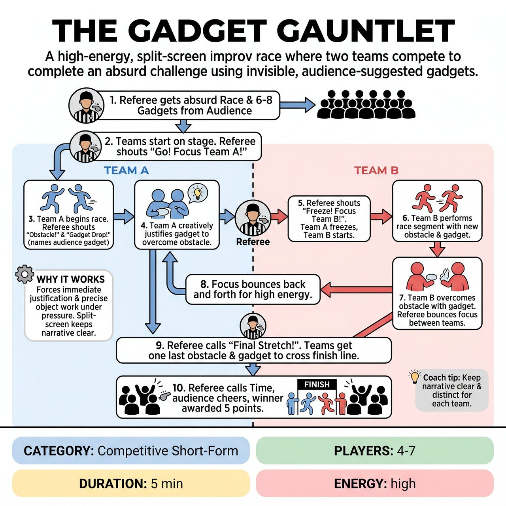

# The Gadget Gauntlet

{ .game-hero }

> A high-energy, split-screen improv race where two teams compete to complete an absurd challenge using invisible, audience-suggested gadgets.

## Overview
A high-energy, split-screen improv race where two teams compete to complete an absurd, audience-suggested challenge. To progress, players must overcome obstacles using invisible, audience-suggested 'gadgets' dropped by the Referee. The Referee swings focus back and forth between the teams to keep the action fast and the audio clear, testing players' quick wit, physical object work, and immediate justification.

## Setup
Two teams of 2-3 players and one Referee. No props required. The stage is divided into two halves (split-screen), one for each team. The audience provides the race theme and a list of random objects.

## How to Play
1. The Referee gets an absurd race or quest suggestion from the audience (e.g., 'The Extreme Grocery Shopping Olympics' or 'Escaping a Lava Pit').
2. The Referee asks the audience to rapid-fire suggest 6-8 random, everyday objects (e.g., a spatula, a rubber duck, a garden hose) and remembers them.
3. Both teams take their starting positions on opposite sides of the stage. The Referee points to Team A and shouts 'Go!'
4. Team A begins miming and narrating their progress in the race. After a few seconds, the Referee shouts 'Obstacle!' and invents a hurdle (e.g., 'A swarm of angry bees!').
5. Immediately, the Referee shouts 'Gadget Drop!' and names one of the audience's objects (e.g., 'A toaster!').
6. Team A must instantly mime the object and creatively justify using it to overcome the obstacle.
7. Once Team A succeeds, the Referee shouts 'Freeze! Focus Team B!' Team A freezes in place, and Team B begins their race.
8. The Referee throws a new obstacle and gadget at Team B, bouncing focus back and forth between the teams to maintain high energy without creating a wall of noise.
9. To conclude the game, the Referee announces the 'Final Stretch!' Both teams are given one last obstacle and gadget to narratively cross the finish line and complete the quest.
10. The Referee calls time, asks the audience to cheer for the most creative team, and awards 5 points to the winner based on overall performance, creativity, and object work.

## Coaching Notes
- Split-screen focus control by the Referee is crucial to prevent audio clutter while maintaining high competitive energy.
- The Referee may call a 'Delay of Game' foul (-5 points) if a player hesitates or fails to instantly use a gadget.
- The Referee may call a clean-content foul (-15 points) for inappropriate content.
- Encourage players to commit to strong, precise object work when handling their invisible gadgets.
- There is no micro-scoring during the scene; keep the pace fast and save the final 5-point award for the end.

## Variations
- Relay Race: Teams have 3-4 players. After a player successfully uses a gadget to clear an obstacle, they must 'tag' the next teammate in to face the next challenge.
- Genre Gauntlet: The audience suggests a specific movie or theater genre (e.g., Sci-Fi, Western, Shakespeare) that both teams must adopt for their characters and justifications.

## Why It Works
It forces immediate justification and strong, precise object work under pressure. The split-screen mechanic allows for a clear narrative arc with a defined 'Final Stretch' conclusion, while requiring zero props or setup makes it highly accessible and fast to stage.

## Safety & Inclusion
Players must maintain physical awareness and avoid actually running into each other or off the stage edges during the high-energy race. Mimed objects and obstacles must remain family-friendly. For players with mobility restrictions, the game can easily be played from a stationary position or seated, focusing on upper-body object work and strong verbal justification.

