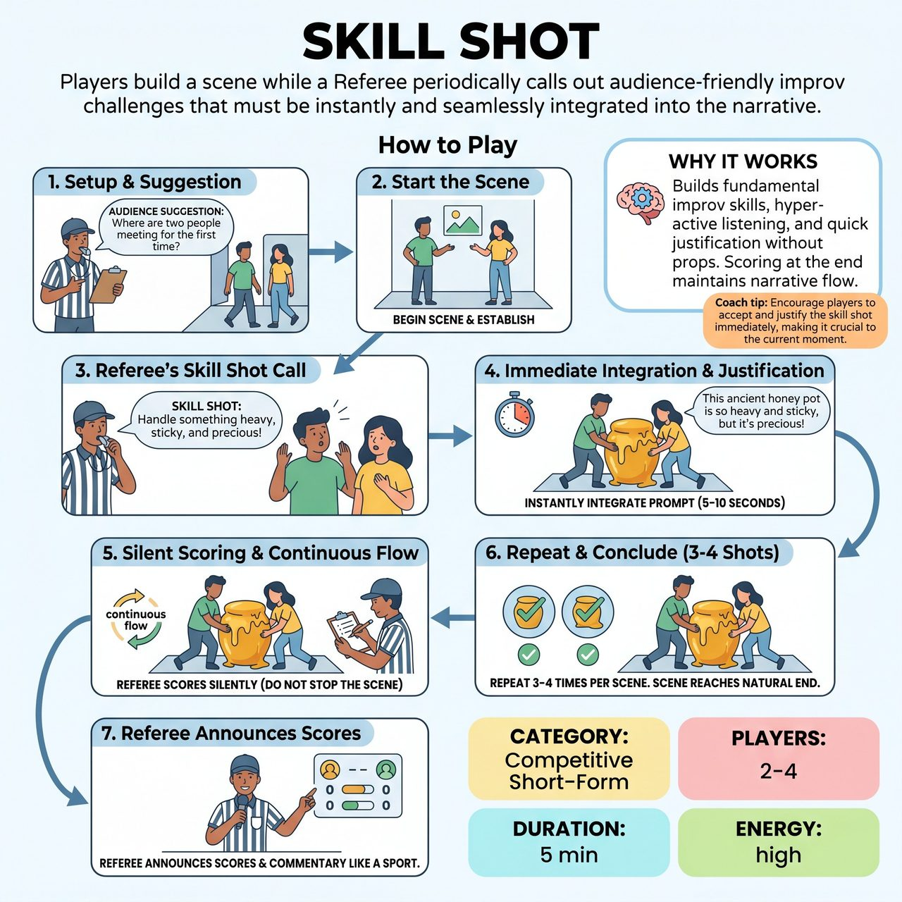

# Skill Shot

{ .game-hero }

> Players build a scene while a Referee periodically calls out audience-friendly improv challenges that must be instantly and seamlessly integrated into the narrative.

## Overview
A fast-paced, competitive short-form game where players build a scene together, but are periodically challenged by the Referee to instantly integrate specific improv skills. Instead of using alienating jargon, the Referee yells out audience-friendly prompts. The scene flows without interruption as the Referee silently scores the execution, tallying the points at the end to see which team best justified the sudden shifts.

## Setup
Format is a competitive short-form match. No props are needed; all object work is mimed. The stage is an open space. The Referee stands downstage left or right with a whistle and a clipboard/scorecard. The audience provides the initial scene suggestion and cheers for impressive integrations.

## How to Play
1. The Referee gets a simple suggestion from the audience (e.g., 'Where are two people meeting for the first time?') and invites representatives from both teams to start the scene.
2. The players begin the scene, establishing the base reality, characters, and relationship.
3. At a strategic moment, the Referee blows the whistle and calls out an audience-friendly 'Skill Shot' prompt (e.g., 'Skill Shot: Handle something heavy, sticky, or dangerous!').
4. The players must immediately and seamlessly integrate this prompt into the ongoing narrative within the next 5-10 seconds, justifying why it is happening in the story.
5. The Referee silently scores the execution on their clipboard. The scene does NOT stop, and the Referee does not announce the points yet, allowing the narrative momentum to continue.
6. The Referee limits the interruptions to exactly 3 or 4 Skill Shots per scene to ensure the scene has room to breathe and a coherent beginning, middle, and end.
7. After the final Skill Shot has been integrated and the scene reaches a natural conclusion, the Referee blows the whistle and calls 'Scene!'
8. The Referee then steps center stage to announce the scores, acting like a sports commentator, and briefly explains to the audience why points were awarded.

## Coaching Notes
- Scoring: Award up to 2 points per team per Skill Shot. Give 1 point for a clear, immediate attempt that the audience understands, and a +1 bonus point if the execution is hilariously and seamlessly justified within the narrative.
- Fumble Foul: Deduct 1 point if a player completely ignores the prompt or breaks character.
- Encourage the audience to applaud great 'saves' and seamless justifications in real-time.
- Translate inside-baseball improv jargon into fun, accessible challenges the audience can easily understand (e.g., 'Show us how you REALLY feel!' instead of 'Heightened Emotion!').
- Players must practice hyper-active listening to track the scene, their partner, and the Referee's sudden prompts simultaneously.

## Variations
- Team Relay: Played with 3 players per team on the back wall. When a Skill Shot is called, a player from the back wall can tag out their teammate to enter the scene and execute the prompt, keeping energy high.
- Audience Arsenal: Before the game, the Referee asks the audience for 'things you might see in an action movie' or 'big emotions.' The Referee uses these specific audience suggestions as the Skill Shots during the scene.

## Why It Works
The game relies entirely on the players' fundamental improv toolkit without needing props or setup. It forces hyper-active listening and quick justification skills. By saving the point announcements and commentary for the end of the scene, it maintains narrative flow while still delivering the competitive, interactive elements of short-form improv.

## Safety & Inclusion
Because prompts often call for sudden physical or emotional shifts, players must maintain strict physical boundaries. Prompts like 'Flip the power dynamic!' or 'Take it physically!' must be executed through staging, levels, and mimed object work, never through non-consensual physical contact, grabbing, or aggressive proximity to scene partners. The Referee must avoid prompts that require players to adopt specific physical disabilities or harmful stereotypes.

