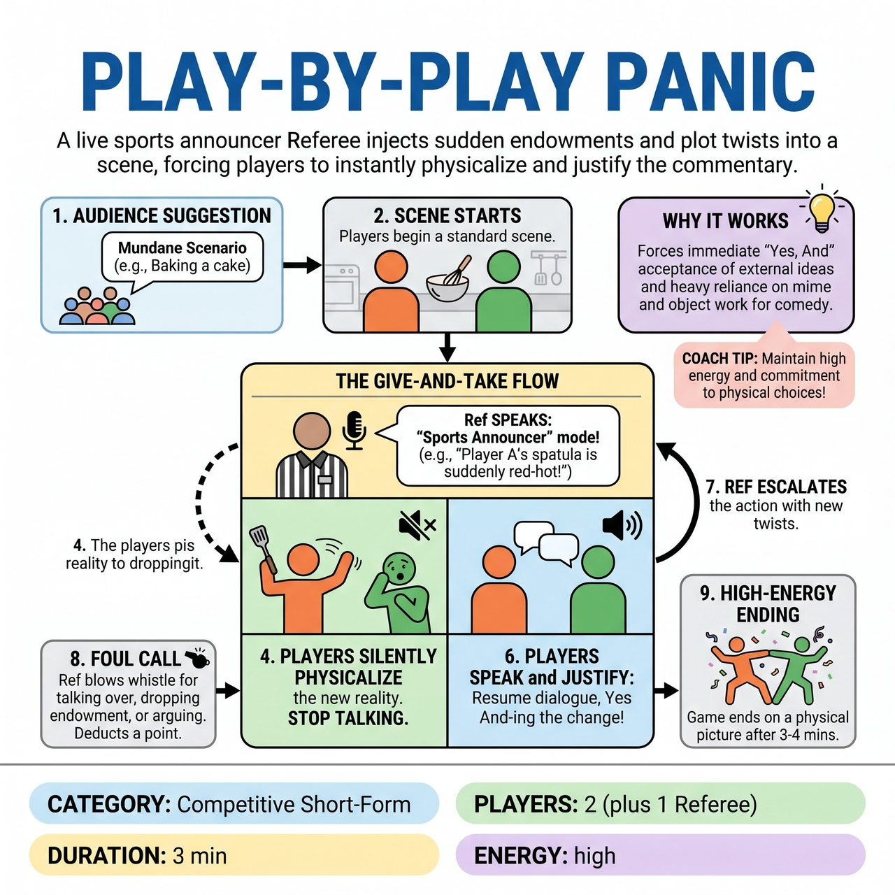

# Play-by-Play Panic

{ .game-hero }

> A live sports announcer Referee injects sudden endowments and plot twists into a scene, forcing players to instantly physicalize and justify the commentary.

## Overview
A high-energy competitive short-form game where the Referee acts as a live sports announcer, injecting sudden endowments, physical challenges, and plot twists into a 1v1 scene. Players must instantly physicalize and justify the Ref's commentary. To prevent audio chaos, the game uses a strict give-and-take mechanic: when the Ref is on the microphone, the players must stop talking and silently physicalize the narration; the moment the Ref pauses, the players resume dialogue, instantly accepting their new reality.

## Setup
2 players total (1 from Team A, 1 from Team B) to keep the audio clear. 1 Referee with a microphone. The audience provides a mundane activity, location, or relationship to start the scene.

## How to Play
1. Get a suggestion from the audience for a mundane scenario (e.g., 'Baking a cake' or 'Fixing a tire').
2. The two players begin a standard scene based on the suggestion.
3. At any moment, the Referee adopts an energetic 'Sports Announcer' persona on the mic and begins narrating the action.
4. THE GIVE-AND-TAKE RULE: The moment the Referee starts speaking, the players must instantly stop talking. However, they must immediately begin to silently physicalize whatever the Referee is describing.
5. The Referee injects a new reality, endowment, or obstacle. (Example: 'And look at this, folks! Player A has suddenly realized the wrench is red-hot, while Player B is being attacked by a swarm of invisible bees!')
6. The moment the Referee stops speaking, the players resume their dialogue, instantly 'Yes, And-ing' the new reality and justifying it within the scene.
7. The Referee continues to bounce in and out of the scene, escalating the stakes and forcing the players into increasingly absurd physical and emotional states.
8. If a player talks over the Referee, drops the physical endowment, or argues with the premise, the Referee blows the whistle and calls a foul (deducting a point).
9. The game concludes after 3 to 4 minutes of escalating panic, ending on a high-energy physical picture.
10. At the end of the game, standard competitive short-form scoring applies: the audience votes by applause for which player/team handled the panic best, awarding them 5 points.

## Coaching Notes
- Active Referee: This game puts the host/referee in a highly entertaining, scene-driving role.
- Audio Discipline: Built-in give-and-take mechanics train players not to talk over each other.
- The Referee does NOT award subjective points for 'good play', but they can and should deduct points (call fouls) during the scene if a player talks over the announcer, ignores an endowment ('Dropping the Play'), or violates family-friendly content rules ('clean-content call').

## Variations
- Tag-Team Panic: Play with 4 players (2 per team). The Referee can narrate sudden substitutions ('And here comes Player C off the bench with a steel chair!'), forcing players to tag in and out seamlessly.
- Inner Monologue Announcer: Instead of narrating physical actions, the Referee narrates the players' secret thoughts ('Little does he know, she is secretly a Russian spy'). Players must then let those secret thoughts influence their next lines of dialogue.

## Why It Works
It forces players to immediately accept and justify external ideas through instant 'Yes, And'. The game heavily relies on mime, object work, and physical reactions to drive comedy, while the strict give-and-take mechanics train players in audio discipline and focus sharing.

## Safety & Inclusion
Referees must ensure endowments do not force players into unsafe physical positions or mandate non-consensual physical contact between players. Endowments should focus on mime, personal environment, and emotional states. The Referee should tailor physical challenges to the actual mobility levels and physical capabilities of the specific players on stage, ensuring the game remains accessible and fun rather than genuinely stressful.

