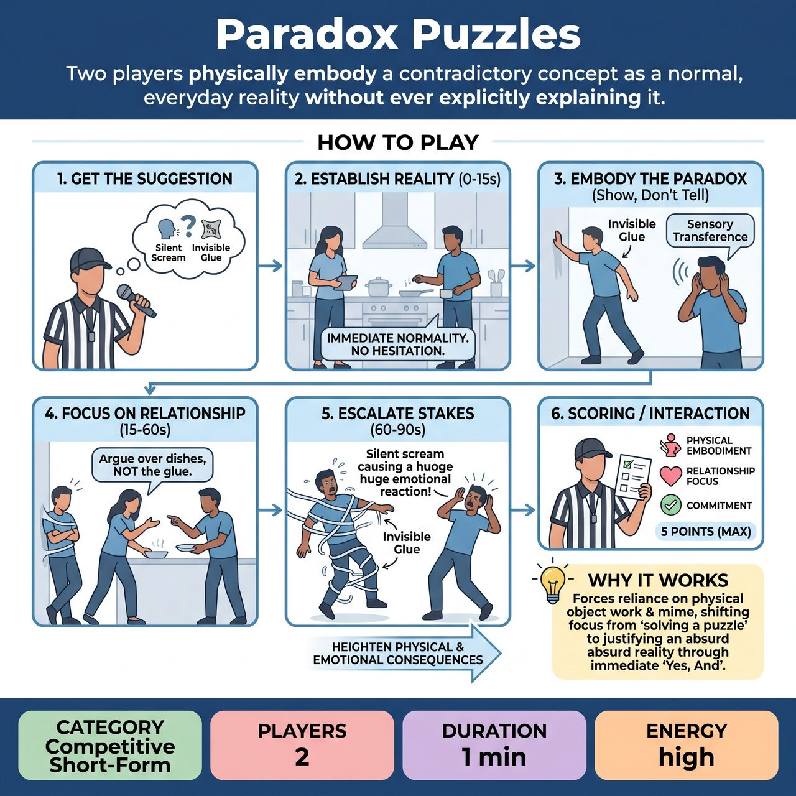

# Paradox Puzzles

{ .game-hero }

> Two players physically embody a contradictory concept as a normal, everyday reality without ever explicitly explaining it.

## Overview
Two players are given a contradictory concept (a 'Paradox Puzzle' like 'invisible glue' or 'a silent scream') and must improvise a fast-paced scene where this paradox exists as a normal, everyday reality. The challenge is to physically embody and justify the paradox through object work, environment, and relationship dynamics without ever explicitly explaining it to the audience, turning an intellectual riddle into a grounded, physical scene.

## Setup
Format: Competitive Short-Form match. Players: 2 per team. Props: None (all object work must be mimed). Stage: Standard open stage. The Referee acts as the host, timekeeper, and judge. Before the scene, the Referee asks the audience for a two-word contradiction or paradox (e.g., 'Deafening Silence', 'Liquid Ice', 'Heavy Feather'). The scene time limit is strictly 60 to 90 seconds.

## How to Play
1. 1. Get the Suggestion: The Referee solicits a family-friendly paradox from the audience, ensuring it is a physical or sensory contradiction rather than a purely philosophical one.
2. 2. Establish the Reality (0-15 seconds): The two players immediately step forward and initiate a scene where this paradox is a mundane part of their world. There is no huddle; players must discover the reality together in real-time.
3. 3. Embody the Paradox (Show, Don't Tell): Players must use specific physical techniques to demonstrate the paradox. Technique A - Sensory Transference: React to one sense with the physical response of another (e.g., covering ears to block out a 'bright darkness'). Technique B - Object Weight/Texture: Manipulate space to show contradictory properties (e.g., straining and sweating to lift a 'heavy feather').
4. 4. Focus on Relationship (15-60 seconds): The scene must not be a lecture about the paradox. Instead, the paradox should simply be the backdrop for a relatable relationship dynamic. For example, if the paradox is 'Liquid Ice', the scene shouldn't be scientists studying it; it should be roommates arguing over who spilled it on the couch.
5. 5. Escalate the Stakes (60-90 seconds): The physical consequences of the paradox must heighten the emotional stakes between the characters until the Referee blows the whistle to call time.
6. 6. Scoring / Audience Interaction: The Referee awards up to 5 points based on three criteria: Physical Embodiment (up to 2 points for clear, creative object work that shows the paradox), Relationship Focus (up to 2 points for grounding the paradox in a character dynamic rather than just talking about it), and Audience Reaction (1 point for eliciting laughter or an 'Aha!' moment).

## Coaching Notes
- Example Scene (The 'Silent Scream'): Player A gets jump-scared by a movie. They open their mouth impossibly wide, veins bulging, face turning red, thrashing backward in pure terror-but absolutely no sound comes out. Player B casually turns up the TV volume and says, 'Could you keep it down? You're waking the neighbors.' Player A nods apologetically and mimes whispering 'Sorry.' Notice how the paradox is physically shown and treated as real, but never explicitly named.
- Fouls: The Referee will call 'The Professor Foul' (minus 1 point) if a player explicitly explains the paradox to the audience or their scene partner (e.g., saying 'As you know, this glue is invisible!'). The 'Clean-Content Foul' (minus 1 point) is called for any non-family-friendly content.
- Coach players to rely on physical object work and mime rather than purely verbal wit.
- Ensure the improvisational focus shifts from 'solving a puzzle' to justifying an absurd reality.
- Remind players that this requires intense active listening and immediate 'Yes, And' to establish the physical rules of the scene.

## Variations
- Paradox Relay: A 4-player variation. Every 30 seconds, the Referee blows the whistle, one player tags out, and a new paradox is thrown in by the Referee. The location and base relationship stay exactly the same, forcing the players to instantly integrate the new paradox into the ongoing reality.
- Silent Paradox: The entire scene is performed in gibberish or pure mime. This completely removes the temptation to trigger 'The Professor Foul' and forces 100 percent reliance on physical storytelling, facial expressions, and spatial awareness.

## Why It Works
It forces improvisers to rely on physical object work and mime rather than purely verbal wit, shifting the focus from 'solving a puzzle' to justifying an absurd reality through intense active listening and immediate 'Yes, And'.

## Safety & Inclusion
Physical Safety: When miming extreme physical reactions (like a silent scream or lifting heavy objects), players must be coached to avoid actual vocal strain or physical overexertion. Content Safety: Referees must rigorously filter audience suggestions to avoid paradoxes that touch on sensitive, triggering, or inappropriate topics (e.g., 'loving abuse'). Keep suggestions focused on physics, nature, or lighthearted concepts. Accessibility: Players with limited mobility can focus on facial expressions, vocal contrast, or emotional paradoxes (e.g., 'happy tears') rather than full-body object work.

