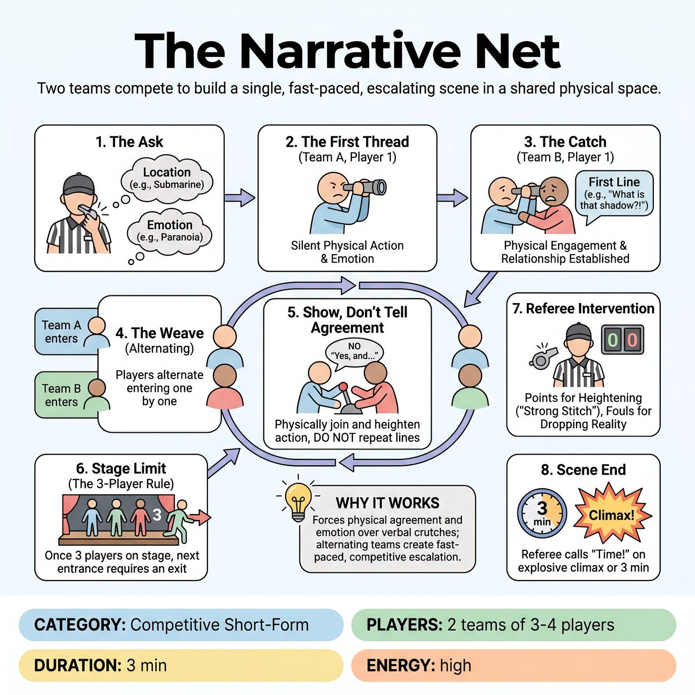

# The Narrative Net

{ .game-hero }

> Two teams compete to build a single, fast-paced, escalating scene in a shared physical space.

## Overview
Two teams compete to build a single, fast-paced, escalating scene in a shared physical space. Instead of standing in a line and narrating a story, players alternate entering the stage, required to instantly and physically agree with the last offer made. The referee scores teams on their ability to heighten the action and emotion without dropping the established reality, penalizing hesitation, bulldozing, or breaking the physical environment.

## Setup
Format: Competitive Short-Form. Teams stand in the wings on opposite sides of the stage. The Referee stands center downstage. Props: None; all objects and environments are mimed.

## How to Play
1. 1. The Ask: The Referee gets a location and a strong emotion from the audience (e.g., 'A submarine' and 'Paranoia').
2. 2. The First Thread: Player 1 from Team A enters the empty stage and establishes the environment through silent physical action and the suggested emotion. No talking yet.
3. 3. The Catch: Player 1 from Team B enters, physically engages with Player A's activity, and delivers the first line of dialogue, establishing the relationship and raising the stakes.
4. 4. The Weave: From here, players alternate entering the scene one by one (Team A, then Team B).
5. 5. Show, Don't Tell Agreement: Players may NOT say the words 'Yes, and...' or repeat the previous line. They must prove their agreement by physically joining the activity, matching or raising the emotional stakes, and adding a new piece of information through dialogue.
6. 6. Stage Limit (The 3-Player Rule): To keep the scene focused and prevent overcrowding, once there are 3 players on stage, the next entrance must organically justify the exit of the player who has been on stage the longest. The scene continues seamlessly.
7. 7. Referee Intervention: The Ref blows the whistle to award points for exceptional physical/emotional heightening ('Strong Stitch') or to call fouls for dropping the reality.
8. 8. Scene End: The game runs for 3 minutes or until the Referee calls 'Time!' on a massive, explosive climax.

## Coaching Notes
- The Referee awards 1 to 3 points for a 'Strong Stitch' (a brilliant entrance that perfectly heightens the physical and emotional reality).
- The Ref deducts 1 point for fouls: 'Net Tangle' (contradicting the physical reality, like walking through a mimed table), 'Bulldozer' (entering with a pre-planned joke that ignores the current stage picture), or 'Thread Drop' (hesitation or entering with low/neutral energy).
- Action-Driven Agreement: Forces players to show agreement through mime and emotion rather than verbal crutches.
- Rolling Entrances and Exits: Keeps the stage picture dynamic and prevents the 'talking heads' trap.
- Objective Foul System: Gives the Referee clear, actionable criteria for stopping play and deducting points.

## Variations
- The Silent Net: The entire scene is played in complete silence or gibberish. Players must rely 100% on physical and emotional agreement to advance the narrative.
- Genre Net: Every time a new player enters, the Referee shouts a new movie genre or theatrical style. The entering player must instantly adapt the current physical/emotional reality into that genre without dropping the established facts.

## Why It Works
The game forces players to show agreement through mime and emotion rather than verbal crutches. The alternating team structure creates a naturally competitive, fast-paced escalation, while rolling entrances and exits keep the stage picture dynamic and prevent the 'talking heads' trap.

## Safety & Inclusion
Because this game requires immediate physical agreement, establish clear boundaries beforehand. 'Physical engagement' means sharing the space, mirroring posture, or interacting with the same mimed objects-it does NOT mean non-consensual grabbing or touching. Players can always establish distance while maintaining emotional agreement. The Referee strictly enforces a 'content foul' for any inappropriate or unsafe content.

