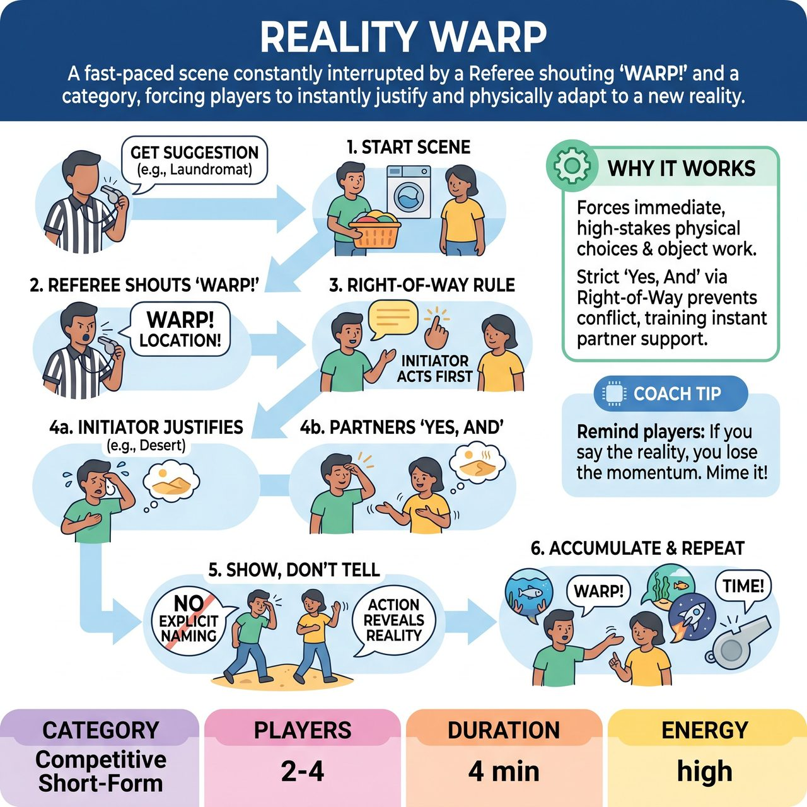

# Reality Warp

{ .game-hero }

> A fast-paced scene constantly interrupted by a Referee shouting 'WARP!' and a category, forcing players to instantly justify and physically adapt to a new reality.

## Overview
A fast-paced, competitive short-form game where players perform a scene that is constantly interrupted by the Referee shouting 'WARP!' followed by a category (like Location, Object, or Emotion). Players must instantly justify and physically adapt to the new reality without breaking the scene's momentum, showing rather than telling the audience what has changed.

## Setup
Requires 2-4 players from one team, an open stage, and a Referee with a whistle or a booming voice. No props are used; all objects must be mimed. The Referee asks the audience for a mundane starting location and a simple relationship to ground the scene before the chaos begins.

## How to Play
1. The Referee gets a starting suggestion from the audience (e.g., 'Two coworkers at a laundromat').
2. The players begin the scene, establishing their characters, the environment, and their objective.
3. At any peak moment or lull, the Referee shouts 'WARP!' followed by a category. There are two types of Warps: 'Open Warps' (e.g., 'WARP! Location!') where players invent the new reality, and 'Closed Warps' (e.g., 'WARP! Location: Inside a toaster!') where the Referee provides the specific reality to spike the difficulty.
4. RIGHT-OF-WAY RULE: To prevent players from initiating conflicting realities at the same time, the player who was currently speaking or performing the primary action when 'WARP!' was called becomes the Initiator. They must make the first physical or verbal choice to define the new reality.
5. The other players on stage must instantly 'Yes, And' the Initiator's choice, adapting their own physicality and dialogue to match the newly established reality.
6. SHOW, DON'T TELL: Players must never explicitly name the new reality. They must reveal it through action, mime, and contextual dialogue.
7. The scene continues, accumulating these warped realities, until the Referee blows the whistle to call time.

## Coaching Notes
- Referee controls pacing to prevent scenes from stalling.
- Categories can include Location, Object, Emotion, Relationship, or Status.
- Award points: +5 Points for an 'Epic Warp' (flawless, instant, and hilarious physical adaptation). +2 Points for a perfect 'Yes, And' from a supporting player.
- Call fouls: 'Explain Foul' (-2 points) for explicitly naming the new reality instead of acting it out; 'Delay Foul' (-2 points) for hesitating more than 2 seconds; 'Clash Foul' (-2 points) if a non-speaking player tries to steamroll the Initiator's right-of-way.
- The audience acts as the ultimate judge of whether a warp was successfully justified by cheering or groaning.

## Variations
- Audience Warp: The Referee divides the audience into sections, assigning each a category (Location, Object, Emotion). The Referee points to a section, and the audience yells their category to trigger the warp.
- Genre Warp: Instead of changing the physical reality, the Referee warps the cinematic or theatrical style (e.g., 'WARP! Film Noir!', 'WARP! Soap Opera!').

## Why It Works
It forces immediate, high-stakes physical choices and object work. Strict enforcement of the 'Yes, And' principle through the Right-of-Way rule prevents conflicting realities and trains players to instantly support their scene partner's choices.

## Safety & Inclusion
Physical safety is paramount during sudden shifts; players must be coached not to throw themselves to the floor or make reckless physical contact when a 'WARP!' is called. Referees must ensure 'Closed Warps' do not force players into physically inaccessible or unsafe postures. As a competitive short-form game, the content foul is strictly enforced to keep all content, justifications, and mimed objects family-friendly and free of crude or offensive material.

