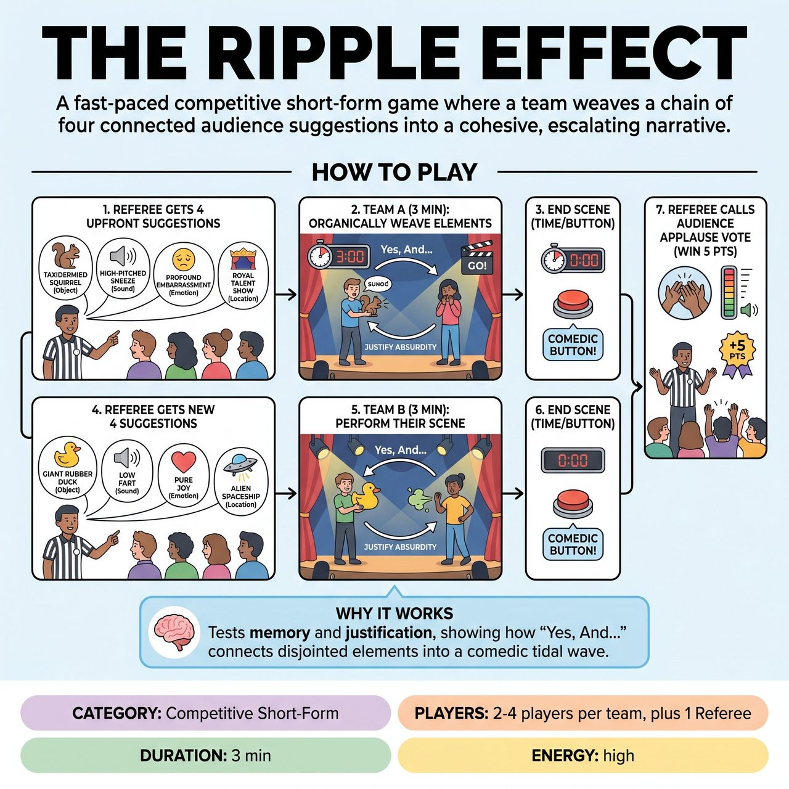

# The Ripple Effect

{ .game-hero }

> A fast-paced competitive short-form game where a team weaves a chain of four connected audience suggestions into a cohesive, escalating narrative.

## Overview
A fast-paced competitive short-form game where a team receives a chain of four connected audience suggestions upfront (an Object, its Sound, an Emotion it triggers, and a Location). The team has three minutes to perform a scene that organically weaves these four elements together into a cohesive, escalating narrative, demonstrating how one small prompt creates a tidal wave of comedic possibilities.

## Setup
Requires 2-4 players per team and a Referee. No props or set pieces are needed; everything is established through mime and object work. Played on a standard competitive short-form stage. The Referee stands downstage to interact with the audience before stepping aside for the scene.

## How to Play
1. The Referee steps forward and asks the audience for a chain of four connected suggestions, gathering them all upfront to preserve scene momentum.
2. First, the Referee asks for a distinct, unusual Object (e.g., 'a taxidermied squirrel').
3. Second, the Referee asks what Sound that specific object would make (e.g., 'a high-pitched sneeze').
4. Third, the Referee asks what Emotion that sound would evoke in a character (e.g., 'profound embarrassment').
5. Finally, the Referee asks for a Location where this would all take place (e.g., 'a live broadcast of a Royal Talent Show').
6. The Referee sets the clock for 3 minutes and yells 'Go!' for Team A.
7. Team A must perform a scene that takes place in the suggested Location, organically introducing the Object, having it make the Sound, and reacting with the Emotion.
8. Players must use 'Yes, And...' to justify why these absurd elements belong together in the same reality.
9. The scene continues until the 3-minute time limit is reached or the players find a strong, natural comedic button to end on.
10. Team B then takes the stage, the Referee gets a brand new chain of four suggestions from the audience, and Team B performs their 3-minute scene.
11. After both teams have performed, the Referee calls for an audience applause vote. The team that receives the loudest applause for their scene wins 5 points. Standard short-form fouls apply, such as the content foul (-1 point for inappropriate content) and the bad pun foul (-1 point for cheap puns).

## Coaching Notes
- Rely entirely on strong mime and object work, as the game requires zero physical props.
- Focus on memory and the ability to organically justify disjointed information.
- Gather all suggestions upfront to eliminate momentum-killing interruptions during the scene.
- Lean into the audience interaction during the setup, as they get to build the comedic premise step-by-step.

## Variations
- The Interrupted Ripple (Long-Form Hybrid): For a longer 4-5 minute scene, the Referee does NOT get the suggestions upfront. Instead, the scene starts with just an Object. Every 60 seconds, the Referee blows a whistle, freezes the scene, and asks the audience for the next element (Sound, then Emotion, then Location), forcing players to pivot their narrative on the spot.
- Blind Ripple: The playing team waits offstage or covers their ears while the audience gives the four suggestions to the Referee. The Referee then calls out the elements one by one while the scene is actively happening, forcing immediate, spontaneous justification.

## Why It Works
It tests players' memory and ability to organically justify disjointed information, demonstrating how one small prompt creates a tidal wave of comedic possibilities when players use 'Yes, And...' to connect absurd elements.

## Safety & Inclusion
The Referee must actively vet the 'Emotion' suggestion to ensure it is playable and safe, avoiding trauma-triggering or genuinely distressing emotions (e.g., swapping 'grief' for 'comedic melodrama' or 'mild annoyance'). Physical safety must be maintained: players should mime the objects and sounds without resorting to unsafe physical contact or throwing actual items. Content is strictly kept clean and all-ages, enforced by the content foul.

