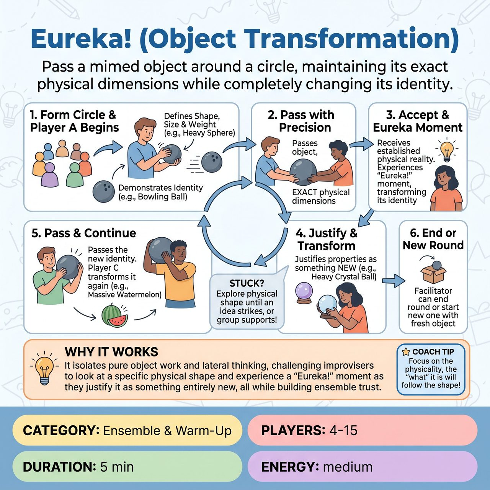

# Eureka! (Object Transformation)

{ .game-hero }

> Pass a mimed object around a circle, maintaining its exact physical dimensions while completely changing its identity.

## Overview
A fast-paced, collaborative circle warm-up where players pass a mimed object, strictly maintaining its physical dimensions and weight, but completely changing its function and identity. Stripped of competitive pressure, this exercise isolates pure object work and lateral thinking, challenging improvisers to look at a specific physical shape and experience a 'Eureka!' moment as they justify it as something entirely new.

## Setup
Players stand or sit in a single circle. No props or stage space are required. A facilitator leads the exercise from within or just outside the circle.

## How to Play
1. The facilitator asks the group to form a circle.
2. Player A begins by molding a mimed object with their hands, clearly establishing its size, shape, and weight (e.g., a heavy, round sphere).
3. Player A interacts with the object for a few seconds to demonstrate what it is (e.g., rolling it down an imaginary lane like a bowling ball).
4. Player A then carefully passes the object to Player B, making sure to maintain its exact physical dimensions and weight during the handoff.
5. Player B receives the object, physically accepting its established reality. They must not change its shape or weight.
6. Player B then has a 'Eureka!' moment: they must justify those exact physical properties as a completely different object. For example, they take the heavy, round sphere, hold it up to their face, and gaze into it like a fortune teller's crystal ball.
7. Player B passes the heavy sphere to Player C, who might heft it onto their shoulder and tap it like a massive, ripe watermelon.
8. The object continues around the circle. If a player gets stuck, they can simply explore the physical shape with their hands until an idea strikes, or the group can gently call out suggestions to support them.
9. Once the object has made it all the way around the circle, the facilitator can have the last person 'destroy' or 'put away' the object, and start a new round with a completely different starting shape (e.g., a long, thin, weightless string).

## Coaching Notes
- Focus heavily on object work, mime, and physical endowment.
- If a player struggles to think of a new object, encourage them to just feel the weight and shape first; the physical action often triggers the mental idea.
- Remind players that there are no points, fouls, or judges. The reward is the collective laughter and 'aha!' moments from the ensemble when a player finds a clever or surprising justification.
- Encourage rapid-fire justification and lateral thinking.
- Build ensemble trust by removing competitive pressure and focusing on shared discovery.

## Variations
- Speed Round: Once the group is comfortable, the facilitator claps a steady, upbeat rhythm. Players must receive, justify, and pass the object within 3-5 seconds, relying purely on instinct rather than overthinking.
- The Morphing Object: Instead of keeping the shape identical, the object is allowed to stretch, shrink, or change weight during the pass. However, the receiver must perfectly accept whatever new physical state it arrives in and justify that new shape.
- Sound & Motion: Players must add a specific sound effect to their new object when they demonstrate its use, engaging vocal warm-up alongside physical mime.

## Why It Works
It isolates pure object work and lateral thinking, challenging improvisers to look at a specific physical shape and experience a 'Eureka!' moment as they justify it as something entirely new, all while building ensemble trust.

## Safety & Inclusion
Mime is highly adaptable; players can participate while seated or using whatever range of motion they possess. The facilitator should emphasize that there are no 'wrong' ideas in a warm-up. The group is encouraged to cheer and support each other's choices.

