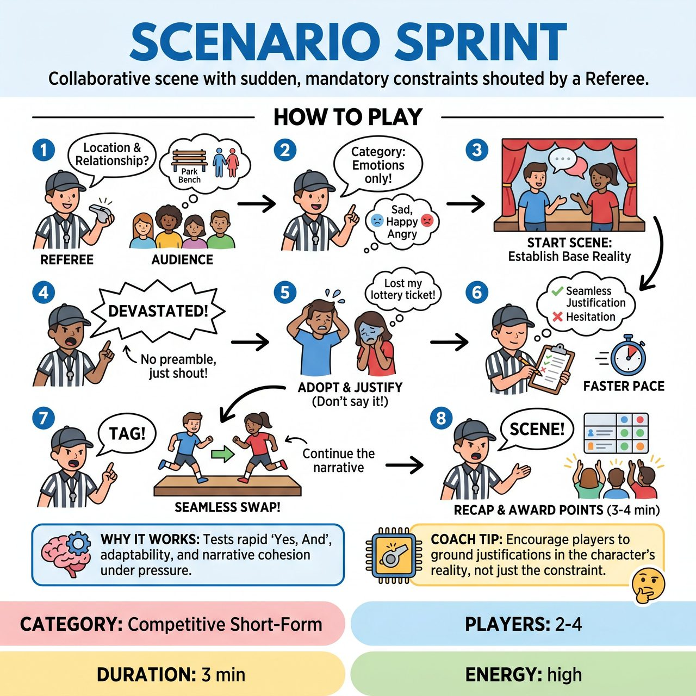

# Scenario Sprint

{ .game-hero }

> Two teams collaborate on a continuous scene while instantly adopting and justifying sudden, mandatory constraints shouted by a Referee.

## Overview
Scenario Sprint is a high-energy, competitive short-form game where two teams collaborate on a continuous scene while a Referee shouts out sudden, mandatory constraints. Players must instantly adopt and justify these new constraints without breaking the reality of the scene. By limiting the categories of constraints per round and scoring silently, the game delivers fast-paced comedic entertainment without devolving into unstructured chaos.

## Setup
Format is a competitive short-form match with 2 to 4 players (1 or 2 per team) and a Referee. The Referee stands downstage or on the sidelines with a clipboard to silently tally points. No props are used; all object work is mimed. The audience provides the initial suggestion (a mundane location and a relationship) and cheers to indicate their favorite justifications.

## How to Play
1. The Referee gets a mundane location and a relationship from the audience to ground the scene.
2. The Referee announces the specific 'Constraint Category' for the round to keep the scene focused (e.g., 'In this round, I will only call out Emotions' or 'Only Movie Genres').
3. Two players (one from each team) begin the scene, establishing the base reality and relationship.
4. The Referee shouts a new constraint from the chosen category (e.g., 'Devastated!' or 'Film Noir!') directly into the scene. There is no whistle or preamble; the Referee simply barks the constraint to keep the momentum going.
5. Players must immediately adopt the new constraint and justify why it makes sense in the current narrative. They must not explicitly name the constraint.
6. The Referee silently tallies points on a clipboard for seamless justifications and notes any fouls for hesitation or breaking character.
7. As the scene progresses, the Referee calls constraints at a faster pace. The Referee may yell 'Tag!' to swap in the remaining team members, who must seamlessly inherit the exact same scene and current constraint.
8. After 3 to 4 minutes, the Referee calls 'Scene!', recaps the best justifications for the audience, and awards the final points.

## Coaching Notes
- Teams earn +1 point for each seamless, instantly justified transition, and +2 points for a brilliant narrative justification that ties the random constraint perfectly into the plot.
- A 'Stumble Foul' (-1 point) is given if a player hesitates, drops character, or explicitly names the constraint (e.g., saying 'Why are we in a Film Noir?').
- A 'Content Foul' (-1 point) is called for inappropriate content.
- The Referee tallies points silently during play to maintain scene flow and theatrical illusion, awarding them at the end.
- Category-limited constraints prevent the narrative from devolving into complete chaos.
- The audience's laughter helps the Referee gauge the success of the justifications.

## Variations
- The Gauntlet: Instead of sticking to one category, the Referee deliberately escalates the categories over time. Minute 1 is only Emotions, Minute 2 is Physical Quirks, and Minute 3 is Genres, building the chaos in a structured way.
- Audience Sprints: Before the show, the audience writes down emotions or genres on slips of paper. The Referee draws and reads these directly during the scene, adding an element of crowd-sourced unpredictability.

## Why It Works
It tests improvisers' ability to rapidly 'Yes, And' random offers, demanding quick wit and narrative cohesion under pressure. The high-energy escalation tests adaptability and active listening.

## Safety & Inclusion
Physical safety is paramount; players should be reminded not to make sudden, dangerous physical choices (like dropping to the floor) when startled by a constraint call. The Referee should tailor constraints to the physical abilities of the performers, avoiding ableist tropes or demands for specific physical acrobatics. The strict enforcement of the Content Foul ensures content remains family-friendly and respectful.

