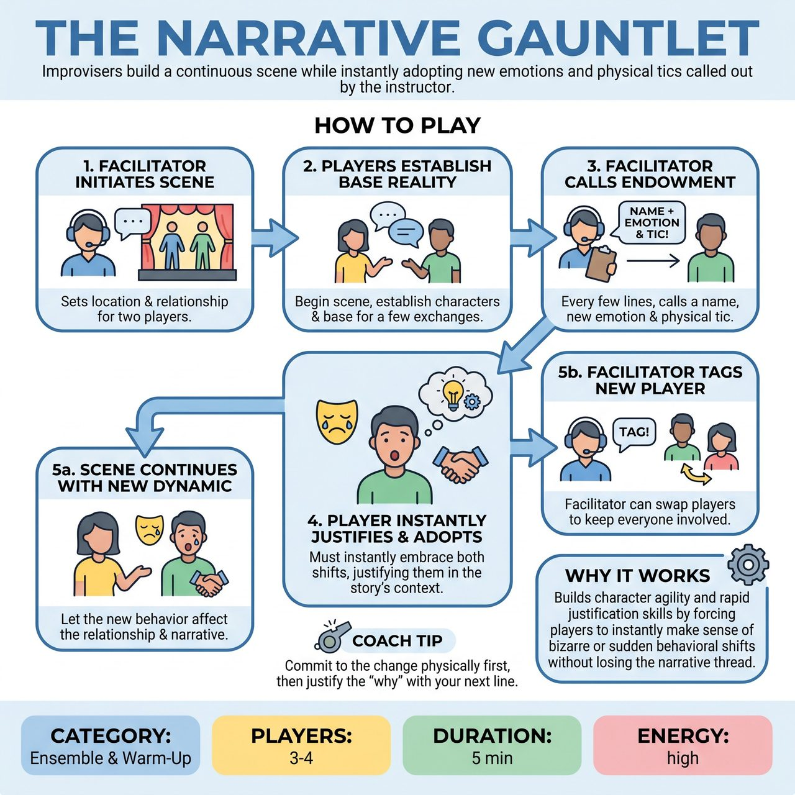

# The Narrative Gauntlet

{ .game-hero }

> Improvisers build a continuous scene while instantly adopting new emotions and physical tics called out by the instructor.

## Overview
The Narrative Gauntlet is a fast-paced, facilitator-led training game where improvisers build a continuous scene while instantly adopting new emotions and physical tics called out by the instructor. Designed to build character agility and rapid justification skills, the exercise challenges players to commit fully to sudden shifts in their behavior without losing the underlying narrative thread or their connection to their scene partner.

## Setup
Three to four players step up to the playing area while the rest of the ensemble observes from the audience or backline. The facilitator stands downstage or in the house with a pre-written list of distinct emotions (e.g., euphoric, deeply suspicious, apathetic) and physical tics (e.g., heavy feet, leading with the chin, constantly adjusting clothing). The facilitator gets a starting location and relationship from the observing group to ground the scene.

## How to Play
1. The facilitator initiates a two-person scene based on the suggested location and relationship.
2. The players begin the scene, establishing their characters and the base reality for a few exchanges.
3. Every four to six lines of dialogue, the facilitator calls out a player's name followed by an emotion and a physical tic from their pre-written list, such as 'Sarah: Furious and swatting invisible flies!'
4. The named player must instantly adopt both the emotion and the physical tic, seamlessly justifying this sudden change within the reality of the scene.
5. The players continue the scene for several exchanges, allowing the new dynamic to affect their relationship and the narrative rather than immediately swapping out.
6. The facilitator continues to inject new endowments for different players on stage to keep them on their toes.
7. To involve the whole group, the facilitator can occasionally call 'Tag!' and name a backline player to replace someone on stage, immediately giving the new player a fresh emotion and tic to enter with.

## Coaching Notes
- Rapid Justification: Forces players to instantly make sense of bizarre or sudden behavioral shifts within the context of the story.
- Physical and Emotional Agility: Trains improvisers to make strong, immediate choices rather than staying in their heads.
- Continuous Pacing: Using a pre-written list eliminates the dead air of polling an audience mid-scene.
- Ensemble Focus: Keeps the backline engaged as they must watch the narrative closely to tag in seamlessly.

## Variations
- Internal Gauntlet: Instead of the facilitator calling out specific traits, they simply ring a bell. The player currently speaking must instantly invent and justify a brand new emotion and physical tic for themselves.
- Status Gauntlet: Instead of emotions and tics, the facilitator calls out extreme status shifts (e.g., 'High Status' or 'Low Status') to train power dynamics in relationships.

## Why It Works
It builds character agility and rapid justification skills by forcing players to instantly make sense of bizarre or sudden behavioral shifts within the context of the story, without losing the underlying narrative thread or their connection to their scene partner.

## Safety & Inclusion
Facilitators must ensure that physical tics on their pre-written list do not mock real-world disabilities, neurodivergent traits, or medical conditions. Focus instead on neutral physicalities like 'moving as if underwater' or 'leading with the nose.' Players are encouraged to modify any physical prompt to accommodate their own mobility needs or physical boundaries. Remind the ensemble that sudden emotional shifts (like anger) should be directed at the situation or the character's internal state, not aggressively at the scene partner's physical person.

