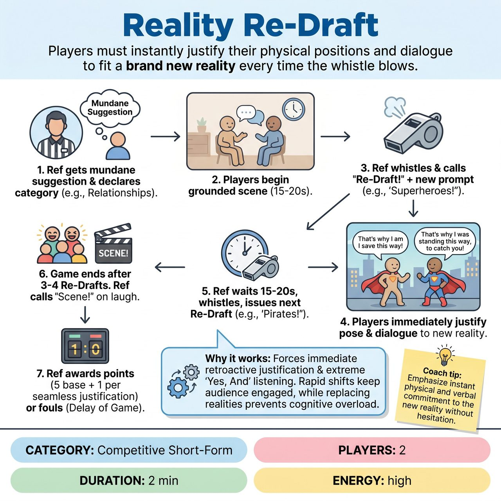

# Reality Re-Draft

{ .game-hero }

> Players must instantly justify their physical positions and dialogue to fit a brand new reality every time the whistle blows.

## Overview
A fast-paced competitive short-form game where two players begin a mundane scene, only for the Referee to blow the whistle and 'Re-Draft' their reality. The Referee assigns a new context, such as a new relationship or genre, and the players must instantly justify their current physical positions and previous dialogue to fit this new truth. To keep the scene grounded and hilarious, new re-drafts completely replace previous ones rather than stacking, and the game is capped at three or four rapid-fire shifts before calling scene.

## Setup
Requires two players, a Referee with a whistle, and no props. The Referee asks the audience for a mundane, everyday activity (e.g., 'folding laundry' or 'waiting at the DMV') and announces the single Re-Draft Category for the round (e.g., 'Relationships' or 'Movie Genres').

## How to Play
1. The Referee gets a mundane suggestion from the audience and declares the single category for the game (e.g., 'Tonight's category is Relationships').
2. The two players begin a grounded scene based on the mundane suggestion.
3. After 15 to 20 seconds, the Referee blows the whistle and calls 'Re-Draft!' followed by a new prompt from the chosen category (e.g., 'Re-Draft! You are a superhero and a supervillain!').
4. The players must immediately resume the scene, retroactively justifying whatever they were just doing or saying to fit this new reality. The new reality completely replaces the old one; they do not stack.
5. The Referee lets the new reality play out for 15 to 20 seconds, then blows the whistle to issue another Re-Draft in the same category (e.g., 'Re-Draft! You are a dentist and a nervous patient!').
6. The game concludes after exactly 3 or 4 Re-Drafts. The Referee calls 'Scene!' on the biggest laugh of the final reality.
7. The Referee awards 5 points for the scene, plus 1 bonus point for every seamless, instant justification of a new reality. Fouls are called for 'Delay of Game' (hesitating) or the 'clean-content foul' (inappropriate content).

## Coaching Notes
- Ensure players do not stack realities; the new reality must completely replace the old one to prevent cognitive overload.
- Watch for the 'Delay of Game' foul. Players hesitating or struggling to adapt should be called out to keep the pace high.
- Encourage players to commit hard to their physical positions when the whistle blows, as justifying awkward physical poses provides the biggest laughs.
- The Referee should time the final 'Scene!' call perfectly on the biggest laugh of the last reality.

## Variations
- Head-to-Head Re-Draft: Team A plays a scene with 3 Re-Drafts. Then Team B plays a scene starting from the exact same mundane suggestion but receives 3 completely different Re-Drafts. The audience applauds to decide the winner.
- Genre Re-Draft: Instead of relationships, the Referee only changes the cinematic style (e.g., 'Film Noir', 'Sci-Fi Horror', 'Romantic Comedy').
- Location Re-Draft: The relationship stays the same, but the location constantly shifts (e.g., 'You are now on the moon!', 'You are now inside a whale!').

## Why It Works
It forces immediate retroactive justification and extreme 'Yes, And' listening. The rapid shifts keep the audience highly engaged, while replacing realities instead of stacking them prevents cognitive overload for the performers.

## Safety & Inclusion
Because players must freeze on the whistle and instantly adapt, they should avoid lifting each other or engaging in precarious physical positions. The Referee must enforce the clean-content foul strictly to keep the rapid-fire justifications family-friendly and safe for all ages.

