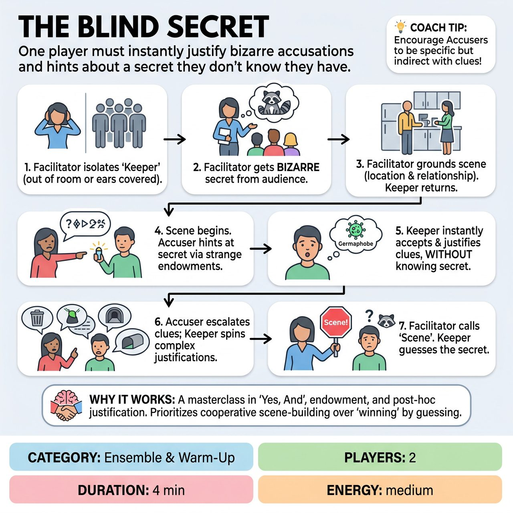

# The Blind Secret

{ .game-hero }

> One player must instantly justify bizarre accusations and hints about a secret they don't know they have.

## Overview
A facilitator-led improvisational exercise focusing on endowment and post-hoc justification. One player (The Accuser) knows a bizarre secret that the other player (The Keeper) supposedly harbors. The Keeper has no idea what their own secret is. As The Accuser drops hints and endows The Keeper with strange behaviors, The Keeper must instantly 'Yes, And' and justify these accusations as true, building a logical, hilarious reality out of entirely unknown circumstances.

## Setup
Format: Improv exercise (Ensemble & Warm-Up). Players: 2 (The Accuser and The Keeper). Facilitator: 1. Props: Two chairs. Space: Open stage or classroom. No special lighting or sound required.

## How to Play
1. The Facilitator asks The Keeper to step out of the room or cover their ears so they cannot hear the audience.
2. The Facilitator asks the ensemble/audience for a bizarre, specific secret that The Keeper's character is hiding (e.g., 'You are secretly a family of raccoons in a trench coat', 'You are embezzling funds to build a time machine'). The Accuser memorizes this secret.
3. The Facilitator gets a mundane location and relationship to ground the scene (e.g., 'Co-workers in a breakroom', 'Roommates cleaning the kitchen'). The Keeper returns to the space.
4. The scene begins. The Accuser initiates dialogue, treating The Keeper as if the secret is absolutely true. They must not state the secret outright, but instead endow The Keeper with related behaviors or ask pointed questions (e.g., 'Why do you keep washing your food in the sink?').
5. The Keeper must immediately accept and justify these endowments without knowing the underlying secret (e.g., 'I am a germaphobe, okay? The sponge is filthy!').
6. The Accuser escalates the endowments, forcing The Keeper to spin an increasingly complex web of justifications to explain away the bizarre 'clues'.
7. The Facilitator calls 'Scene' after 3-4 minutes when the justifications reach a comedic peak. The Facilitator then asks The Keeper to guess what their secret was, based entirely on the bizarre reality they just built.

## Coaching Notes
- The joy for the audience comes from dramatic irony watching The Keeper's frantic mental gymnastics as they confidently justify absurd accusations.
- The Accuser must not state the secret outright, but instead endow The Keeper with related behaviors or ask pointed questions.
- Remind players this is non-competitive. There are no points or fouls, and the goal is cooperative scene-building, not just guessing correctly.

## Variations
- The Interrogation (Group Scale): Three players act as Detectives interrogating one Suspect. The Suspect does not know their bizarre crime. The Detectives lay out the 'evidence' one by one, and the Suspect must justify every piece of evidence.
- The Tell-Tale Heart (Narrative Focus): The Keeper occasionally steps out of the scene to deliver an aside/monologue to the audience, explaining their frantic internal logic and what they think is going on, before returning to the scene.

## Why It Works
It is a masterclass in 'Yes, And', active listening, endowment, and post-hoc justification. By removing the strict requirement to 'guess correctly' to win, the game prioritizes cooperative scene-building and character logic over a pass/fail mechanic.

## Safety & Inclusion
The Facilitator must strictly vet the secret to ensure it is all-ages, clean, and free from sensitive triggers (e.g., real-world trauma, phobias, or non-consensual themes). Endowments should be strictly verbal and behavioral; The Accuser must not physically force The Keeper into uncomfortable physical positions or unwanted touch to prove a point.

