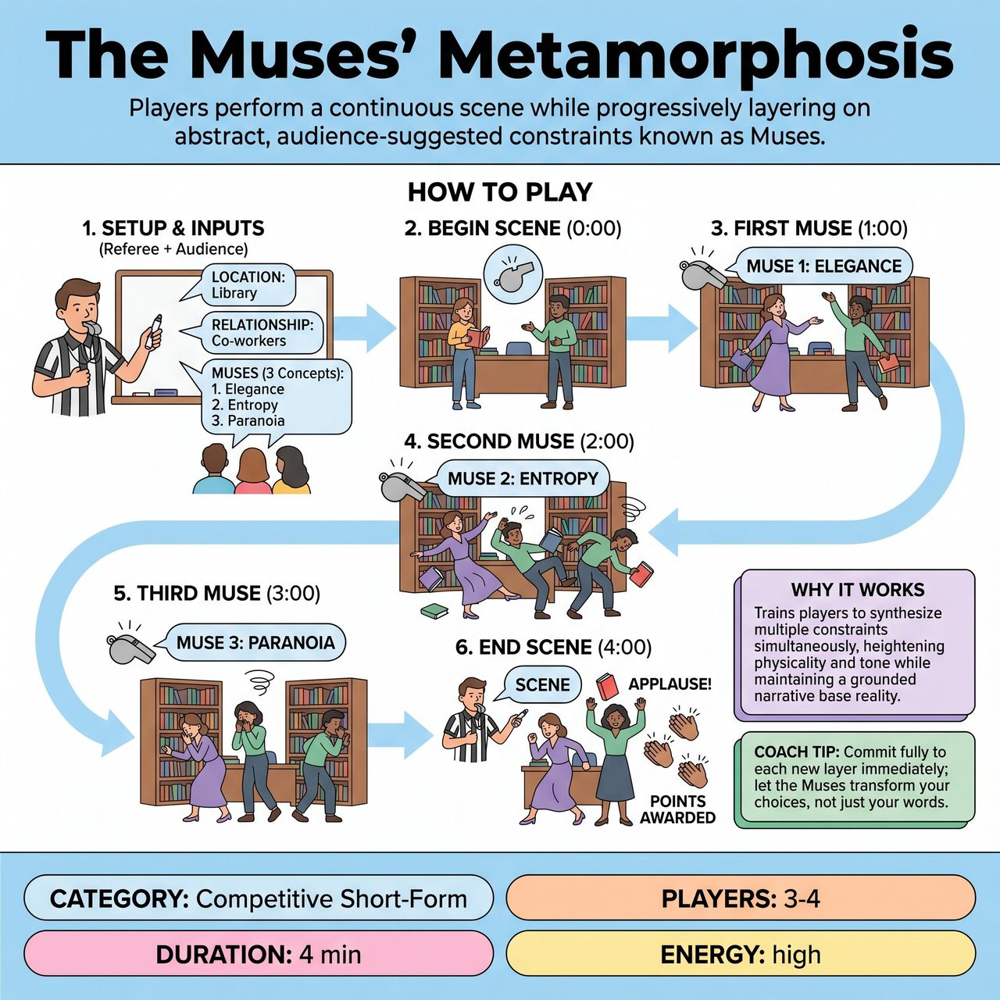

# The Muses' Metamorphosis

{ .game-hero }

> Players perform a continuous scene while progressively layering on abstract, audience-suggested constraints known as Muses.

## Overview
In this short-form game, a single team performs a continuous scene while the Referee periodically layers on abstract, audience-suggested constraints known as Muses. As the scene progresses, the players must seamlessly adopt concepts like Elegance, Entropy, or Paranoia into their characters and environment without losing the narrative thread, culminating in a hilarious, multi-layered climax.

## Setup
Requires 3 to 4 players from one team, a Referee with a whistle and a stopwatch, and a whiteboard or screen visible to the players and audience. The Referee asks the audience for a location, a relationship, and three abstract concepts or styles (the Muses) such as Serendipity, Clamor, or Stagnation. The Referee writes the three Muses on the board.

## How to Play
1. The Referee introduces the game, explains the concept of the Muses, and collects the location, relationship, and three abstract concepts from the audience, writing the concepts on the whiteboard.
2. The Referee starts a 4-minute timer and blows the whistle to begin. The players initiate a grounded scene based on the location and relationship, establishing clear characters and a base reality.
3. At the 1-minute mark, the Referee blows the whistle and calls out the first Muse from the board. The players must immediately absorb this abstract concept into the scene, altering their physicality, dialogue, and tone to embody it while continuing the story.
4. At the 2-minute mark, the Referee blows the whistle and calls out the second Muse. The players must now layer this new concept on top of the first one, synthesizing both constraints simultaneously.
5. At the 3-minute mark, the Referee calls out the third and final Muse. The players must integrate all three concepts at once, driving the scene toward a heightened, chaotic, yet narratively satisfying climax.
6. At the 4-minute mark, the Referee blows the whistle to call Scene. Points are awarded based on the audience's applause and the team's ability to maintain the narrative under mounting constraints.

## Coaching Notes
- The Referee awards up to 5 points at the end of the scene based on the volume of the audience's applause.
- The Referee actively monitors for content and can blow the whistle to call standard fouls, such as a clean-content foul for inappropriate language or a delay of game foul if players ignore the called Muse.
- Remind players to maintain the narrative thread and base reality; the Muses should color the scene, not completely derail the story.

## Variations
- Beginner Muses: Instead of abstract concepts, use strong, distinct emotions or movie genres to help newer players grasp the layering mechanic.
- Opposites Attract: The Referee specifically curates the audience suggestions to ensure the three Muses are wildly contradictory, forcing the players to justify impossible combinations.

## Why It Works
It trains players to synthesize multiple constraints simultaneously, heightening physicality and tone while maintaining a grounded narrative base reality.

## Safety & Inclusion
The Referee must actively curate the audience's abstract suggestions to ensure they remain family-friendly and safe to play. Concepts that touch on real-world trauma, mental illness, or inappropriate themes must be immediately vetoed and replaced with playful, theatrical concepts. Players are reminded to respect physical boundaries, especially during the chaotic final minute when multiple constraints are active.

