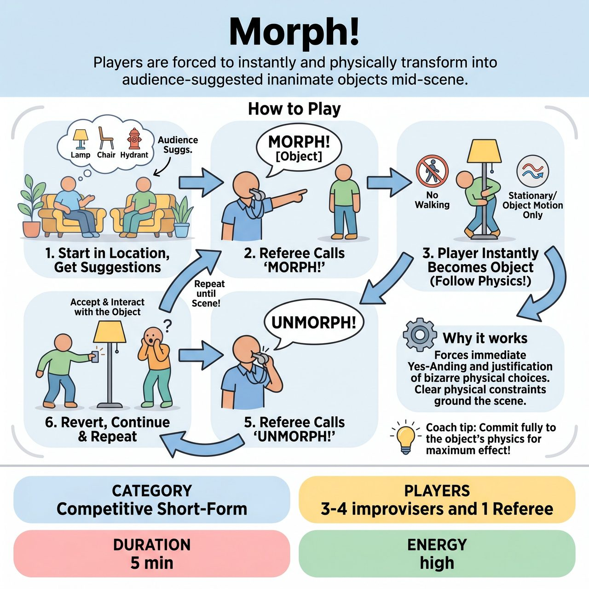

# Morph!

{ .game-hero }

> Players are forced to instantly and physically transform into audience-suggested inanimate objects mid-scene.

## Overview
A fast-paced, competitive short-form game where players begin a scene in a mundane location. At the Referee's whistle, a player is forced to instantly and physically transform into an audience-suggested inanimate object. The remaining players must immediately justify and physically interact with this 'living object' until the Referee calls 'Unmorph!'

## Setup
The stage is completely bare (no chairs or set pieces). The Referee needs a clipboard and pen to record suggestions. Best played in a competitive short-form match.

## How to Play
1. 1. Gather Suggestions Upfront: The Referee asks the audience for a mundane, everyday location. Then, the Referee asks the audience to shout out 3 to 4 inanimate objects you would typically find in that location. The Referee writes these on their clipboard.
2. 2. Scene Initiation: The players begin a grounded, fast-paced scene in the suggested location, establishing their human characters and relationships.
3. 3. The 'Morph' Call: At any point, the Referee blows their whistle, points at one specific player, and shouts 'MORPH into [Object from the list]!'
4. 4. The Transformation: The chosen player must instantly drop their human character and physically contort their body to become that object.
5. 5. Object Physics (Crucial Rule): The morphed player cannot walk around on two legs like a human. They must remain stationary OR move only as the object would (e.g., rolling, sliding, or being carried by other players). They can speak and make sound effects, but only in the 'voice' or persona of the object.
6. 6. Justification and Interaction: The remaining human players must instantly accept this new object, physically interact with it, and justify its sudden appearance in the narrative.
7. 7. The 'Unmorph' Call: After 30-60 seconds of exploring the object, the Referee blows the whistle and shouts 'UNMORPH!' The player instantly reverts to their original human character, and the scene continues as if nothing happened.
8. 8. Game End: The Referee continues to trigger Morphs and Unmorphs using the remaining objects on the clipboard until calling 'Scene!' at a high point of comedic energy.

## Coaching Notes
- The audience provides the location and the list of objects before the scene begins, preventing mid-scene stalling.
- The Referee awards points to players for exceptional physical choices or seamless justifications.
- The Referee can also call a 'Humanity Foul' (deducting points) if an object-player breaks physics by walking around like a normal person.
- Highly physical and visually entertaining for the audience.
- Gives the Referee a fun, active role in pacing the scene and injecting chaos.

## Variations
- Morph Roulette: The Referee does not point to a specific player. Instead, they just blow the whistle and yell 'MORPH into [Object]!' The last player to have spoken before the whistle blew is the one who must transform.
- Chain Morph: Instead of calling 'Unmorph', the Referee blows the whistle and morphs a SECOND player into a different object. This leaves only one human player frantically trying to interact with multiple living objects at once.

## Why It Works
Forces immediate Yes-Anding and justification of bizarre physical choices. Clear physical constraints ('Object Physics') ground the scene and prevent it from becoming a muddy free-for-all.

## Safety & Inclusion
Physical Safety: Players must establish consent and be mindful of physical limitations before lifting, dragging, or heavily manipulating an 'object-player'. Object-players should choose safe physical positions (avoiding resting all their weight on knees, neck, or wrists). Content Safety: The Referee filters audience suggestions to ensure all objects are clean, all-ages appropriate, and safe to physically embody.

