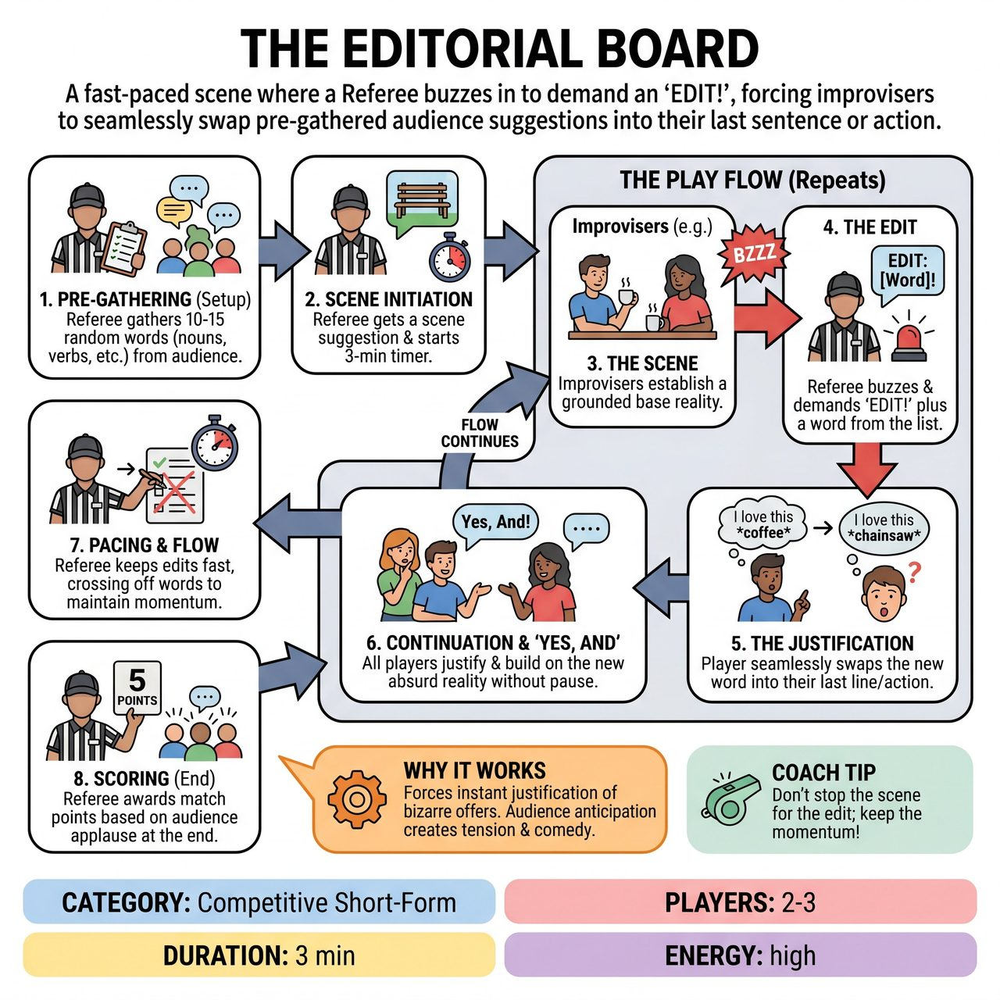

# The Editorial Board

{ .game-hero }

> A fast-paced scene where a Referee buzzes in to demand an 'EDIT!', forcing improvisers to seamlessly swap pre-gathered audience suggestions into their last sentence or action.

## Overview
A fast-paced short-form game where improvisers perform a scene, but the Referee frequently interrupts with a buzzer to demand an 'EDIT!' The Referee instantly supplies a pre-gathered audience suggestion, and the improviser must seamlessly swap it into their last sentence or action, justifying the bizarre new reality without missing a beat.

## Setup
2-3 players from one team. 1 Referee (host). Props: A buzzer, bell, or whistle for the Referee, plus a clipboard and pen to record audience suggestions before the scene.

## How to Play
1. Pre-Gathering: Before the scene begins, the Referee asks the audience for a rapid-fire list of 10-15 random nouns, verbs, emotions, and physical actions, writing them down on a clipboard.
2. Scene Initiation: The Referee gets a standard scene suggestion (e.g., a mundane location or relationship) and starts the scene (typically 3 minutes).
3. The Scene: The improvisers begin the scene, establishing a grounded base reality so the upcoming edits have comedic contrast.
4. The Edit: At any moment, the Referee hits the buzzer and yells 'EDIT!' followed immediately by one of the words from their list (e.g., *BZZZ* 'EDIT: Chainsaw!').
5. The Justification: The improviser who just spoke or acted must instantly repeat their last line or action, replacing the core noun, verb, or emotion with the Referee's word. For example, Player 1 says, 'I brought you this beautiful bouquet of roses.' Referee: *BZZZ* 'EDIT: Chainsaw!' Player 1: 'I brought you this beautiful bouquet of chainsaws. I know you've been having trouble with those giant weeds.'
6. Continuation: The improviser must then continue the scene, justifying this absurd new reality. Scene partners must instantly 'Yes, And' the new reality.
7. Pacing and Flow: The Referee crosses off words as they are used. The edits should come fast and unexpectedly, without stopping the momentum of the scene.
8. Scoring: At the end of the scene, the Referee awards match points (e.g., 5 points) based on audience applause. The Referee can call a 'Delay of Game' foul if a player freezes or argues with an edit, deducting a point or awarding it to the opposing team.

## Coaching Notes
- Establish a grounded base reality early on so the upcoming edits have comedic contrast.
- Pre-gathered suggestions eliminate mid-scene stalling, ensuring rapid-fire pacing.
- The Referee has a clear, structured, and powerful role to direct the scene's chaos. They should keep edits fast and unexpected.
- Watch out for players freezing or arguing with an edit; enforce the 'Delay of Game' foul to maintain momentum.

## Variations
- The Rival Board: The opposing team writes the list of 10-15 edits instead of the audience, trying to come up with the most challenging (but clean) words possible.
- Action & Emotion Only: Instead of nouns and verbs, the Referee only gathers and edits physical actions and emotional states (e.g., *BZZZ* 'EDIT: Furious!' or *BZZZ* 'EDIT: Churning butter!').

## Why It Works
It forces players to instantly justify bizarre, disconnected offers. Pre-gathering the suggestions keeps the audience highly invested in when their specific word will be deployed, providing clear moments of comedic tension and release.

## Safety & Inclusion
The Referee acts as a filter during the pre-gathering phase, ensuring all words and actions on the list are clean, all-ages appropriate, and physically safe to perform. Players should prioritize physical safety over literal execution if given a demanding action edit (e.g., miming a dangerous action rather than attempting it practically).

