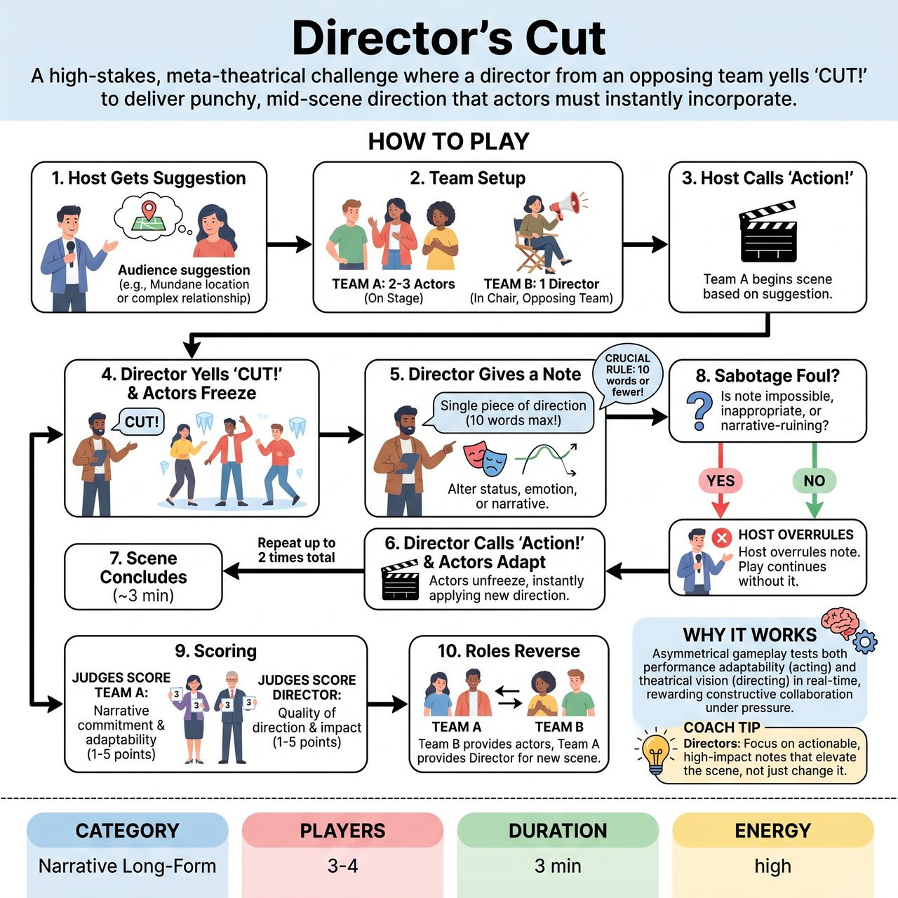

# Director's Cut

{ .game-hero }

> A high-stakes, meta-theatrical challenge where a director from an opposing team yells 'CUT!' to deliver punchy, mid-scene direction that actors must instantly incorporate.

## Overview
A high-stakes, meta-theatrical challenge where two teams collaborate and compete simultaneously. While Team A performs a scene, a designated 'Director' from Team B can yell 'CUT!' to deliver a punchy, mid-scene piece of direction. Team A must instantly adapt and incorporate the note. Scored by a panel of judges, the game rewards the actors for their seamless adaptability and the director for genuinely elevating the narrative, while strictly penalizing any attempts to sabotage the opposing team.

## Setup
Format: Competitive short-form match (Judged / Narrative Long-Form). Staging: An open stage for the actors, with a distinct 'Director's Chair' placed downstage left or right. Personnel: A Host to manage the game and enforce fouls, plus a panel of 3 Judges with scorecards (1-5).

## How to Play
1. The Host gets a suggestion from the audience (e.g., a mundane location or a complex relationship).
2. Team A provides 2-3 actors. Team B provides 1 Director who sits in the Director's Chair.
3. The Host calls 'Action!' and Team A begins improvising the scene based on the suggestion.
4. At any point, the Director from Team B can loudly yell 'CUT!' The actors on stage must instantly freeze in their current physical positions.
5. The Director gives a single piece of direction to alter the scene's status, emotion, or narrative trajectory. CRUCIAL RULE: The note must be 10 words or fewer (e.g., 'Play this like you are hiding a dead body', or 'Actor 1, drop your status completely').
6. Immediately after delivering the note, the Director calls 'Action!' The actors unfreeze and resume the scene, instantly applying the new direction.
7. The Director may only call 'CUT!' a maximum of two times per scene. The scene lasts approximately 3 minutes.
8. If a note is physically impossible, inappropriate, or clearly designed to ruin the narrative (e.g., 'Face the back wall and whisper for two minutes'), the Host blows a whistle for a 'Sabotage Foul'. The note is vetoed, Team B loses 1 point, and the scene resumes as it was.
9. After the scene concludes, scoring occurs: Judges hold up scorecards (1-5 points) for Team A based on narrative commitment and adaptability. Judges then give a Thumbs Up (+1 point), Neutral (0 points), or Thumbs Down (-1 point) for Team B's Director based on whether the notes genuinely elevated the scene's theatricality.
10. The roles reverse. Team B provides the actors, and Team A provides the Director for a new scene.

## Coaching Notes
- Enforce the 10-Word Limit strictly. It forces the Director to be punchy and precise, maintaining the scene's energy and preventing momentum-killing monologues.
- Use the Sabotage Foul to protect the integrity of the scene and force the opposing team to use strategic, constructive coaching rather than cheap tricks.
- Ensure judges cleanly separate performance from direction, using the 'Scene Score' for actors and the 'Modifier Score' for the director.
- Encourage actors to fully commit to the new direction the moment 'Action!' is called, without hesitating or breaking character.

## Variations
- Genre Cut: The Director is only allowed to change the theatrical genre or style of the scene (e.g., 'Do it as a Film Noir', 'Switch to Soap Opera').
- Internal Monologue: Instead of a general note, the Director taps a frozen actor and dictates their character's secret inner thought, which the actor must then use to drive their next actions.
- Ensemble Warm-up (Non-Competitive): The facilitator plays the Director to train students on immediate emotional pivots, listening, and taking direction without dropping character or taking notes personally.

## Why It Works
The asymmetrical gameplay tests both performance adaptability (acting) and theatrical vision (directing) in real-time. The 10-word limit and Sabotage Foul force the director to provide genuinely constructive, high-impact notes rather than derailing the narrative, while actors practice immediate, seamless pivots.

## Safety & Inclusion
The 'Sabotage Foul' explicitly prevents unsafe, physically demanding, or inappropriate notes. Actors are empowered to drop or modify a note if it violates their physical boundaries, with the Host stepping in to enforce safety. The 10-word limit prevents the Director from monopolizing stage time or talking down to performers, ensuring a respectful, collaborative environment even within a competitive frame.

