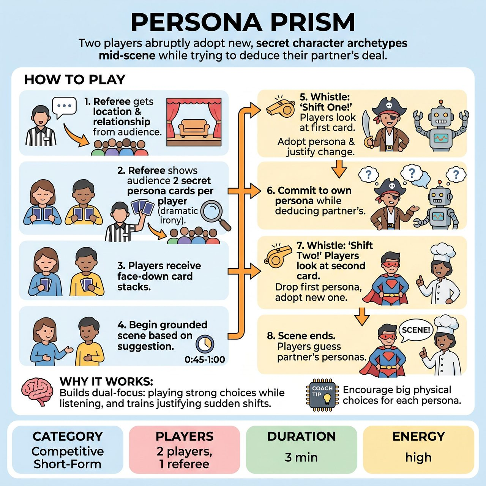

# Persona Prism

{ .game-hero }

> Two players abruptly adopt new, secret character archetypes mid-scene while trying to deduce their partner's deal.

## Overview
Persona Prism is a fast-paced improv game where two players must abruptly adopt new, secret character archetypes mid-scene. The audience is shown the upcoming personas in advance, creating hilarious dramatic irony as the players struggle to integrate their new personalities while simultaneously trying to deduce their partner's deal.

## Setup
Requires 2 players and 1 referee. Prepare a deck of 30 or more 'Persona Cards' featuring strong archetypes, rhetorical styles, or points of view (e.g., 'Noir Detective', 'Town Gossip', 'Kindergarten Teacher', 'Conspiracy Theorist').

## How to Play
1. The referee gets a location and relationship suggestion from the audience.
2. The players close their eyes. The referee draws two cards for Player A and two for Player B, showing them clearly to the audience to establish dramatic irony.
3. The referee hands the face-down, two-card stacks to the players, who pocket them or place them on the floor nearby.
4. The players begin a grounded, normal scene based on the audience suggestion.
5. After 45 to 60 seconds, the referee blows the whistle and calls 'Shift One!' Players instantly look at their first card, adopt that persona, and justify the sudden change in their character's behavior.
6. Players interact, fully committing to their own persona while trying to figure out their partner's.
7. After another 45 to 60 seconds, the referee calls 'Shift Two!' Players look at their second card, completely dropping the first persona for the new one.
8. The scene runs for a final minute before the referee calls 'Scene!' Players then guess their partner's personas for bonus points.

## Coaching Notes
- Encourage players to seamlessly justify the sudden shifts in their character's behavior.
- Remind players of the dual-focus challenge: they must play their own strong choice while actively listening to deduce their partner's deal.
- The audience acts as co-conspirators; lean into the dramatic irony of the crowd knowing the personas in advance.
- The referee awards points based on the seamlessness of justifications, with bonus points for correctly guessing the partner's personas at the end.
- Keep the shifts limited to two per player to allow the scene and characters to breathe.

## Variations
- Emotional Prism: Instead of character archetypes, use strong, specific emotional states (e.g., 'Devastated about a haircut', 'Fiercely proud of a rock').
- Three-Player Prism: Add a third player to the scene, but only two players shift at a time, leaving one 'straight man' to justify the sudden madness of the other two.

## Why It Works
The game develops the dual-focus challenge of playing a strong choice while actively listening, and trains players to seamlessly justify sudden behavioral shifts.

## Safety & Inclusion
Persona cards must focus on behaviors, tropes, or attitudes rather than cultural, racial, or gender stereotypes. If a player draws a card they are uncomfortable playing, they can seamlessly drop it and draw a backup card without penalty.

