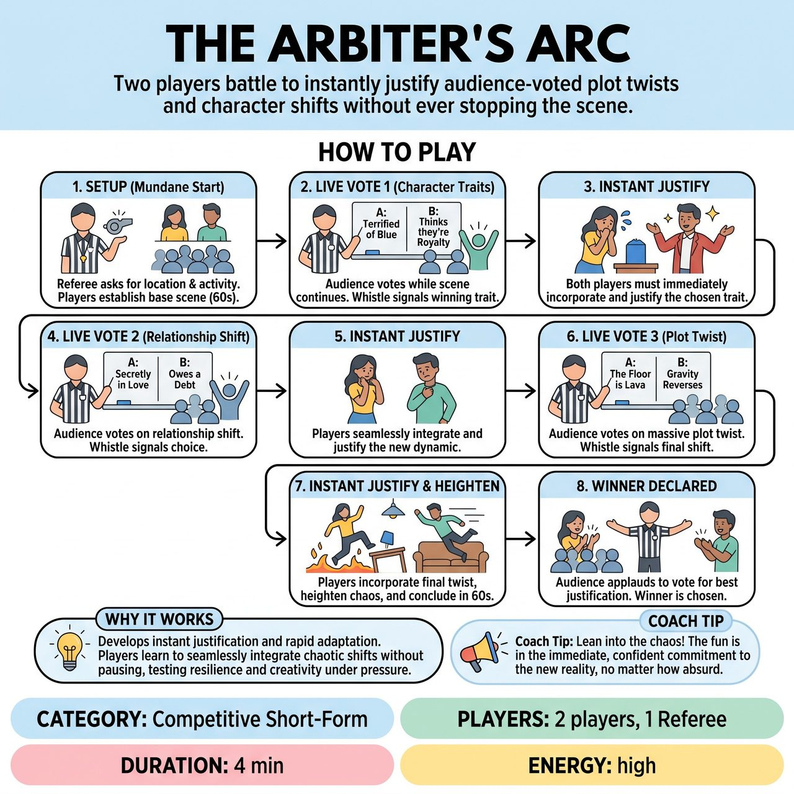

# The Arbiter's Arc

{ .game-hero }

> Two players battle to instantly justify audience-voted plot twists and character shifts without ever stopping the scene.

## Overview
A fast-paced, competitive short-form game where two players perform a scene while the Referee conducts live audience voting on character traits, relationship shifts, and plot twists. The catch is that the scene never stops for the vote. Players must instantly justify the winning choices the moment the Referee flashes the winning whiteboard, competing to see who can best handle the chaotic narrative shifts.

## Setup
Requires 2 players (one from the Red Team, one from the Blue Team) and 1 Referee. The Referee needs a large, highly visible whiteboard, a dark dry-erase marker, and a whistle or bell. No other props or set pieces are needed.

## How to Play
1. The Referee brings one player from each team center stage and asks the audience for a mundane location (e.g., a laundromat) and a shared activity to start the scene.
2. The Referee blows the whistle to begin. The players have 45 to 60 seconds to establish a grounded base reality, their characters, and the environment without any interruptions.
3. At the 1-minute mark, the Referee writes two contrasting character traits or physical quirks on the whiteboard (e.g., 'A: Terrified of the color blue' vs. 'B: Thinks they are a secret agent').
4. The Referee steps downstage, holds up the board, and gestures to the audience to cheer for A, then B. The scene does NOT stop; players continue acting, leaning into physical choices or stage business while the audience cheers.
5. The Referee circles the loudest option, blows the whistle sharply, and holds the board up for the players to see. Both players must instantly incorporate and justify this new reality into the ongoing scene.
6. At the 2-minute mark, the Referee repeats the live-voting process for a Relationship Shift (e.g., 'A: Secretly in love with the other' vs. 'B: Owes the other a million dollars').
7. At the 3-minute mark, the Referee repeats the live-voting process for a massive Plot Twist (e.g., 'A: The floor is lava' vs. 'B: Gravity reverses').
8. After the third twist is injected, the players have 60 seconds to heighten the chaos and find a natural, hilarious conclusion that incorporates all three active twists. The Referee calls 'Scene!' at the 4-minute mark.
9. The Referee asks the audience to applaud for the Red Team player, then the Blue Team player, based on who justified the abrupt twists most creatively. The winner earns 5 points for their team.

## Coaching Notes
- Ensure players do not freeze during the voting process; they must maintain scene momentum and use stage business while the audience cheers.
- Stick strictly to the structured, predictable escalation (Trait -> Relationship -> Twist) to prevent the scene from becoming an unplayable mess.
- The Referee can award 1-point 'Brownie Points' during the scene to reward exceptionally brilliant instant justifications.
- Players should focus on head-to-head competitive justification, fully committing to the new reality the second the whistle blows.

## Variations
- Single-Team Survival: Instead of a head-to-head battle, two players from the same team play. Their goal is simply to survive all three twists and reach a satisfying conclusion to win a flat 5 points for their team.
- The Gauntlet (3-Player): Three players are in the scene. The Referee's whiteboard options specifically target one player at a time (e.g., 'Player 1 becomes a werewolf' vs 'Player 1 loses their bones'), rotating the focus so each player gets a dedicated hurdle to overcome.

## Why It Works
The game develops the improv skill of instant justification and rapid adaptation. By removing the ability to freeze or pause, players are forced to seamlessly integrate chaotic, audience-driven narrative shifts into an ongoing reality, testing their listening and commitment.

## Safety & Inclusion
The Referee acts as the ultimate safety filter by generating the A/B options on the whiteboard. The Ref must ensure all options are clean, all-ages appropriate, and physically accessible for the specific players on stage. If a player has mobility restrictions, the Ref should avoid physical mandates (e.g., 'must do jumping jacks') and instead offer emotional, vocal, or status-based twists (e.g., 'speaks like a Shakespearean villain' or 'suddenly deeply suspicious').

