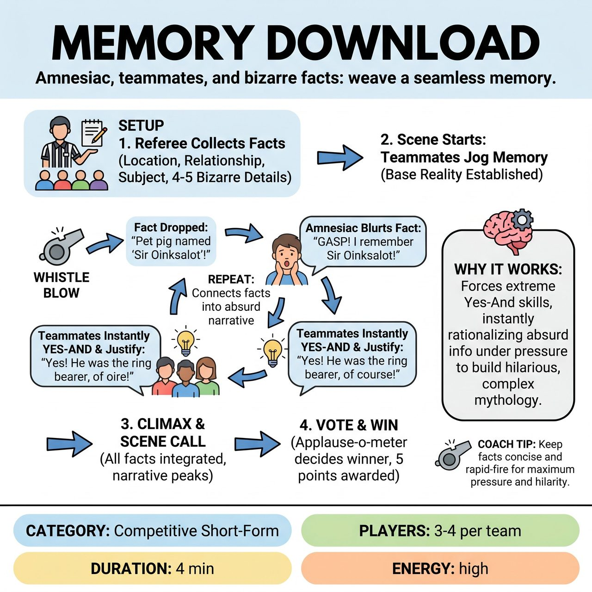

# Memory Download

{ .game-hero }

> An Amnesiac and their teammates must seamlessly integrate a rapid-fire list of bizarre, pre-collected audience facts into a single, cohesive memory.

## Overview
A competitive justification game where one player plays an Amnesiac who has forgotten a major shared event. The referee gathers bizarre facts from the audience upfront and injects them into the scene via whistle blows. The team must instantly justify and weave these disparate details into a logical, escalating narrative.

## Setup
3-4 players per team. A referee equipped with a whistle and a notepad. A whiteboard or digital display for tracking points. Best played in a Competitive Short-Form format.

## How to Play
1. The referee explains the premise: one player (the Amnesiac) has forgotten a major shared event or subject, and teammates are helping them remember.
2. The referee asks the audience for a Location, a Relationship, and a Forgotten Subject.
3. Before the scene begins, the referee asks the audience for 4-5 completely unrelated, highly specific, and bizarre facts about the Subject, writing them down.
4. The scene begins with teammates gently trying to jog the Amnesiac's memory, establishing the base reality.
5. Every 30-45 seconds, the referee blows the whistle and rapidly announces one of the pre-collected facts in under 3 seconds.
6. The Amnesiac must immediately gasp, remember the fact, and blurt it out, while teammates instantly Yes-And the detail to justify it.
7. The referee continues dropping facts one by one as the team connects them into a logical, absurd narrative.
8. After 3-4 minutes, once all facts are integrated and a climax is reached, the referee calls Scene, and the opposing team plays a round.
9. The referee holds an applause-o-meter vote to determine the winner, awarding 5 points.

## Coaching Notes
- Gathering all bizarre details before the scene ensures high momentum and zero dead air during play.
- The referee controls the tempo, dropping facts exactly when the scene needs a jolt of energy or a new obstacle.
- Players must focus on instantly rationalizing absurd information under pressure rather than denying or ignoring the prompts.

## Variations
- The Interrogation: Instead of an amnesiac, the main player is a suspect being interrogated by detectives (their teammates). The referee drops New Evidence (the facts) that the suspect must instantly explain away.
- The Pitch: The players are eccentric inventors pitching a new product to investors. The referee drops Features that the audience suggested, and the inventors must justify why the product absolutely needs them.

## Why It Works
It forces players to exercise extreme Yes-And skills by instantly rationalizing absurd information under pressure, which naturally builds a hilarious, complex mythology around a single mundane subject.

## Safety & Inclusion
Frame the amnesia as a lighthearted, sitcom-style memory lapse rather than real-life medical memory loss, trauma, or dementia. The referee should actively steer audience suggestions toward goofy, low-stakes subjects. Ensure players know that physicalizing a memory flash should not involve unsafe movements like falling to the floor or thrashing.

