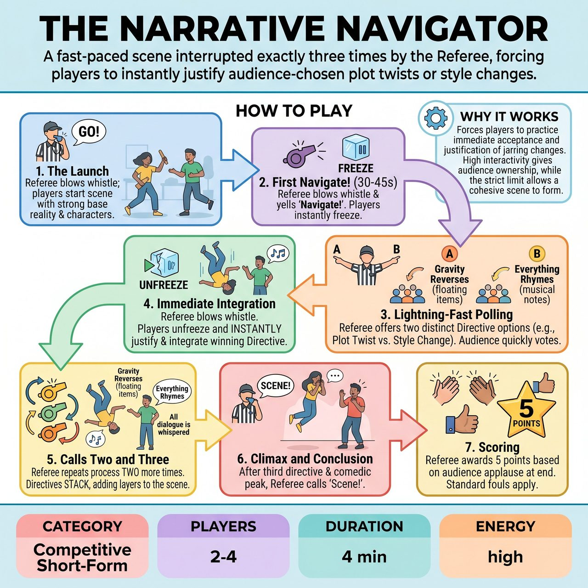

# The Narrative Navigator

{ .game-hero }

> A fast-paced scene interrupted exactly three times by the Referee, forcing players to instantly justify audience-chosen plot twists or style changes.

## Overview
A fast-paced, competitive short-form game where improvisers perform a scene that is interrupted exactly three times by the Referee. At each interruption, the Referee offers two wildly different 'Directives' (plot twists or style changes) and quickly polls a section of the audience to choose one. The players must instantly justify and integrate the winning directive, forcing them to adapt on the fly while keeping the narrative intact.

## Setup
Requires 2-4 players from one team and a Referee (Host). The Referee needs a pre-written list of 'Directives' (e.g., on a clipboard or digital tablet) divided into categories like Narrative Twists, Performance Styles, and Character Challenges. The stage is a standard bare improv stage. The Referee asks the audience for a clean, all-ages suggestion (e.g., a mundane location and a relationship) to start the scene.

## How to Play
1. The Launch: The Referee gets the suggestion, blows the whistle, and the players begin the scene, establishing a strong base reality and clear character relationships.
2. The First 'Navigate!' (Early Scene): About 30-45 seconds in, the Referee blows the whistle and yells 'Navigate!' The players immediately freeze in their current physical and emotional states.
3. Lightning-Fast Polling: The Referee quickly announces two Directive options (e.g., 'Option A: Gravity reverses' or 'Option B: Everything must rhyme'). To prevent momentum loss, the Referee points to a specific section of the audience (e.g., 'Section 2!') and demands they instantly shout 'A' or 'B'. The loudest/fastest response wins.
4. Immediate Integration: The Referee blows the whistle again to unfreeze the scene. The players must instantly and seamlessly apply the chosen Directive, justifying it within the reality of the scene without breaking character.
5. Calls Two and Three: The Referee repeats this process exactly two more times (for a strict total of 3 'Navigate' calls per scene). Directives stack on top of each other unless they directly contradict.
6. The Climax and Conclusion: After the third directive is integrated and the scene reaches a comedic peak, the Referee blows the whistle and calls 'Scene!'
7. Scoring: The Referee awards a flat 5 points to the team at the end of the game based on audience applause. Standard fouls apply: a 'Delay of Game' foul if players hesitate or fail to adopt the directive, and a 'clean-content call' foul for inappropriate content.

## Coaching Notes
- Maintain a strict limit of exactly 3 interruptions to balance chaotic fun with actual narrative progression.
- Use the lightning-fast audience polling method to maintain high scene momentum without bogging it down.
- Encourage players to practice immediate acceptance and justification of jarring changes.
- Watch for 'Delay of Game' fouls if players hesitate or fail to adopt the directive, and 'clean-content call' fouls for inappropriate content.

## Variations
- The Gauntlet (Head-to-Head): Both teams are on stage. When 'Navigate!' is called, the team not currently in the scene tags in, takes over the exact physical positions of the previous players, and instantly applies the new directive.
- Genre Navigator: Instead of random twists, all directives are strictly film or theatre genres (e.g., Film Noir, Western, Shakespeare, Soap Opera). The narrative remains the same, but the lens constantly shifts.

## Why It Works
Forces players to practice immediate acceptance and justification of jarring changes. It is highly interactive, giving the audience a strong sense of ownership over the scene's mechanics while the strict limit of interruptions allows a cohesive narrative to develop.

## Safety & Inclusion
The Referee must pre-vet all Directives to ensure they are physically safe (no 'do a backflip' or dangerous stunts) and content-safe (strictly all-ages, no punching down). Players are encouraged to modify or drop physical directives if they have mobility restrictions (e.g., 'Perform in slow motion' can be executed purely vocally or from a seated position without penalty). The standard 'clean-content call' foul ensures the content remains clean and family-friendly.

