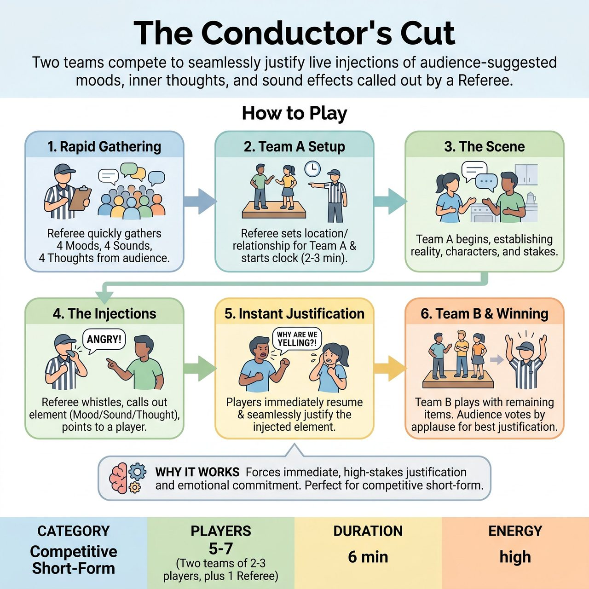

# The Conductor's Cut

{ .game-hero }

> Two teams compete to seamlessly justify live injections of audience-suggested moods, inner thoughts, and sound effects called out by a Referee.

## Overview
Two teams compete in fast-paced scenes where the Referee (acting as the 'Conductor') injects pre-gathered audience suggestions—moods, inner thoughts, and sound effects—live into the action. Players must instantly justify these chaotic elements without breaking the reality of the scene.

## Setup
Requires two teams of 2-3 players each, and one Referee. The Referee needs a whistle or bell, and a whiteboard, clipboard, or good memory to track audience suggestions. Played on a standard stage with a clean, all-ages audience.

## How to Play
1. Rapid Gathering: Before any scenes begin, the Referee rapidly gathers a 'Conductor's List' from the audience: 4 distinct Moods, 4 random Sound Effects, and 4 secret Inner Thoughts (e.g., 'Did I leave the stove on?').
2. Team A Setup: The Referee gets a location and relationship from the audience for Team A, and starts the clock (typically 2-3 minutes).
3. The Scene: Team A begins their scene, establishing their base reality, characters, and stakes.
4. The Injections: At any moment, the Referee blows their whistle to briefly pause the action, calls out an element from the list, and points to a player. For example: 'Whistle! Sound Effect: Chainsaw!' or 'Whistle! Inner Thought for Player 1: I think I'm a ghost!'
5. Instant Justification: The players must immediately resume the scene and justify the injection. If a mood is called, the whole scene shifts to that emotion. If a sound is called, players must react to it in their environment. If an inner thought is called, the targeted player must speak it as a quick aside or weave it directly into their next line of dialogue.
6. Team B's Turn: After Team A's time is up, Team B takes the stage with a new location and relationship, and the Referee uses the remaining items on the Conductor's List to disrupt their scene.
7. Winning: Once both teams have played, the Referee calls for an audience applause vote to determine which team justified the interruptions most seamlessly and hilariously.

## Coaching Notes
- Maintain rapid-fire pacing so the scene never loses momentum.
- The Referee may award bonus points for brilliant justifications or call a delay foul if a player ignores an injected element.
- Remind players that the audience suggestions act as landmines; the goal is to weave them in seamlessly rather than stopping the scene's reality.

## Variations
- The Opposing Conductor: Instead of the Referee calling the elements, the captain of Team B acts as the Conductor for Team A's scene, strategically deploying the gathered suggestions to trip them up.
- Blind Draw (Long-Form/Ensemble): Instead of a Referee calling them out, players have the suggestions written on slips of paper in their pockets. A bell rings every 45 seconds, and a player must pull a slip, read it aloud, and instantly justify it.

## Why It Works
It forces immediate, high-stakes justification and emotional commitment. The game is a perfect fit for competitive short-form, pitting two teams against the exact same mechanical challenge while giving the audience high ownership over the scene's obstacles.

## Safety & Inclusion
The Referee acts as a filter during the rapid gathering phase, ensuring all moods, sounds, and thoughts are clean, all-ages, and non-offensive. If an audience member shouts something inappropriate, the Referee calls a content foul to maintain a safe environment. Players should be coached that 'Sound Effects' do not require dangerous physical stunts to justify.

