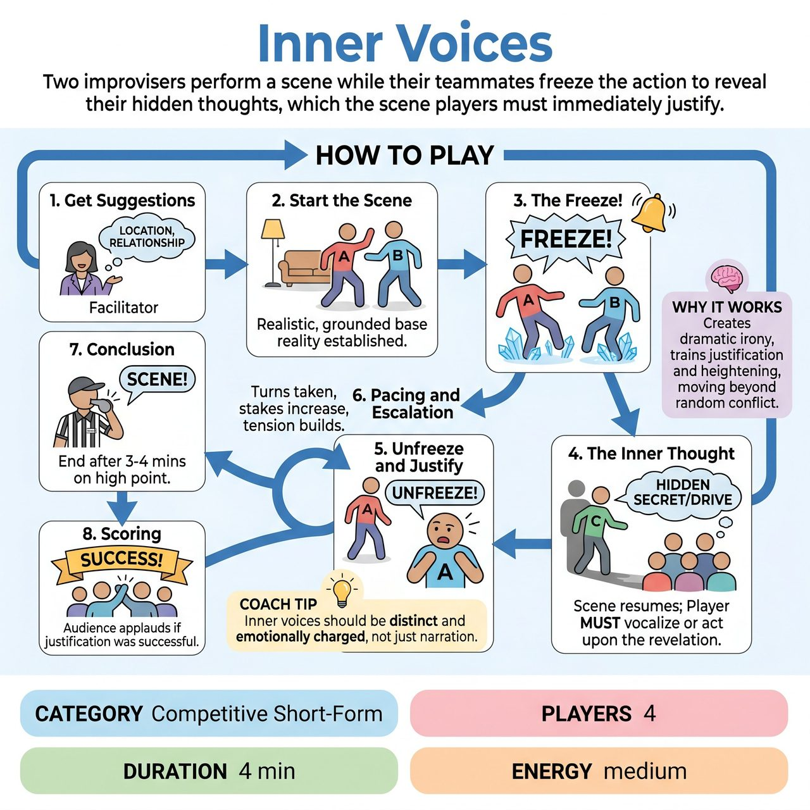

# Inner Voices

{ .game-hero }

> Two improvisers perform a scene while their teammates freeze the action to reveal their hidden thoughts, which the scene players must immediately justify.

## Overview
A four-player competitive short-form game where two improvisers perform a scene while their two teammates act as their 'Inner Voices.' By freezing the action, the Inner Voices speak the characters' hidden thoughts, desires, or secrets aloud to the audience. The scene players must then immediately justify and act upon these internal revelations, heightening the narrative rather than destroying it.

## Setup
Format: Competitive short-form match format. Players: 4 players from one team (2 Scene Players, 2 Inner Voice Players). Positions: The 2 Scene Players stand center stage. The 2 Inner Voice Players stand directly behind their respective Scene Players. Facilitator: A Referee with a whistle to run the game, call fouls, and manage the audience. Suggestions: The audience provides a mundane location and a relationship between two people.

## How to Play
1. 1. Get Suggestions: The Referee asks the audience for a location and a relationship to ground the scene.
2. 2. Start the Scene: The two Scene Players begin a realistic, grounded scene, establishing their characters and the base reality.
3. 3. The Freeze: At any point, an Inner Voice player can call 'Freeze!' (or ring a bell). Both Scene Players immediately freeze in place.
4. 4. The Inner Thought: The Inner Voice steps out slightly and speaks their character's hidden thought, secret, or emotional drive loudly to the audience. Crucially, this offer must heighten the existing scene, not destroy it (e.g., if they are fixing a car, 'I need to prove I'm smarter than my dad' is a great offer; 'I am a dinosaur' is a foul).
5. 5. Unfreeze and Justify: The Inner Voice steps back and calls 'Unfreeze!' The scene resumes. The affected Scene Player must immediately vocalize or act upon that internal thought, justifying it naturally in the dialogue.
6. 6. Pacing and Escalation: The Inner Voices should take turns and gradually increase the stakes of their thoughts. The scene builds as both characters are driven by increasingly intense hidden motives.
7. 7. Conclusion: The Referee blows the whistle and calls 'Scene!' after 3-4 minutes on a high point of comedic tension or a major revelation.
8. 8. Scoring: At the end of the game, the Referee asks the audience to applaud if they felt the team successfully justified the inner voices. If the applause is strong, the team is awarded 5 points.

## Coaching Notes
- The Referee actively uses the whistle during the game to call a 'Narrative Foul' if an Inner Voice gives a completely disconnected, random offer that destroys the scene's reality, forcing the Inner Voice to give a better, heightening offer instead.
- Ensure the turn-taking freeze mechanic is respected to eliminate audio overlap and ensure the audience hears every offer clearly.
- Remind players to focus on the improv principle of justification and heightening rather than random conflict.

## Variations
- Cross-Team Challenge: Two players from Team A are the Scene Players, while two players from Team B act as their Inner Voices. Team B tries to give challenging (but still narrative-valid) thoughts, and Team A must justify them. Both teams can score points based on audience applause.
- Physical Impulses: Instead of speaking thoughts, the Inner Voices gently manipulate their Scene Player's frozen body into a new posture or facial expression. When unfrozen, the Scene Player must justify the new physical state emotionally.

## Why It Works
Creates dramatic irony, as the audience is 'in on the secret' of the characters' true thoughts before the other character knows. It focuses on the improv principle of justification and heightening rather than random conflict.

## Safety & Inclusion
The Referee ensures all inner thoughts remain family-friendly and free of harmful tropes. Since Inner Voices dictate another player's internal reality, they must avoid assigning thoughts that violate the Scene Player's personal boundaries or force them into uncomfortable stereotypes. If using a physical tap to initiate a freeze, players must establish physical boundaries beforehand; a verbal 'Freeze' is the safest default and ensures full accessibility for players with mobility or sensory considerations.

