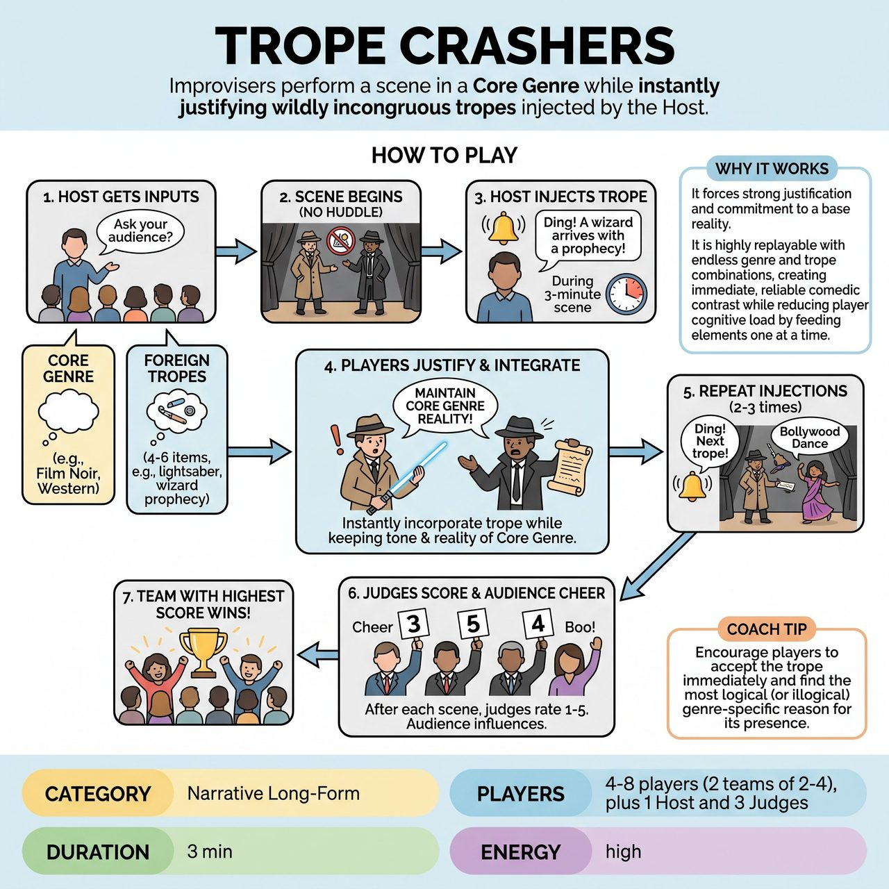

# Trope Crashers

{ .game-hero }

> Improvisers perform a scene in a Core Genre while instantly justifying wildly incongruous tropes injected by the Host.

## Overview
Two teams compete to perform a scene in a specific Core Genre. As the scene progresses, the Host injects wildly incongruous tropes from other genres. The improvisers must instantly justify and integrate these foreign elements without breaking the base reality of their Core Genre.

## Setup
2 teams of 2-4 players. A Host to take suggestions, ring a bell, and inject tropes. A panel of 3 Judges with scorecards (1 to 5). A bell or buzzer for the Host.

## How to Play
1. The Host asks the audience for a broad Core Genre (e.g., 'Film Noir,' 'Western,' 'Medical Drama').
2. The Host then asks the audience for 4 to 6 specific tropes, objects, or plot devices from completely different genres (e.g., 'a lightsaber,' 'a Bollywood dance number,' 'a talking cartoon dog'). The Host writes these down.
3. Team A takes the stage and begins a scene in the Core Genre immediately with no huddle or planning time.
4. As the scene unfolds, the Host rings a bell and announces one of the collected tropes (e.g., Ding! 'A wizard arrives with a prophecy!').
5. The players must instantly incorporate the trope into the scene, justifying its existence while strictly maintaining the tone, status, and reality of the Core Genre.
6. The Host injects 2 to 3 tropes over the course of a 3-minute scene.
7. Team B then performs a new 3-minute scene in the same Core Genre, and the Host injects the remaining 2 to 3 unused tropes.
8. After each scene, a panel of three Judges holds up scorecards rating the scene from 1 to 5. The audience can cheer or boo to influence the Judges. The team with the highest total score wins the round.

## Coaching Notes
- Encourage players to instantly justify the absurd tropes while maintaining unwavering dedication to the Core Genre's tone.
- Remind Judges to evaluate based on narrative commitment, how brilliantly the improvisers justified the absurd tropes, and their dedication to the base reality.
- Use the bell mechanic to feed elements one at a time, which helps reduce player cognitive load and creates immediate, reliable comedic contrast.

## Variations
- Blind Crashes: The players step off stage or cover their ears while the Host collects the trope suggestions from the audience, making the mid-scene injections a genuine surprise.
- Short-Form Adaptation: For a fast-paced competitive format without judges, the audience votes by applause for the team that justified their tropes best, and the referee awards a flat 5 points to the winner.

## Why It Works
It forces strong justification and commitment to a base reality. It is highly replayable with endless genre and trope combinations, creating immediate, reliable comedic contrast while reducing player cognitive load by feeding elements one at a time.

## Safety & Inclusion
The Host acts as a gatekeeper for audience suggestions, ensuring all tropes are safe, clean, and non-offensive before writing them down. When sudden action tropes are injected (e.g., 'a massive explosion' or 'an alien attack'), players are encouraged to react emotionally and narratively rather than throwing themselves physically to the floor, ensuring physical safety.

