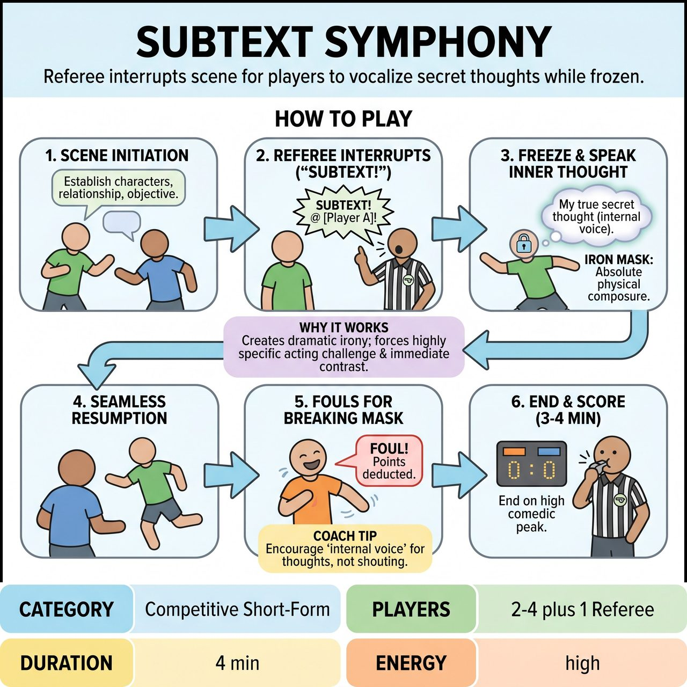

# Subtext Symphony

{ .game-hero }

> A fast-paced game where a Referee interrupts a scene to force players to vocalize their secret inner thoughts while maintaining an absolute physical freeze.

## Overview
A fast-paced, competitive short-form adaptation of the classic 'Inner Monologue' improv exercise. A Referee periodically interrupts an ongoing scene by shouting 'Subtext!' at a specific player. That player must immediately vocalize their character's secret, internal thoughts while maintaining an 'Iron Mask'—absolute physical composure, freezing their face and body exactly as they were.

## Setup
Requires 2-4 improvisers (playing as one team for a set score, or two teams alternating scenes) and 1 Referee equipped with a whistle or buzzer. The stage should be open and clutter-free. The Referee stands off to the side, visible to the players but out of the main action. Get a standard scene suggestion from the audience, such as a mundane location (e.g., a DMV waiting room) or a specific relationship dynamic (e.g., rival antique dealers on a first date).

## How to Play
1. Scene Initiation: The players begin the scene based on the audience suggestion, establishing clear characters, relationships, and outward objectives within the first few lines.
2. The Interruption: The Referee keenly observes the scene for moments of unspoken tension, hidden motivations, or polite deception. When a prime moment arises, the Referee blows the whistle/buzzer and sharply calls out, 'SUBTEXT, [Player Name]!'
3. The Iron Mask: Upon hearing their name, the designated player must instantly freeze their physical posture, facial expression, and body language exactly as it was in the scene. This 'Iron Mask' constraint is critical—there must be no visible shift in their outward demeanor.
4. The Subtext Revelation: While frozen, the player immediately vocalizes their character's unstated inner thought. The voice should shift to an 'internal monologue' style (e.g., slightly lower volume, conspiratorial). The thought should be concise and contrast with the outward action.
5. Seamless Resumption: The moment the player finishes their subtext line, the scene instantly resumes exactly where it left off. The Referee does NOT stop the scene to award points. The characters in the scene remain entirely oblivious to the vocalized subtext.
6. Fouls for Breaking: If a player breaks their 'Iron Mask' (e.g., involuntarily laughing, physically shifting, or looking at the audience), the Referee may quickly blow the whistle and call a 'Flinch Foul,' deducting a point or simply calling them out for comedic effect, before immediately resuming play.
7. Game End & Scoring: The scene runs for 3-4 minutes. The Referee blows the whistle to end the scene on a high comedic peak or strong narrative resolution. The Referee awards a flat 5 points to the team if they successfully maintained their 'Iron Mask' throughout the scene, or determines the winner by audience applause if two teams are competing.

## Coaching Notes
- Good subtext includes a hidden agenda ('If I can just get him to sign this before he reads the fine print'), profound embarrassment ('I have absolutely no idea what I am talking about'), or an honest emotional truth contrasting with a smile ('I am absolutely seething with rage right now').
- Mid-scene verbal point scoring is completely removed to preserve the rhythm and momentum of the scene.
- The audience's laughter and gasps during the subtext reveals provide instant, organic feedback for the players.
- Ensure the vocalized thought contrasts with the outward action to create dramatic irony and hilarious contrasts between outward politeness and inward chaos.

## Variations
- Subtext Dubbing: Instead of the player speaking their own subtext, a teammate on the sidelines speaks the internal monologue for them through a microphone, forcing the frozen player to justify the new internal reality when the scene resumes.
- Workshop Mode (Non-Competitive): Played in a circle or standard scene-work drill without a Referee. Players self-edit, raising their own hand to pause the scene and deliver their subtext, focusing purely on character depth and listening rather than points.

## Why It Works
It acts as a dramatic irony engine where the audience is privileged to know the characters' true feelings while the other characters remain oblivious. The 'Iron Mask' constraint forces a highly specific acting challenge that creates immediate visual and auditory juxtaposition, while the seamless pacing eliminates math and mid-scene interruptions, keeping the narrative momentum fast and engaging.

## Safety & Inclusion
Content must remain clean and all-ages (family-friendly). 'Secret thoughts' should focus on character insecurities, petty grievances, or situational absurdity; players must avoid using subtext to punch down, rely on stereotypes, or introduce bigoted/inappropriate content (which should immediately trigger a standard foul). Physically, players should avoid freezing in precarious, off-balance, or uncomfortable positions when the 'Iron Mask' is called.

