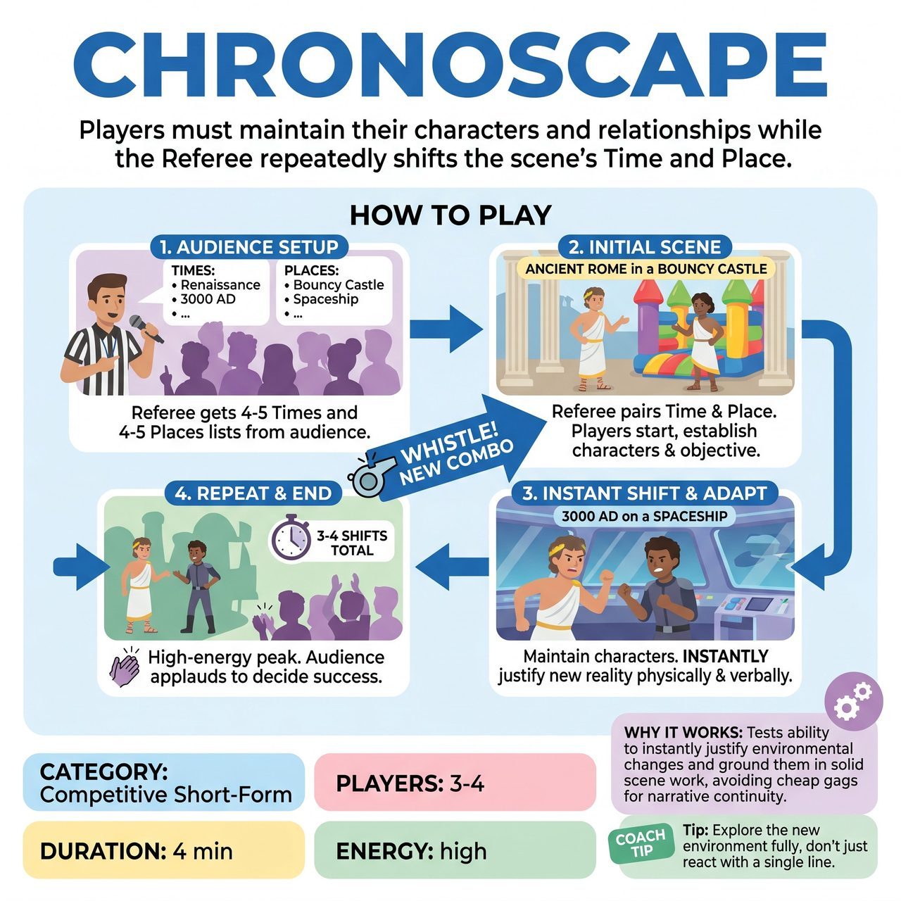

# Chronoscape

{ .game-hero }

> Players must maintain their characters and relationships while the Referee repeatedly shifts the scene's Time and Place.

## Overview
A high-energy, competitive short-form game where players must maintain their characters and relationships while the Referee repeatedly shifts the scene's Time and Place. The audience is highly engaged from the start by providing robust dual-lists of Times and Places.

## Setup
3-4 players from one team. A Referee (or Host) stands to the side with a clipboard and a whistle to record suggestions and call the shifts. No digital displays, whiteboards, or special props are needed.

## How to Play
1. The Referee asks the audience for two distinct lists: 4-5 'Historical Periods or Times' (e.g., The Renaissance, 3000 AD, 5 minutes ago) and 4-5 'Specific Locations' (e.g., a submarine, a bouncy castle, a DMV). The Referee writes these down.
2. The Referee pairs one Time and one Place to start the scene (e.g., 'Ancient Rome in a bouncy castle') and calls 'Go!'
3. The players begin the scene, establishing clear characters, relationships, and an objective within that specific time and place.
4. After 45 to 60 seconds, the Referee blows the whistle and loudly announces a new Time and Place combination from the lists.
5. The players do not start a new scene. Their existing characters and relationships instantly transition into the new reality. They must verbally and physically justify the change.
6. Players explore the new reality for another 45-60 seconds, establishing the new environment physically and narratively rather than just reacting with a single gag.
7. The Referee calls 3 to 4 shifts total, blowing the whistle to end the game on a high-energy comedic peak.
8. At the end of the game, the audience votes by applause to decide if the team successfully met the challenge to earn 5 points.

## Coaching Notes
- Focus on character continuity and rapid justification.
- Give players enough time (45-60 second intervals) to build a grounded reality and encourage grounded scene work over quick gags.
- Ensure players establish the new environment physically and narratively rather than just reacting with a single gag.
- The Referee role is simplified, requiring only a clipboard and a loud voice, and they do not grade individual scene choices.

## Variations
- Head-to-Head: Both teams play a 3-minute Chronoscape back-to-back using the same lists, and the audience votes for the winner.
- Dimension Jump: Instead of Time and Place, the Referee shifts the scene's Genre and a specific Physical Constraint (e.g., Western / No one can bend their knees).

## Why It Works
It tests the team's ability to instantly justify absurd environmental changes and ground them in solid scene work, avoiding cheap gags in favor of narrative continuity.

## Safety & Inclusion
Players must maintain physical safety and spatial awareness during sudden environmental shifts (e.g., transitioning safely from 'weightless in space' to 'cramped in an elevator'). The Referee must filter audience suggestions to ensure they remain clean, family-friendly, and avoid historical eras or locations that might invite harmful stereotypes, accents, or cultural appropriation.

