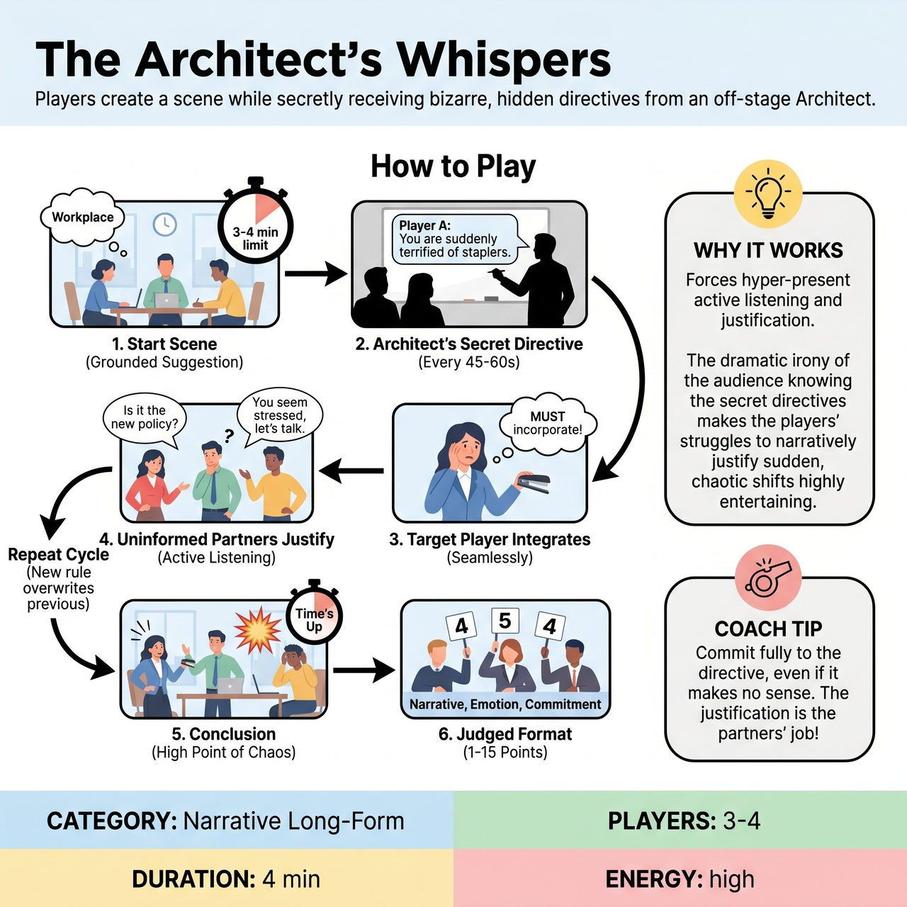

# The Architect's Whispers

{ .game-hero }

> Players create a scene while secretly receiving bizarre, hidden directives from an off-stage Architect.

## Overview
An improvisational challenge where players create a scene while secretly receiving bizarre, hidden directives from an off-stage 'Architect.' Because the audience can see the directives but the uninformed players cannot, the game creates hilarious dramatic irony. The core joy comes from watching the targeted player seamlessly integrate the new rule, while their scene partners scramble to actively listen and narratively justify the sudden, chaotic shifts in behavior.

## Setup
Requires 3-4 improvisers, a Host (The Architect), and a panel of 3 Judges. Crucially, you need two large whiteboards positioned downstage left and right (in the wings, visible to players but out of the scene), or a digital monitor at the back of the house. The audience must also be able to see these directives, either via a projector screen or by the Architect writing on a board angled toward the crowd. Prepare a list of behavioral, emotional, and linguistic directives beforehand.

## How to Play
1. The Host gets a simple, grounded scene suggestion from the audience, such as a mundane workplace or a family dinner.
2. The scene begins. The time limit is strictly set to 3 to 4 minutes to keep the energy high and prevent cognitive exhaustion.
3. Every 45 to 60 seconds, the Architect writes a secret directive on the off-stage whiteboard aimed at a specific player (e.g., 'Player A: You are suddenly terrified of the color red' or 'Player B: End every sentence with a question'). The audience is shown the directive simultaneously.
4. The targeted player must immediately and seamlessly incorporate this directive into their character's reality without breaking the scene or acknowledging the whiteboard.
5. The uninformed players must actively listen, observe the bizarre new behavior, and narratively justify it within the scene (e.g., 'I know you have been on edge since the ketchup incident, but please calm down').
6. New directives overwrite previous ones. A player only ever manages one secret directive at a time to prevent the scene from becoming unplayable and to maintain narrative focus.
7. The scene concludes at the 3 to 4 minute mark, ideally on a high point of justified chaos.
8. Judged Format: A panel of three judges scores the scene from 1 to 5 points each (maximum 15 points). Judges base their scores on narrative justification, emotional commitment, and how organically the ensemble incorporated the bizarre directives without breaking character. The audience participates by laughing at the dramatic irony and can boo the judges if they disagree with the scores.

## Coaching Notes
- Dramatic Irony: The audience is in on the secret, making the players' struggles and justifications highly entertaining.
- Active Listening: Forces players to stay hyper-present and justify their partners' bizarre offers.
- Seamless Flow: Off-stage whiteboards eliminate the need for a referee to interrupt the physical space of the scene.

## Variations
- Earpiece Edition: If the theater has the technology, the Architect feeds directives to players via wireless earpieces. This creates a magical, completely seamless visual experience for the audience, who see the directives on a projection screen.
- Status Whispers: To deeply drill core improv principles, all directives are strictly status-based (e.g., 'Play high status to the boss, but low status to the intern'). This grounds the chaos in pure character dynamics.

## Why It Works
The game forces hyper-present active listening and justification. The dramatic irony of the audience knowing the secret directives makes the players' struggles to narratively justify sudden, chaotic shifts in behavior highly entertaining.

## Safety & Inclusion
Directives must never force players into unsafe physical actions, non-consensual touch, or traumatic emotional states. Keep directives focused on status, quirky behaviors, or linguistic games. Implement a 'Wipe' rule: if a player sees a directive on the whiteboard they are uncomfortable with, they can subtly wipe their hand across their chest. The Architect must immediately erase it and write a new one, no questions asked.

