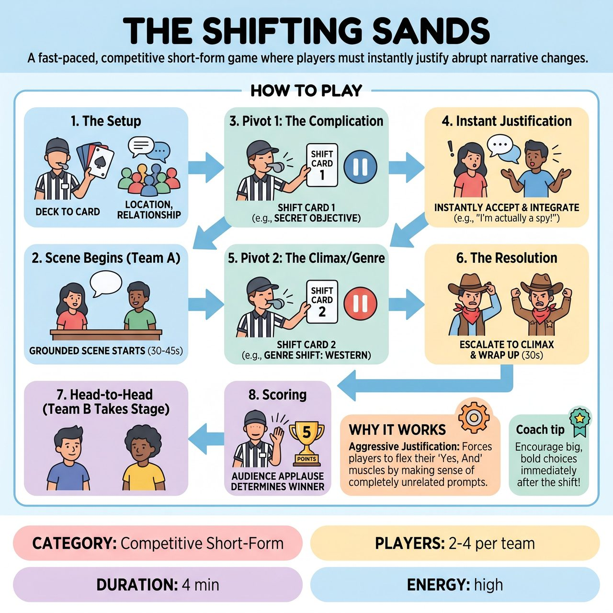

# The Shifting Sands

{ .game-hero }

> A fast-paced, competitive short-form game where players must instantly justify abrupt narrative changes.

## Overview
A fast-paced, competitive short-form game where players must instantly justify abrupt narrative changes. To maintain high energy and comedic momentum, the Referee uses pre-written 'Shift Cards' (gathered from the audience before the match) to inject exactly two major pivots into the scene. Players must seamlessly weave these sudden new realities—like a secret objective or a drastic genre change—into their existing narrative without breaking character or stalling.

## Setup
Format: Competitive Short-Form. Personnel: 1 Referee to run the game and call shifts. Materials: A stack of pre-written 'Shift Cards' (index cards with random objectives, genres, or events written by the audience before the show). Stage: Bare stage, no props.

## How to Play
1. The Setup: The Referee asks the live audience for a starting Location and a Relationship for the scene. The Referee also holds a deck of pre-written 'Shift Cards' gathered before the show.
2. The Scene Begins: Two players from the active team step forward and begin a grounded scene based on the initial Location and Relationship, establishing their characters and base reality.
3. Pivot 1 (The Complication): After 30-45 seconds, the Referee blows the whistle, briefly pausing the action. The Referee immediately reads one Shift Card aloud (e.g., 'SHIFT: Player A is secretly trying to steal Player B's shoes!' or 'SHIFT: Gravity has just reversed!').
4. Instant Justification: The scene resumes the exact second the Referee finishes speaking. The players must instantly accept, justify, and integrate this new information into the scene without dropping their established characters.
5. Pivot 2 (The Climax/Genre): After another 30-45 seconds of play, the Referee blows the whistle for the second and final time, reading a final Shift Card (e.g., 'SHIFT: The scene is now a high-stakes courtroom drama!').
6. The Resolution: The players use this final shift to escalate the scene to a climax, wrapping up the narrative within the next 30 seconds. The Referee blows the whistle to end the scene.
7. Head-to-Head: The opposing team then takes the stage, gets a new Location and Relationship, and plays their own scene with two new Shift Cards.
8. Scoring: At the end of both teams' scenes, the Referee calls for audience applause to determine the winner. The Referee awards 5 points to the winning team.

## Coaching Notes
- Zero dead-time: Using pre-written cards and gathering suggestions upfront completely eliminates the pacing drop of mid-scene audience polling.
- The Referee can call a 'Balking Foul' (deducting 1 point) if a player hesitates, denies, or complains about a shift instead of justifying it.
- Structured escalation: Limiting the game to exactly two pivots allows the scene to breathe, establish a base reality, escalate, and resolve cleanly.

## Variations
- Blind Shifts (Advanced): Instead of the Referee reading the cards, the players start the scene with two Shift Cards in their pockets. At the Referee's whistle, a player must pull out a card, read it aloud as dialogue, and instantly justify it.
- Training Mode (Ensemble/Warm-up): Played in a circle with no points or teams. Two players do a scene in the center while the facilitator rapid-fires shifts every 15 seconds to aggressively train the ensemble's ability to justify abrupt narrative changes.

## Why It Works
Aggressive justification: Forces players to flex their 'Yes, And' muscles by making sense of completely unrelated prompts.

## Safety & Inclusion
The Referee must pre-screen the audience-written Shift Cards to remove any inappropriate, unsafe, or offensive content before the game begins. The game adheres to strict 'clean comedy' rules; if a player takes a shift into inappropriate territory, the Referee blows the whistle and calls a 'content foul' to immediately course-correct. Physical boundaries must be respected, especially during action-oriented shifts.

