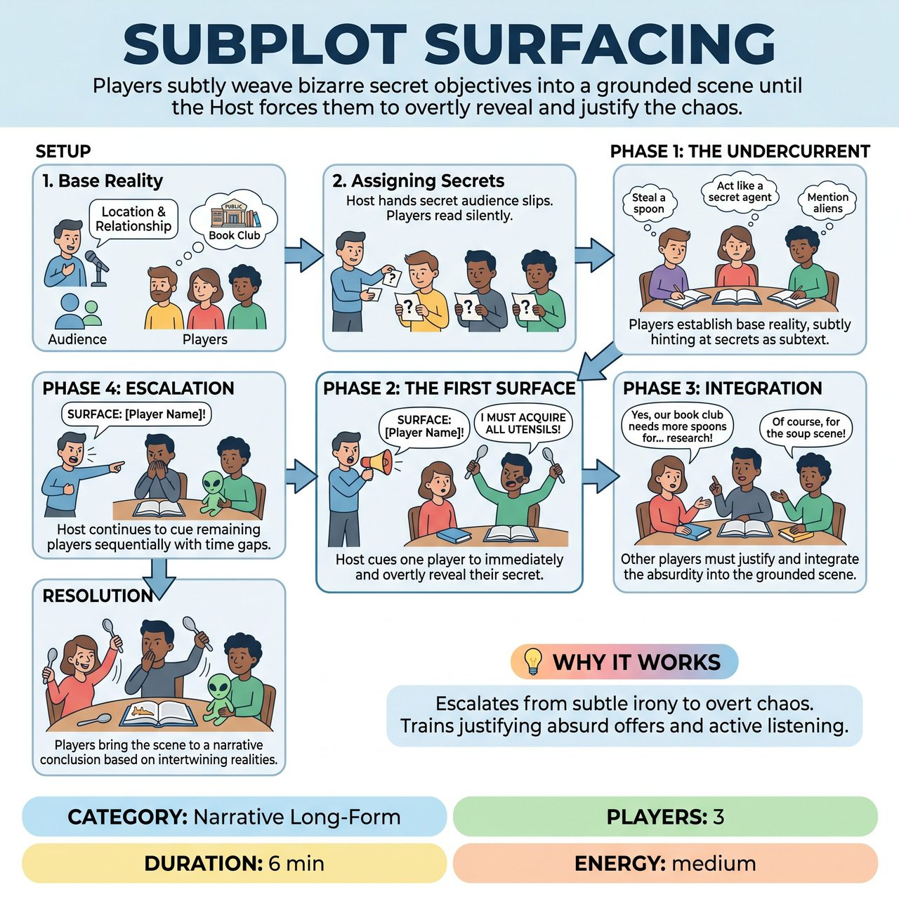

# Subplot Surfacing

{ .game-hero }

> Players subtly weave bizarre secret objectives into a grounded scene until the Host forces them to overtly reveal and justify the chaos.

## Overview
Three players begin a scene with an established setting and relationship, but each secretly holds a bizarre personal objective provided by the audience. Players must subtly weave these 'subplots' into their actions and dialogue as subtext. On the Host's specific cue, an improviser must overtly reveal their subplot, forcing the others to instantly justify and integrate this new reality.

## Setup
Exactly 3 players, 1 Host/MC, and a panel of Judges (for competitive improv formats). Pre-show preparation: The Host collects written slips from the audience before the show with 'secret objectives or bizarre character traits' (e.g., 'thinks everyone is a robot', 'needs to hide a stolen diamond', 'is secretly a werewolf').

## How to Play
1. Base Reality: The Host asks the audience for a location and a relationship for the three players (e.g., 'A public library; three members of a book club').
2. Assigning Secrets: The Host hands each of the 3 players a pre-written audience slip containing a secret objective. Players read their slips silently. No player knows the others' secrets.
3. Phase 1 (The Undercurrent): The scene begins. Players focus on establishing the base reality and relationship. Concurrently, they must subtly hint at their secret objective through subtext, physical ticks, or odd dialogue. They must NOT explicitly state or achieve the secret yet. The audience enjoys the dramatic irony.
4. Phase 2 (The First Surface): After 1-2 minutes of subtle groundwork, the Host calls out 'SURFACE: [Player Name]!' That specific player must immediately and overtly reveal their secret objective in the scene (e.g., pulling out a fake diamond and yelling, 'I stole it!').
5. Phase 3 (Integration): The other two players must immediately accept, justify, and integrate this bizarre new reality into the grounded scene. They cannot dismiss it; they must treat it as a vital part of the ongoing narrative.
6. Phase 4 (Escalation): The Host continues to call 'SURFACE: [Player Name]!' for the remaining players one at a time. Crucially, the Host waits 1-2 minutes between each call so the scene can breathe and the players can fully integrate the previous reveal before adding new chaos.
7. Resolution: Once all three secrets are out and justified, the players bring the scene to a natural narrative conclusion based on the newly intertwined realities.

## Coaching Notes
- Dramatic Irony: The audience knows the secrets (if the Host reads them aloud to the crowd while players close their eyes) or discovers them alongside the cast, creating high engagement.
- Active Listening: Players must pay hyper-attention to their partners' weird behavior to justify it later.
- Structural Escalation: The Host controls the pacing, ensuring the scene moves cleanly from subtext to overt action.
- Scoring / Audience Interaction: In a competitive format, Judges score the scene (typically 1-5 points) based on narrative coherence, how well the players justified the bizarre reveals, and their commitment to active listening rather than just waiting to shout their own secret.

## Variations
- The Grounding Pin: Only 2 players receive secret objectives. The 3rd player is the 'straight person' whose sole job is to ground the scene, react truthfully, and help justify the escalating madness of the other two.
- Headphone Secrets: Instead of pre-show slips, the Host sends two players out of the room (or puts them in noise-canceling headphones) while getting the secret for the remaining player from the audience, repeating until all three have secrets. This allows the audience to know all the secrets in advance, maximizing dramatic irony.

## Why It Works
The game escalates from subtle dramatic irony to overt narrative chaos, testing the players' ability to justify the absurd. It trains improvisers to ground absurd offers in emotional reality and forces active listening.

## Safety & Inclusion
The Host must filter the pre-show slips to ensure all secrets are safe, all-ages appropriate, and free of trauma or non-consensual physical touch. Players are reminded that 'revealing a secret' must still respect their scene partners' physical boundaries (e.g., if the secret is 'wants to steal their shirt,' the player mimes the action or uses a prop, rather than grabbing the actual performer).

