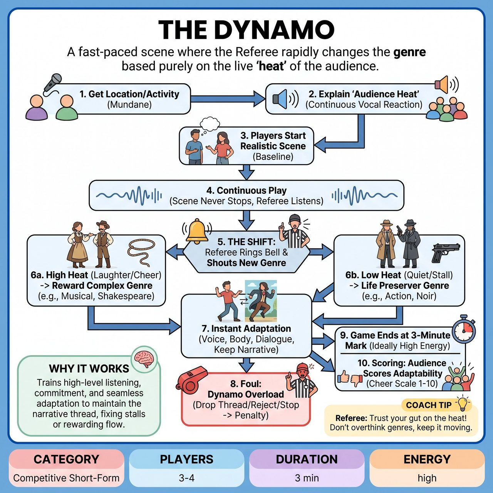

# The Dynamo

{ .game-hero }

> A fast-paced scene where the Referee rapidly changes the genre based purely on the live 'heat' of the audience.

## Overview
A fast-paced, high-energy scene where the Referee rapidly changes the genre based purely on the live 'heat' of the audience. There is no stopping and no tech required. The audience's continuous vocal reactions act as a single metric. When the audience erupts or flatlines, the Referee rings a bell and shouts a new genre, forcing the players to instantly adapt their current exact moment, characters, and physical positions into the new style without breaking the scene's momentum.

## Setup
3 to 4 players from one team. A Referee equipped with a loud bell or whistle, and a cheat sheet of genres categorized into 'High Heat' (complex/escalating) and 'Low Heat' (structured/physical). A neutral stage with no complex props. A time limit of 3 minutes.

## How to Play
1. The Referee gets a suggestion of a mundane location or everyday activity from the audience to ground the scene.
2. The Referee explains the single metric: 'Audience Heat.' The audience is instructed to react vocally and continuously. If they love it, laugh and cheer loudly. If they are bored, stay dead silent or groan.
3. The players begin the scene in a baseline, realistic style based on the suggestion.
4. Continuous Play: The scene never stops or freezes. The Referee actively listens to the audience's volume and engagement.
5. The Shift: When the audience reaction hits a peak (High Heat) or drops off (Low Heat), the Referee rings the bell and shouts a new genre (e.g., 'Ding! Western!').
6. Instant Adaptation: Players must immediately seamlessly shift their vocal tone, physicality, and dialogue to fit the new genre while continuing the exact narrative moment they were just in.
7. The Logic Matrix - High Heat: If the audience is laughing and cheering, the Referee rewards the players with complex, escalating genres (e.g., Musical, Shakespeare, Sci-Fi, Action Movie).
8. The Logic Matrix - Low Heat: If the audience is quiet or the scene stalls, the Referee throws a 'life preserver' genre that forces physical action or clear structure (e.g., Silent Film, Slapstick, Soap Opera, Horror).
9. Foul - Dynamo Overload: If a player completely drops the narrative thread, rejects the genre, or stops to think, the Referee blows the whistle, calls a foul, and deducts a point.
10. The game ends exactly at the 3-minute mark, ideally on a high-energy genre shift.
11. Scoring: At the end of the 3-minute round, the Referee asks the audience to judge the team's overall adaptability and survival skills by cheering on a scale of 1 to 5, awarding points to the team based on the volume of the final applause.

## Coaching Notes
- Ensure continuous play with zero mid-scene stopping or freezing.
- Rely on the single, intuitive analog metric (Audience Heat) to dictate the pacing.
- Demand instant, seamless adaptation requiring high-level listening and commitment from the players.
- Use the built-in Referee logic matrix to naturally fix stalling scenes or reward great play.

## Variations
- Emotion Dynamo: Instead of calling out genres, the Referee calls out specific, extreme emotions (e.g., 'Ding! Terrified!', 'Ding! Awestruck!') based on the same Audience Heat logic.
- Head-to-Head Dynamo: Two teams are on stage. When the Referee rings the bell, they shout a new genre AND call out the opposing team, who must instantly tag in and take over the exact physical positions and narrative of the departing team.

## Why It Works
The game demands high-level listening and commitment, forcing players to seamlessly adapt their vocal tone, physicality, and dialogue without dropping the narrative thread. The built-in logic matrix naturally fixes stalling scenes or rewards great play based on audience feedback.

## Safety & Inclusion
Because genres shift rapidly, players must maintain physical safety and boundaries. When shifting to high-action genres like 'Action Movie' or 'Slapstick', players must use slow-motion or maintain safe stage-combat distances. The Referee must curate the genre list to ensure all genres are recognizable, family-friendly, and avoid cultural appropriation or offensive stereotypes.

