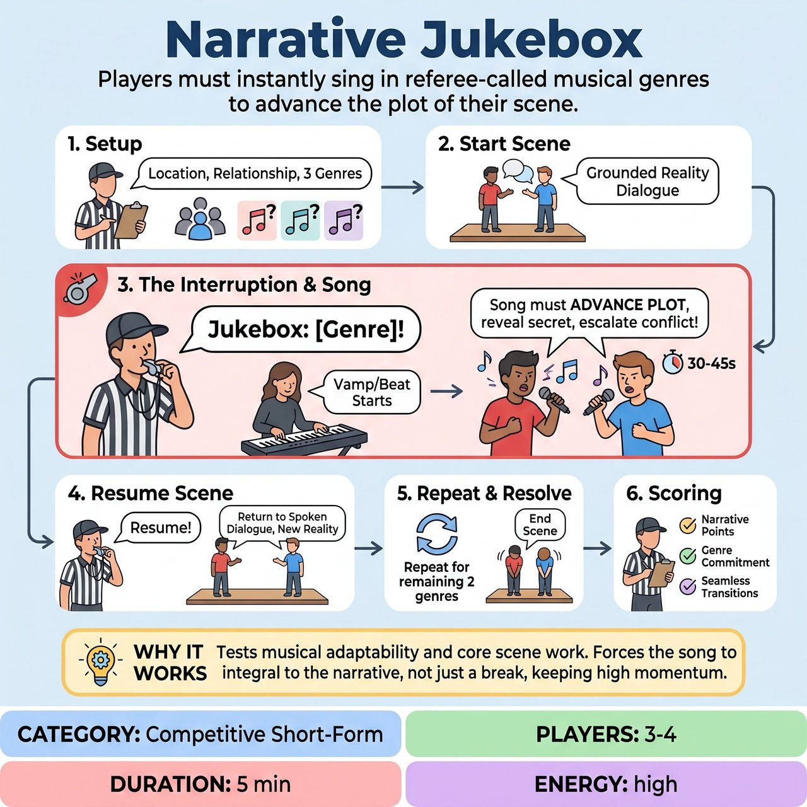

# Narrative Jukebox

{ .game-hero }

> Players must instantly sing in referee-called musical genres to advance the plot of their scene.

## Overview
A fast-paced competitive short-form game where a standard scene is interrupted by referee-called musical genres. Instead of pausing the scene, players must immediately sing a song in that genre that actively advances the plot. Once the song ends, the scene resumes with the new narrative reality.

## Setup
3 to 4 players, 1 Referee, and 1 Musical Director (on keys or guitar) or an ensemble ready for a cappella. No props required.

## How to Play
1. The Referee asks the audience for a location, a relationship, and exactly three distinct musical genres, writing the genres down.
2. Two players begin a spoken scene based on the location and relationship, establishing a grounded reality.
3. At a moment of heightened emotion, the Referee blows their whistle and calls out one of the collected genres (e.g., 'Jukebox: Country!').
4. The Musical Director immediately starts a vamp in that genre. If playing a cappella, the off-stage players provide the beat, bassline, or vocal vamp.
5. The active players transition into a song. The lyrics must actively advance the plot, reveal a secret, or escalate the conflict, rather than just summarizing what already happened.
6. After 30 to 45 seconds, the Referee blows the whistle and calls 'Resume!' The music stops, and players instantly return to spoken dialogue, treating everything sung as canon.
7. The Referee repeats this for the remaining two genres, capping the interruptions at three so the underlying scene has time to breathe and resolve.
8. The Referee awards points for narrative advancement during the song, strong genre commitment, and seamless transitions back to the scene. Fouls are called for Stalling or Genre Mismatch. The audience votes for the winning team by applause at the end of the match.

## Coaching Notes
- Ensure the songs actively advance the plot rather than just summarizing what already happened; this prevents the song from being a dead-end gag.
- Pre-collecting the genres helps maintain scene momentum and prevents stalling when the whistle is blown.
- Watch for 'Stalling' (singing without advancing the plot) or 'Genre Mismatch' and call fouls accordingly to keep the competitive element sharp.
- Remind players to treat everything established during the song as canon once they return to spoken dialogue.

## Variations
- A Cappella Jukebox: Played entirely without a Musical Director. The ensemble must use body percussion, beatboxing, and vocal harmonies to establish the genre.
- Jukebox Tag: When a genre is called, any player from the sidelines can tag into the scene to initiate the song, bringing a new character into the narrative.

## Why It Works
It tests both musical adaptability and core scene work. By forcing players to use the song to advance the narrative, it integrates the musical gimmick deeply into the scene's reality, while pre-collected genres keep the momentum high.

## Safety & Inclusion
The Referee must filter out genre suggestions that invite harmful cultural caricatures or offensive accents. Players who are anxious about singing can participate by performing spoken-word poetry in rhythm, providing backup vocals, or doing supportive physical dancing.

