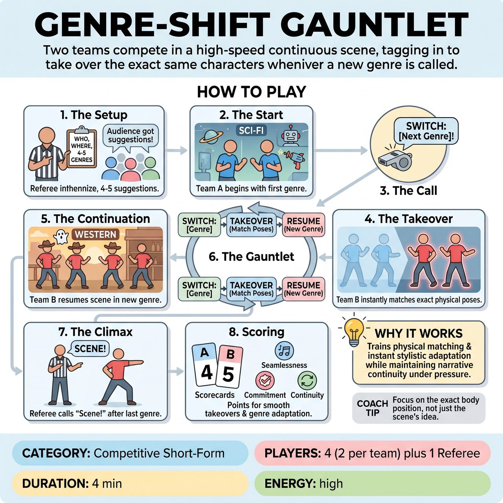

# Genre-Shift Gauntlet

{ .game-hero }

> Two teams compete in a high-speed continuous scene, tagging in to take over the exact same characters whenever a new genre is called.

## Overview
Two teams compete in a single, high-speed continuous scene, tagging in to take over the exact same characters whenever the Referee calls out a new genre. By gathering all genres upfront, the game becomes a rapid-fire test of listening, physical matching, and instant stylistic adaptation without ever stopping the action.

## Setup
Format: Competitive Short-Form. Requires two teams (2 players each on stage), a Referee with a whistle or loud voice, and ideally an improvisational musician. The Referee asks the audience for a relationship, a location, and a list of 4 to 5 distinct movie, television, or theatrical genres before the scene begins.

## How to Play
1. The Setup: The Referee gets the Who, Where, and 4-5 genres from the audience upfront, writing them down or memorizing them.
2. The Start: Two players from Team A take the stage and begin the scene using the first genre on the list.
3. The Call: At a high point in the action (usually 30-45 seconds in), the Referee blows the whistle and shouts, 'SWITCH: [Next Genre]!'
4. The Takeover: The action freezes for a split second. Team A immediately steps away, and Team B rushes in to assume the exact physical positions and postures Team A just left.
5. The Continuation: Team B instantly resumes the scene. They are playing the exact same characters and continuing the exact same plot, but they must immediately filter everything through the lens of the new genre.
6. The Gauntlet: The Referee continues to call switches back and forth between the two teams, burning through the remaining genres every 30-45 seconds.
7. The Climax: After the final genre has been played and the story reaches a natural (or absurd) conclusion, the Referee calls 'Scene!'
8. Scoring: The Referee awards 1 to 5 points per team based on the seamlessness of their physical takeovers, their instant commitment to the new genre, and their ability to keep the core narrative alive.

## Coaching Notes
- Call fouls (minus 1 point) for Delay of Game (hesitating on the switch), Dropping the Plot (starting a completely new scene instead of continuing the story), or inappropriate/unclean content.
- Focus on instant physical matching and spatial awareness during the takeovers.
- Encourage rapid genre parody and stylistic commitment.
- Remind players that high-level listening and narrative continuity are required to maintain unbroken pacing and high-energy momentum.

## Variations
- Emotion-Shift Gauntlet: Instead of genres, the audience provides 4-5 extreme emotional states upfront.
- Director's Cut: When the Referee calls a switch, they also yell 'Rewind!' The incoming team must replay the last 10 seconds of dialogue exactly, but in the new genre, before moving the plot forward.

## Why It Works
By gathering all genres upfront, the game becomes a rapid-fire test of listening, physical matching, and instant stylistic adaptation without ever stopping the action. It forces players to maintain narrative continuity while rapidly shifting genre parodies.

## Safety & Inclusion
Referees should monitor physical takeovers to ensure players aren't forced into uncomfortable, unsafe, or non-consensual physical contact when matching postures. Remind players to rely on theatrical tropes and stylistic conventions for genres rather than cultural stereotypes or offensive accents. Keep all content clean and family-friendly.

