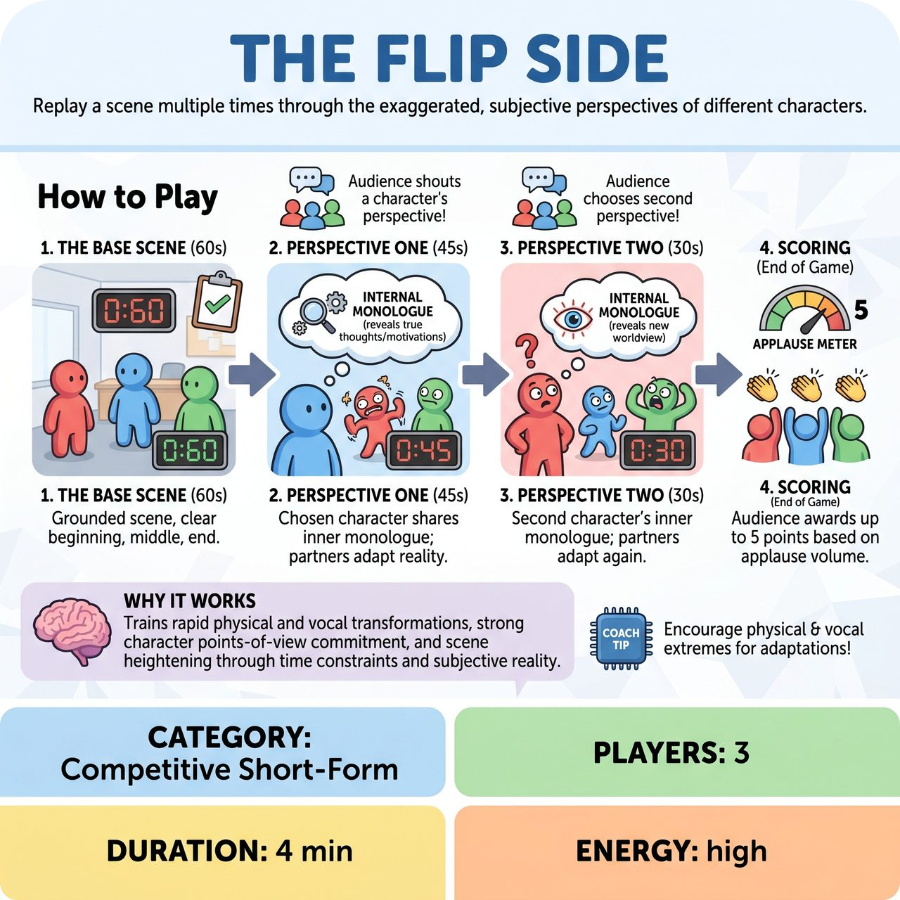

# The Flip Side

{ .game-hero }

> Replay a scene multiple times through the exaggerated, subjective perspectives of different characters.

## Overview
A fast-paced, competitive short-form game where a team performs a 60-second base scene, then replays it twice from the subjective, exaggerated perspectives of different characters. With descending time limits, players reveal their inner monologues while their scene partners drastically alter their characters to match that skewed reality.

## Setup
3 players from one team. A Referee with a whistle and a stopwatch. An audience suggestion of an everyday location or event (e.g., 'a busy airport security line').

## How to Play
1. The Base Scene (60 seconds): The Referee gets a suggestion and starts the clock. The three players perform a grounded, objective scene with a clear beginning, middle, and end. The Referee blows the whistle at exactly 60 seconds.
2. Perspective One (45 seconds): The Referee asks the audience to shout out which of the three characters' perspectives they want to see (e.g., 'The TSA Agent!'). The clock is set to 45 seconds, and the scene restarts from the top.
3. The Shift: The chosen character now speaks their internal monologue out loud to the audience, revealing their true thoughts and secret motivations. Crucially, the other two players must instantly adapt their behavior to match how the central character perceives them (e.g., if the TSA Agent views the passengers as mindless zombies, the passengers must play the scene as literal zombies). The Referee blows the whistle at 45 seconds.
4. Perspective Two (30 seconds): The Referee asks the audience for a second character's perspective (e.g., 'The Nervous Traveler!'). The clock is set to 30 seconds, and the scene restarts one final time.
5. The Final Sprint: The Nervous Traveler now shares their inner monologue, and the other two players adapt to this new worldview (e.g., the TSA Agent is now perceived as a terrifying, fire-breathing dictator). The Referee blows the whistle at 30 seconds.
6. Scoring: At the end of the game, the Referee asks the audience to applaud for the team's performance, awarding up to 5 points based on the volume of the applause. No granular judge scoring is used.

## Coaching Notes
- Ensure the base scene is grounded and objective; this provides a solid foundation to contrast with the crazy subjective realities later.
- Supporting players must commit to rapid physical and vocal transformations to embody the subjective reality.
- Use the descending time limits to create urgency and naturally escalate the energy of the scene.
- Encourage the focal character to use their inner monologue to reveal subtext and hidden motivations, not just narrate the action.

## Variations
- Half-Life Flip: For an even faster pace, the time limits are strictly halved each round (60s, 30s, 15s), forcing players to frantically fast-forward to the most important moments of the scene while maintaining the new perspectives.
- Musical Flip: The inner monologue of the central character must be sung, turning their subjective perspective into a dramatic solo number while the other players act as backup dancers or exaggerated figures in their fantasy.

## Why It Works
It trains players to make rapid physical and vocal transformations, commit to strong character points-of-view, and heighten scenes through time constraints and subjective reality.

## Safety & Inclusion
When portraying a character's skewed perception of another, players should focus on comedic, status-based, or emotional exaggerations rather than punching down or relying on harmful stereotypes. If a character perceives another as 'creepy' or 'aggressive', players must maintain physical boundaries and use cartoonish choices rather than genuine menace. The Referee should use a content foul for any crude or inappropriate content to keep the game family-friendly.

