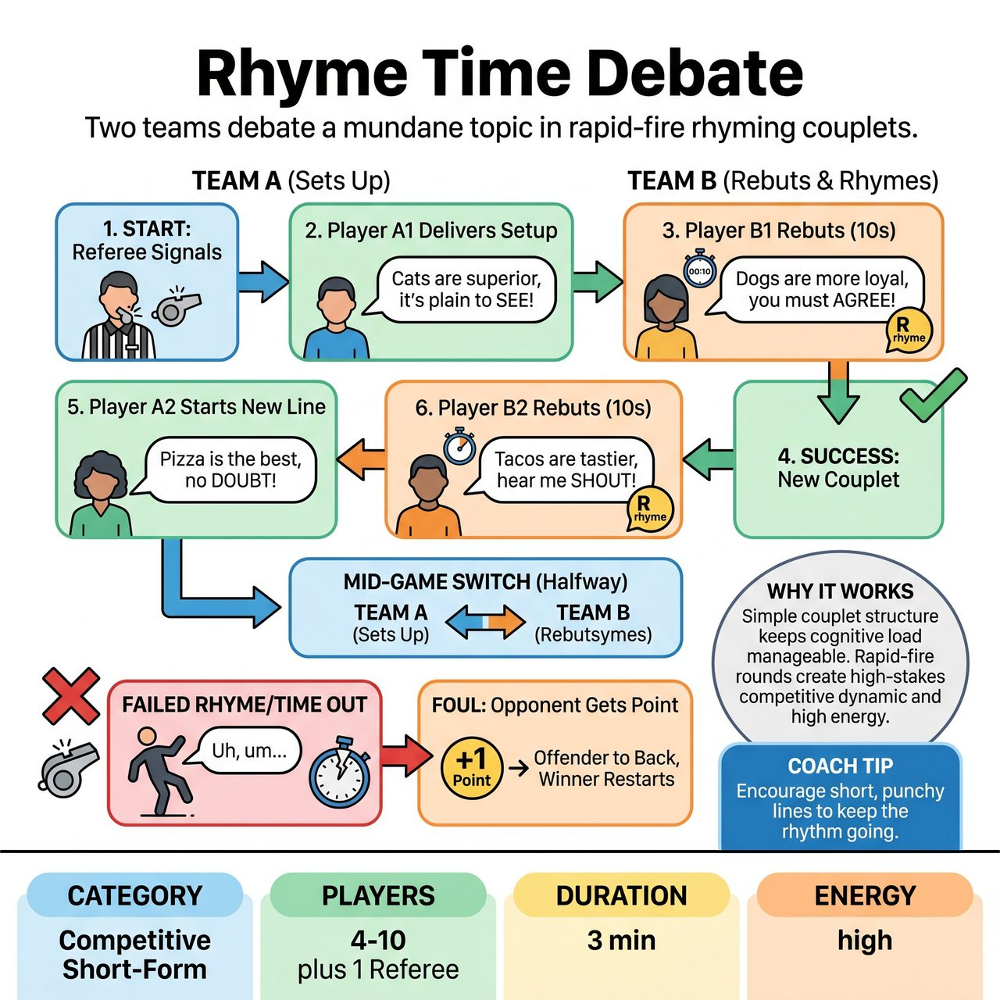

# Rhyme Time Debate

{ .game-hero }

> Two teams debate a mundane topic in rapid-fire rhyming couplets.

## Overview
A fast-paced, competitive short-form game where two teams debate a mundane topic in rhyming couplets. Players must deliver on-topic rebuttals that rhyme with the opposing team's setup line within a ten-second time limit, earning points for their team when opponents stumble.

## Setup
Two teams line up on opposite sides of the stage. A Referee stands center stage. The Referee asks the audience for a mundane, low-stakes debate topic (for example, Pancakes versus Waffles) and assigns one side to Team A and the other to Team B.

## How to Play
1. The Referee starts the match. Player 1 from Team A steps forward and delivers a single line arguing their side, ending in a word that is easy to rhyme.
2. Player 1 from Team B has up to ten seconds to step forward and deliver a rebuttal line that argues their side AND rhymes with Team A's ending word.
3. If successful, Player 2 from Team A steps forward and delivers a completely new line ending in a new word, starting a new couplet.
4. Player 2 from Team B then has ten seconds to rhyme with that new word while arguing their side.
5. If a player fails to rhyme, takes longer than ten seconds, breaks the rhythm, or says something nonsensical, the Referee blows the whistle or dings a bell.
6. The offending team commits a foul. The Referee awards one point to the opposing team.
7. The player who failed goes to the back of their team's line. The team that won the point gets to start the next couplet with a fresh word.
8. Halfway through the three-minute game, the Referee calls a switch. Team B now sets up the rhymes, and Team A must deliver the rhyming rebuttals. The team with the most points at the end wins.

## Coaching Notes
- Encourage the audience to cheer for good rhymes and groan for bad ones.
- The Referee can award bonus points for exceptionally clever rhymes that get a massive audience reaction.
- If a player freezes, the Referee should cheerfully call the foul and move on quickly, keeping the tone supportive and preventing the player from feeling stranded or embarrassed.
- Remind the setting team to end their lines on words that are easy to rhyme to keep the game flowing.

## Variations
- Rhyming Compliments: Instead of a debate, the teams try to aggressively compliment each other or a shared object, still using the rhyming couplet structure.
- All-Play Debate: Instead of one team setting up and the other rhyming for half the game, the setup alternates every single couplet. Team A sets up, Team B rhymes. Then Team B sets up the next rhyme, and Team A rhymes it.

## Why It Works
The simple couplet structure keeps the cognitive load manageable while still looking impressive. The fast-paced, rapid-fire rounds create a clear, high-stakes competitive dynamic that keeps the energy high and the audience engaged.

## Safety & Inclusion
The ten-second rule gives players enough time to process and construct a sentence, making the game more accessible to neurodivergent players or those who process language differently. The Referee must ensure debate topics remain lighthearted and mundane to avoid sensitive or genuinely contentious real-world issues.

