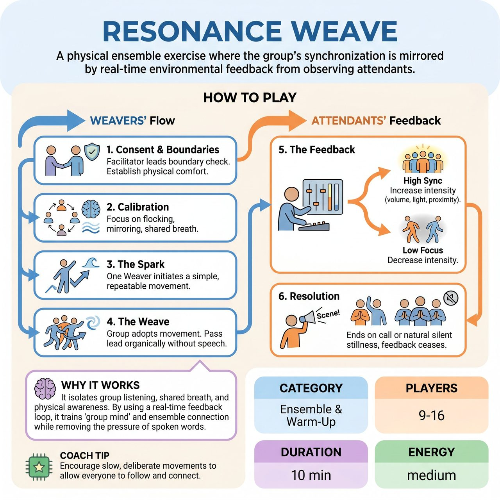

# Resonance Weave

{ .game-hero }

> A physical ensemble exercise where the group's synchronization is mirrored by real-time environmental feedback from observing attendants.

## Overview
A facilitator-led physical ensemble exercise where the group's physical synchronization is mirrored by real-time environmental feedback. A small group of 'Attendants' controls elements like sound volume, lighting, or physical proximity, increasing intensity when the main group of 'Weavers' moves together as a unified whole, and decreasing it when the group loses focus. This creates a living feedback loop that trains deep listening, shared breath, and group mind without relying on spoken words.

## Setup
Divide the group: 6-12 players act as 'Weavers' in the center of the room, while 3-4 players act as 'Attendants' on the perimeter. Assign each Attendant a simple environmental control (e.g., humming volume, a phone flashlight, or stepping closer/further from the center). Clearly define the playing space using tape or cones.

## How to Play
1. Consent & Boundaries: The facilitator leads a physical boundary check. Players establish if they are open to physical touch or prefer no-touch, and the physical edges of the playing space are clearly pointed out.
2. Calibration: The facilitator explains the goal to the Weavers: move as one organism using techniques like flocking, breathing together, and mirroring. Attendants are instructed to watch for objective signs of unity (shared rhythm, eye contact, fluid weight shifts).
3. The Spark: Weavers begin in a neutral standing circle. One Weaver initiates a simple, repeatable movement (e.g., a slow arm raise, a rhythmic step, or a deep audible breath).
4. The Weave: The rest of the Weavers immediately adopt and support this movement. The goal is to pass the 'lead' organically without speaking, shifting into new movements (e.g., moving around the room like a flock of birds, sinking to the floor together, creating a machine-like rhythm).
5. The Feedback: Attendants respond to the Weavers' unity. If the Weavers are highly synchronized and focused, Attendants increase their environmental element (e.g., humming louder, shining the light brighter, stepping closer). If the Weavers hesitate, clash, or lose focus, Attendants decrease the element.
6. Resolution: The exercise ends when the facilitator calls 'Scene' or when the group naturally brings the movement to a synchronized, silent stillness and the Attendants fade their feedback to zero.

## Coaching Notes
- Remind the Weavers to remove verbal pressure entirely, focusing only on physical ensemble building.
- Encourage the Attendants to be highly responsive; their real-time feedback is the core mechanic guiding the ensemble's focus.
- Watch for objective signs of unity like shared rhythm, eye contact, and fluid weight shifts to gauge the group's success.
- Feel free to scale the environmental feedback from zero-tech (humming/clapping) to high-tech (dimmer switches/music) depending on your space and resources.

## Variations
- Blind Weave: Weavers close their eyes and rely entirely on the Attendants' sound feedback and the sound of their fellow players' breathing/footsteps to synchronize.
- The Shifting Thread: Once the group is highly synchronized, the facilitator taps one Weaver to introduce a completely contrasting movement (e.g., sharp and fast instead of slow and fluid). The group must adapt to the new rhythm without losing the feedback intensity.

## Why It Works
It isolates group listening, shared breath, and physical awareness. By using a real-time feedback loop, it trains 'group mind' and ensemble connection while removing the pressure of spoken words.

## Safety & Inclusion
Mandatory pre-game check-in for physical touch boundaries and mobility limitations. Clear physical boundaries (tape/cones) must be established to prevent collisions, especially if players are moving backward or with closed eyes. Movements can be easily adapted for seated players or those with limited mobility by focusing on breath, hand gestures, and facial mirroring rather than whole-body locomotion.

