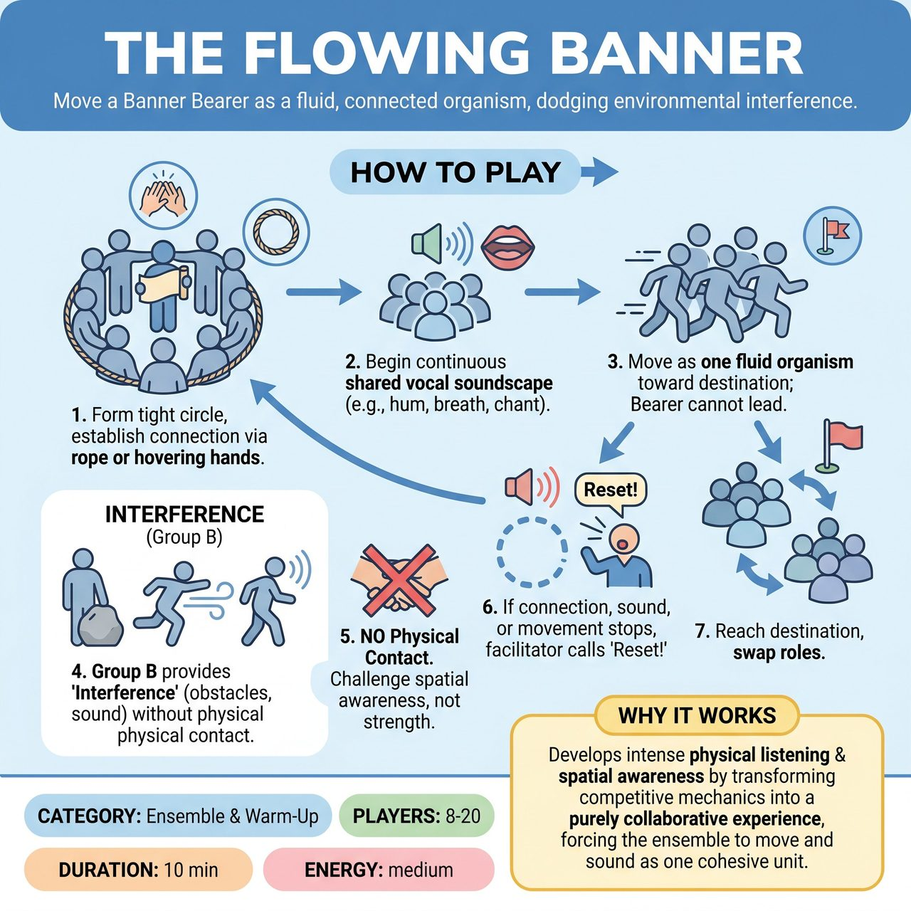

# The Flowing Banner

{ .game-hero }

> Move a Banner Bearer across the room as a fluid, connected organism while dodging environmental interference.

## Overview
A non-competitive ensemble warm-up where a group moves a 'Banner Bearer' across the room while maintaining a continuous spatial connection and a shared vocal soundscape. The rest of the room acts as environmental 'interference,' challenging the moving group's focus and cohesion without physical contact.

## Setup
Clear a large room. Divide the group in half. Group A is the 'Support Circle' and Group B is the 'Interference.' Give Group A a highly visible object to act as the Banner, such as a brightly colored scarf or a ribbon on a stick. Designate a starting wall and a destination wall.

## How to Play
1. Group A forms a tight circle around the Banner Bearer. They establish their connection by either holding a shared circular rope or keeping their hands hovering exactly two inches apart.
2. Group A begins a continuous, shared vocal soundscape, such as a collective hum, a rhythmic breath, or a chanted vowel.
3. Group A begins moving toward the destination wall. The Bearer cannot lead; the circle must move as one fluid organism.
4. Group B provides 'Interference' by acting as environmental obstacles. Concrete examples of interference include: standing perfectly still like a boulder the circle must flow around, walking slowly and deliberately across the circle's path, or making dissonant wind noises to distract the soundscape.
5. Physical contact from Group B is strictly forbidden. They are challenging the circle's spatial awareness, not their physical strength.
6. If Group A's connection breaks, their soundscape stops, or they come to a complete halt, the facilitator calls 'Reset!' and Group A starts over from the beginning.
7. Once Group A reaches the destination, the groups swap roles.

## Coaching Notes
- Remind players there are no points, judges, or audience; the objective is purely developmental.
- Encourage the group to achieve a state of collective flow, deep ensemble listening, and non-verbal problem-solving.
- Ensure the continuous vocal soundscape externalizes the group's connection.
- Remind players to remove the pressure of being funny or generating narrative.
- Watch Group B closely to ensure they are providing interference without making any physical contact.

## Variations
- The Magnetic Field (Touch-Free): Players maintain exactly one foot of distance between hands, relying purely on visual and spatial awareness to stay connected.
- Seated Soundscape (Mobility-Friendly): Group A sits in a circle, passing the banner fluidly while maintaining a complex vocal rhythm. Group B walks around them trying to distract their rhythm with contrasting sounds or movements.

## Why It Works
It develops intense physical listening and spatial awareness by transforming competitive mechanics into a purely collaborative experience, forcing the ensemble to move and sound as one cohesive unit.

## Safety & Inclusion
Always establish consent for touch before playing; default to the 'Magnetic Field' variation or holding a shared rope if anyone is touch-averse. The speed of the moving circle must always be dictated by its slowest or least mobile member. The facilitator must strictly enforce the 'no physical contact' rule for the Interference group.

