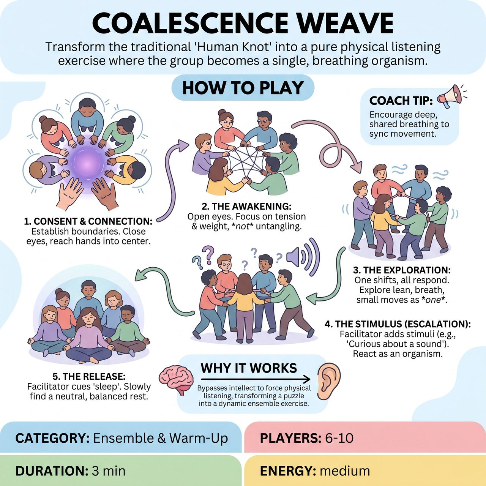

# Coalescence Weave

{ .game-hero }

> Transform the traditional 'Human Knot' into a pure physical listening exercise where the group becomes a single, breathing organism.

## Overview
A non-competitive ensemble warm-up that transforms the traditional 'Human Knot' into a pure physical listening exercise. Instead of trying to untangle, players form a connected web and become a single, multi-limbed organism. By shifting weight, breathing, and reacting to side-coached stimuli as one entity, players bypass the intellect to build deep ensemble trust, non-verbal responsiveness, and group-mind.

## Setup
6 to 10 players stand in a loose circle. The facilitator explains the consent mechanics, the 'Drop' safety word, and the goal of the exercise (to move as one, not to untangle). Scarves, ropes, or resistance bands should be on hand for accessibility adaptations.

## How to Play
1. Consent & Connection: The facilitator asks all players to establish physical boundaries. Players then close their eyes, reach both hands into the center of the circle, and gently find two different hands to hold (belonging to two different people, neither being their immediate neighbor).
2. The Awakening: Once connected, players open their eyes. The facilitator introduces the Point of Concentration: 'Do not untangle. Listen to the tension and weight of the group.' The group takes three deep, audible breaths together to 'wake up' the organism.
3. The Exploration: As one person naturally shifts their weight, the rest of the knot must accommodate and respond without speaking. The group slowly explores leaning, sinking, rising, and rotating as a single entity, following the path of least resistance.
4. The Stimulus (Escalation): To elevate the playfulness, the facilitator introduces imaginary environmental stimuli. Examples: 'The organism is curious about a sound above it,' 'The organism is suddenly freezing cold,' or 'The organism is moving through thick, heavy honey.' The group reacts physically as one.
5. The Release: After 2 to 3 minutes of continuous movement, the facilitator cues the organism to 'go to sleep.' The group slowly finds a neutral, balanced resting point, takes one final collective breath, and gently releases hands.

## Coaching Notes
- Act as a side-coach, offering gentle prompts and imaginative stimuli to keep players focused on physical listening rather than intellectualizing or trying to 'solve' the knot.
- Remind players of the Point of Concentration: the goal is to listen to the tension and weight of the group, not to untangle.
- Scale the escalation smoothly: start with simple breath and slowly build to complex environmental reactions.

## Variations
- Fabric Weave (Accessibility/Mobility Focus): Instead of holding hands, players hold the ends of long scarves, resistance bands, or ropes. This allows players in wheelchairs, those with limited reach, or those who prefer no direct physical contact to fully participate in feeling the tension and release of the organism.
- The Vocal Organism: As the group shifts and moves, players add a continuous, collective hum, click, or vowel sound. The pitch, tempo, and volume of the sound organically rise and fall based on the physical tension and compression of the knot.
- The Emotional Organism: The facilitator side-coaches shared emotions (e.g., 'The organism is suspicious,' 'The organism is overjoyed,' 'The organism is terrified'). The knot must physically manifest that emotion together without breaking connection.

## Why It Works
It provides a strong, clear Point of Concentration that bypasses the intellect and forces physical listening. By shifting weight, breathing, and reacting to stimuli as one entity, it transforms a common team-building puzzle into a dynamic, creature-building theatrical exercise that builds deep ensemble trust and non-verbal responsiveness.

## Safety & Inclusion
Explicit Consent is mandatory; always offer the 'Fabric Weave' variation as a default if anyone is hesitant about touch. Establish a safety word ('Drop'): if any player feels pain, discomfort, or claustrophobia, they say 'Drop' and the entire group immediately releases hands. Keep the exercise to 2-3 minutes maximum to prevent physical strain. For players who cannot stand, the entire game can be played seated in a tight circle of chairs.

