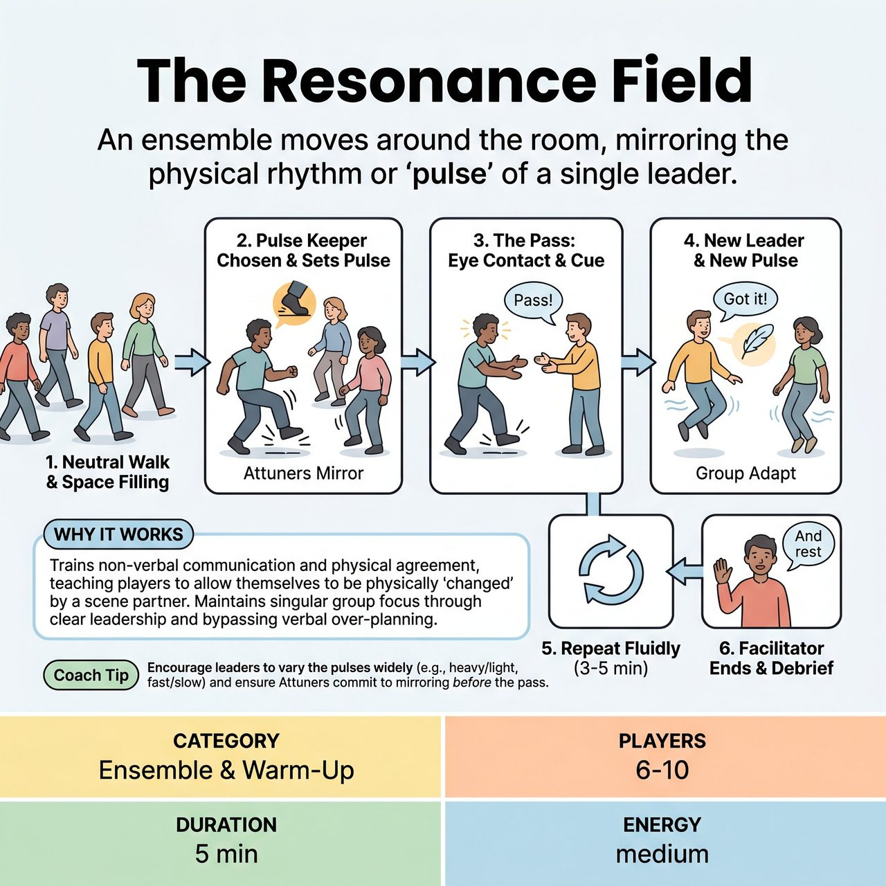

# The Resonance Field

{ .game-hero }

> An ensemble moves around the room, mirroring the physical rhythm or 'pulse' of a single leader.

## Overview
A focused, silent warm-up where an ensemble of 6-10 players moves around the room, mirroring the physical rhythm or 'pulse' of a single leader. The current leader passes control to a new leader using a clear physical and vocal cue, training the group to maintain singular focus, pick up on subtle physical offers, and move as a unified organism.

## Setup
An open room completely clear of chairs, bags, and obstacles. No props are required. Larger groups should split into smaller pods of 6-10 players.

## How to Play
1. The facilitator asks the group to begin walking around the room silently at a neutral, comfortable pace, filling the empty space.
2. The facilitator calls out the name of one player to be the first 'Pulse Keeper.'
3. The Pulse Keeper introduces a simple, repeatable physical movement or rhythm (the 'pulse') as they move. Examples: A heavy, stomping walk; a light, floating sway; a quick, nervous shoulder twitch; or a slow, expansive arm swing.
4. The rest of the ensemble (the 'Attuners') immediately observes and mirrors this pulse. They match the leader's physical energy, posture, and rhythm while continuing to move independently around the room.
5. To change leaders, the current Pulse Keeper makes direct, intentional eye contact with another player.
6. The Pulse Keeper executes a clear physical 'give' (e.g., extending both hands toward the receiver) and gives a vocal cue, saying 'Pass!'
7. The receiving player acknowledges by saying 'Got it!' and instantly becomes the new Pulse Keeper.
8. The new Pulse Keeper immediately drops the old movement and starts a brand new physical pulse. The rest of the group (including the old leader) instantly adapts to mirror this new energy.
9. The game continues fluidly for 3 to 5 minutes. The facilitator ends the exercise by calling 'And rest' or 'Neutral.'
10. Debrief (Crucial): The facilitator asks the group how it felt to be 'changed' by someone else's physical choice.

## Coaching Notes
- Explain during the debrief that in scene work, adopting a partner's posture or breathing rate is the fastest way to establish relationship and agreement without words.
- Remind players that this is a non-competitive ensemble warm-up. The focus is entirely on group connection, active listening, and process over product.
- Encourage players to bypass their intellect and rely on physical instinct rather than overthinking their movements.

## Variations
- Vocal Resonance: Once the physical passing is smooth, allow the Pulse Keeper to add a simple, repeatable sound (a hum, a click, a sigh, a rhythmic breath) that the group also mirrors.
- Fishbowl Observation: For groups larger than 10, split the room in half. Group A performs the exercise while Group B observes the 'hive mind' effect from the outside, then swap. This is excellent for demonstrating how unified the group looks to an audience.
- Scene Start Transition: Use this warm-up to launch directly into scenes. The facilitator calls 'Freeze!' Two players closest to the center step forward, keep the exact physical posture and energy of the current pulse, and use that physical state to inspire the first line of dialogue in a two-person scene.

## Why It Works
It trains non-verbal communication and physical agreement, teaching players to allow themselves to be physically 'changed' by a scene partner. It maintains singular group focus through a clear, current-leader-driven passing mechanic and bypasses the intellect, forcing improvisers to rely on physical instinct.

## Safety & Inclusion
Physical Safety: Ensure the room is completely clear of tripping hazards, as players will be moving while looking at each other. Accessibility: The 'pulse' does not need to be a full-body movement; it can be adapted to whatever mobility level players have (e.g., facial expressions, hand gestures, or breathing rhythms). Consent: Eye contact should be an invitation, not a demand. If a player avoids eye contact, the Pulse Keeper must respect that boundary and look for another partner to pass the lead to.

