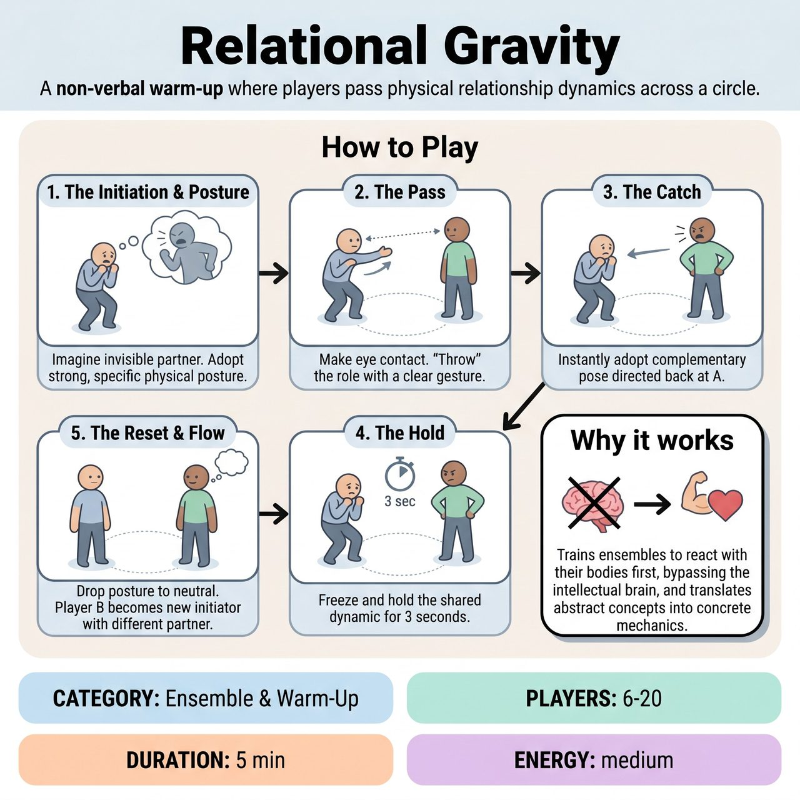

# Relational Gravity

{ .game-hero }

> A non-verbal warm-up where players pass physical relationship dynamics across a circle.

## Overview
A non-verbal warm-up where players pass physical relationship dynamics across a circle. By establishing a strong posture with an invisible partner and 'throwing' that role to a teammate, players practice instant, intuitive physical commitment and reading body language without the pressure of dialogue. It trains ensembles to react with their bodies first, bypassing the intellectual brain.

## Setup
Players stand in a large circle with clear space in the middle. The facilitator stands on the edge of the circle to side-coach. No props or chairs are needed.

## How to Play
1. The Initiation: One player (Player A) looks into the empty space just in front of them and imagines an invisible partner.
2. The Posture: Player A adopts a strong, specific physical posture and facial expression reacting to this invisible partner (e.g., cowering in fear, scolding with hands on hips, reaching out tenderly).
3. The Pass: Once the posture is clear, Player A makes direct eye contact with another player (Player B) across the circle. Player A makes a single, clear physical gesture toward Player B to 'pass' the invisible partner's role (e.g., a dismissive wave, a beckoning finger, a defensive block).
4. The Catch: Player B stays in their spot on the circle but instantly adopts the complementary physical posture, directing it back at Player A. For example, if Player A was pleading, Player B might adopt a rigid, unyielding posture of authority.
5. The Hold: Both players freeze and hold this shared physical dynamic across the empty space for 3 seconds, locking in the relationship and maintaining eye contact.
6. The Reset: Both players drop the posture and return to neutral. Player B is now the new Initiator. They imagine a new invisible partner with a completely different dynamic, adopt a new posture, and pass it to Player C.
7. The Flow: The game continues across the circle, with the facilitator side-coaching to increase the pace and encourage full-body commitment.

## Coaching Notes
- Side-coach with prompts like 'React with your spine!', 'Don't think, just move!', and 'Hold that picture for three seconds!' to keep the energy focused and fast.
- Encourage players to rely entirely on non-verbal physical cues and body language.
- Demand immediate, intuitive commitment without time for intellectual planning.

## Variations
- Step Into the Space: Instead of staying on the circle, Player B physically steps into the center of the circle to occupy the exact spot of the invisible partner, completing a tight stage picture before both players reset.
- Sound and Motion: Players add one non-verbal sound (a sigh, a grunt, a gasp, a laugh) to their posture to heighten the emotional stakes and give their partner an auditory cue to react to.

## Why It Works
It trains ensembles to react with their bodies first, bypassing the intellectual brain. It translates abstract relationship concepts into concrete, playable physical mechanics like posture, distance, and tension.

## Safety & Inclusion
Explicitly instruct players that all gestures must be mimed at a safe distance. There is absolutely no actual striking, aggressive lunging, or forced physical proximity. By keeping the main game on the perimeter of the circle, players maintain their own personal space while still engaging in intense relational dynamics. Players with mobility restrictions can participate fully by focusing on upper-body posture, facial expressions, and clear arm gestures; the game does not require walking, running, or standing.

