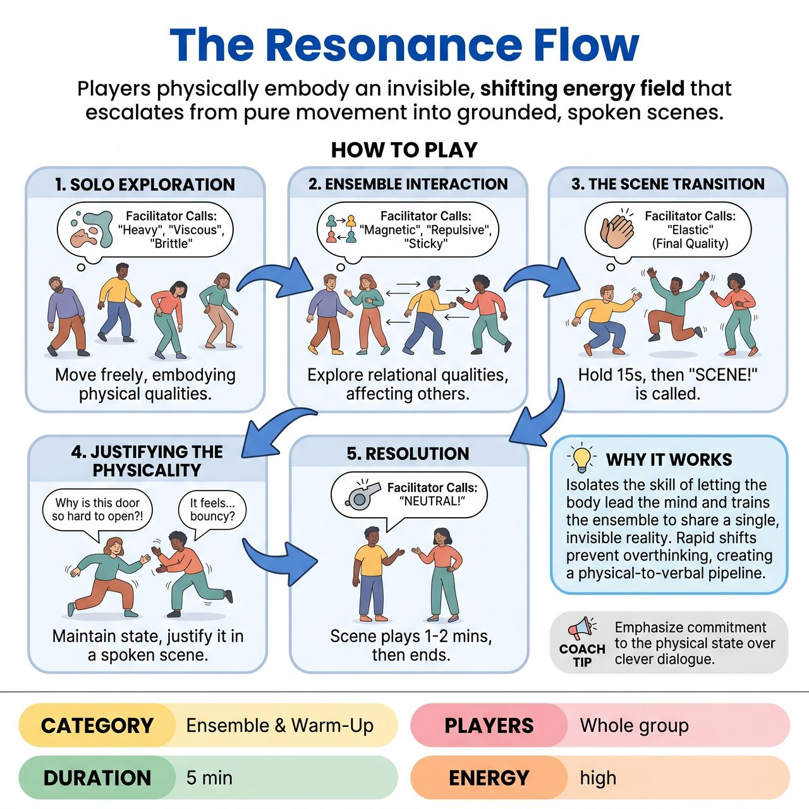

# The Resonance Flow

{ .game-hero }

> Players physically embody an invisible, shifting energy field that escalates from pure movement into grounded, spoken scenes.

## Overview
A facilitator-led ensemble exercise where players physically embody an invisible, shifting energy field (e.g., 'heavy,' 'vibrating,' 'magnetic') that permeates the room. Starting as a pure movement warm-up to get players out of their heads, the game escalates by using these spontaneous physical states to inspire and transition into grounded, spoken scenes.

## Setup
Players gather in a spacious, open area, standing in a neutral position. No props or chairs are needed. The facilitator acts as the 'Flow Guide,' calling out the shifting qualities and side-coaching the ensemble.

## How to Play
1. Solo Exploration: The facilitator instructs players to move freely around the space and calls out a physical quality (e.g., 'Heavy', 'Viscous', 'Brittle', 'Buoyant'). Players must instantly let that quality affect their entire body and movement through the space.
2. Ensemble Interaction: After a few solo shifts, the facilitator introduces relational qualities (e.g., 'Magnetic', 'Repulsive', 'Sticky'). Players must now let the energy dictate how they interact with others in the space, moving together or apart based on the invisible forces.
3. The Scene Transition: Once the group is highly responsive, the facilitator calls a final quality (e.g., 'Elastic'). After 15 seconds of physical exploration, the facilitator calls, 'Hold the body, find the scene!'
4. Justifying the Physicality: Players pair up or form small groups. They must maintain their current physical state (e.g., moving as if elastic) but now justify it with a spoken scene, character, and relationship (e.g., two astronauts struggling with a tether, or two toddlers fighting over a toy).
5. Resolution: The scene plays out for 1-2 minutes, grounded by the physical choice, before the facilitator calls 'Neutral!' to end the exercise.

## Coaching Notes
- Actively side-coach to keep players out of their heads. Prompts include: 'Breathe into the sensation, don't plan it,' 'If you catch yourself trying to be funny or gagging, drop it and just feel the weight of your arms,' and 'Let the environment move you; you don't have to invent a story yet.'
- The 'score' is the ensemble's ability to achieve total physical commitment without hesitation.
- Act as a side-coach to guide the pacing and ensure players don't drop their physicality when they begin speaking.

## Variations
- Emotional Resonance: Instead of physical properties, the facilitator calls out emotional energies ('Anxious', 'Joyful', 'Suspicious'). Players let the emotion dictate their movement, then transition into a scene justifying that collective emotional state.
- The Dial: The facilitator calls a quality (e.g., 'Heavy') and then uses a 1-to-10 dial to increase or decrease the intensity of the flow, teaching players how to modulate their physical choices subtly.

## Why It Works
It isolates the skill of letting the body lead the mind and trains the ensemble to share a single, invisible reality. Rapid shifts prevent players from overthinking or pre-planning, creating a physical-to-verbal pipeline that teaches players how to use an abstract physical warm-up to generate concrete scene ideas.

## Safety & Inclusion
Explicit consent and boundaries are required for relational qualities like 'Magnetic' or 'Sticky'. Implement the 'Forcefield Rule': players must maintain a 2-inch gap between bodies to simulate connection without actual physical touch, unless explicit prior consent for contact has been established. For mobility inclusion, emphasize that 'movement' can be entirely internal, facial, or upper-body; a player seated in a chair can embody 'heavy' or 'vibrating' just as effectively as a player walking the room. Remind players not to strain or risk injury during extreme qualities like 'brittle' or 'heavy'.

