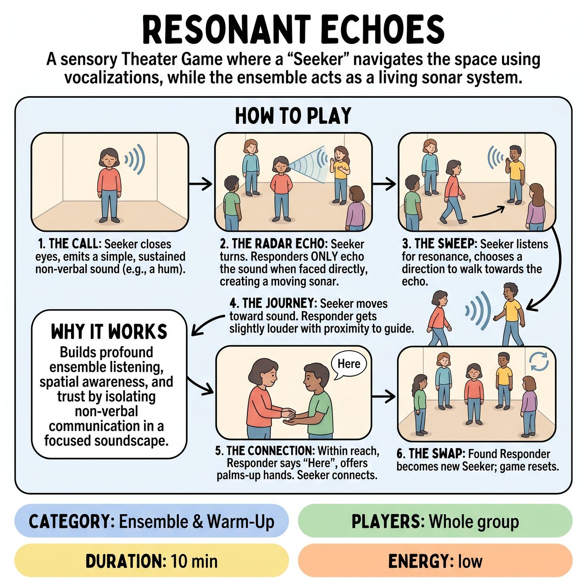

# Resonant Echoes

{ .game-hero }

> A sensory Theater Game where a 'Seeker' navigates the space using vocalizations, while the ensemble acts as a living sonar system.

## Overview
A sensory Theater Game where a 'Seeker' with closed eyes navigates the space using vocalizations, while the ensemble acts as a living sonar system. By echoing the Seeker's sounds only when faced directly, the group creates a dynamic, moving soundscape. This exercise builds profound ensemble listening, spatial awareness, and trust, isolating non-verbal communication in a highly focused environment.

## Setup
Clear the room of all obstacles, bags, and chairs. The ensemble scatters around the edges of the space, rooting their feet in place. One player volunteers to be the 'Seeker' in the center. Before beginning, the facilitator establishes touch boundaries: when the Seeker finds a Responder, connection is made strictly hand-to-hand. The Seeker may close their eyes, wear a blindfold, or simply hold a soft, unfocused gaze at the floor, depending on their personal comfort level.

## How to Play
1. The Call: The Seeker stands in the center, closes their eyes, and emits a simple, sustained non-verbal sound (e.g., a hum, a sigh, or a sustained vowel).
2. The Radar Echo (Preventing Overload): To avoid a chaotic wall of sound, Responders act as 'sonar.' A Responder ONLY echoes the Seeker's sound when the Seeker's chest/face is pointed in their general direction (within a 45-degree angle).
3. The Sweep: As the Seeker slowly turns in place, the echo moves around the room. The Seeker listens for the resonance and chooses a direction to walk slowly, keeping their hands raised at chest level as 'bumpers.'
4. The Journey: The Seeker moves toward the sound. Responders adjust their volume based on proximity-getting slightly louder as the Seeker approaches, guiding them purely through auditory and energetic pull.
5. The Connection: When the Seeker is within arm's reach, the Responder gently says 'Here' and offers their hands palms-up. The Seeker places their hands on top, completing the connection.
6. The Swap: The found Responder becomes the new Seeker, moving to the center, and the game resets.

## Coaching Notes
- If players feel silly or disconnected, the facilitator should calmly side-coach: 'Breathe into the sound. Don't perform it, just reflect it. Let the vibration move you. Trust the ensemble to catch you.'
- Explicit Point of Concentration (POC): Seekers focus on kinesthetic and auditory tracking; Responders focus on immediate, authentic vocal mirroring.
- The 'win' is the ensemble achieving a synchronized, living soundscape and the Seeker safely navigating the space through trust and whole-body listening.

## Variations
- One-to-One Echo: For highly sensitive groups or smaller spaces, the facilitator silently points to just ONE Responder per round. Only that person echoes the Seeker, creating a highly focused, intimate game of Marco Polo.
- Emotion Echo: The Seeker imbues their call with a specific emotional texture (e.g., a frustrated grunt, a joyful trill). The Responders must echo back the exact emotional resonance, not just the pitch, training empathetic listening.

## Why It Works
It isolates non-verbal communication and spatial awareness. The radar mechanic prevents sensory overload and creates a beautiful, sweeping Doppler effect in the room, building profound ensemble listening, spatial awareness, and trust.

## Safety & Inclusion
Physical Safety: The facilitator acts as an active 'spotter,' shadowing the Seeker to physically intervene if they wander near a wall or hazard. Consent: Blindfolds are strictly opt-in; players may simply close their eyes or look at their shoes. Touch is limited to hand-to-hand connection, initiated by the stationary Responder saying 'Here' to prevent accidental collisions or unwanted physical contact. Accessibility: Players with mobility limitations can easily participate as stationary Responders, and the Seeker role can be adapted to moving via wheelchair or mobility aid with the spotter's assistance.

