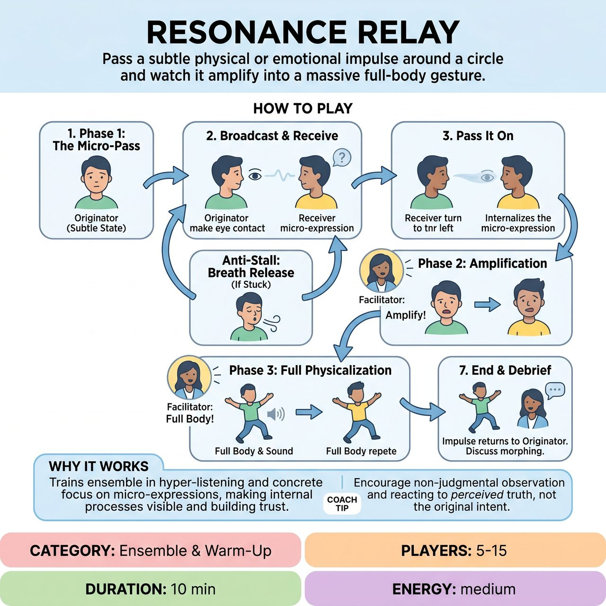

# Resonance Relay

{ .game-hero }

> Pass a subtle physical or emotional impulse around a circle and watch it amplify into a massive full-body gesture.

## Overview
A meditative, focus-building warm-up where players pass a subtle physical or emotional impulse around a circle. Starting with barely perceptible micro-expressions, the group gradually amplifies the impulse in subsequent rounds until it becomes a fully physicalized movement. It acts like a game of non-verbal 'Telephone,' training the ensemble in hyper-listening while providing the satisfying payoff of watching a tiny internal feeling evolve into a massive group gesture.

## Setup
Players stand or sit in a loose circle, at least arm's length apart. The room should be quiet and free of distractions. The facilitator stands outside the circle to side-coach and guide the phases.

## How to Play
1. Phase 1: The Micro-Pass. One player (the Originator) chooses a tiny, internal state or micro-expression. Examples include a slight widening of the eyes, a subtle weight shift to one heel, a softening of the jaw, a sharp inhale, or a tiny flutter of the fingers.
2. The Originator turns to the person on their left (the Receiver) and 'broadcasts' this state purely through that micro-expression and focused eye contact.
3. The Receiver observes, internalizes whatever they perceive (even if they misinterpret it), and then turns to their left to pass their version of that micro-expression to the next person.
4. The Anti-Stall Mechanic (The Breath Release): If a Receiver feels absolutely nothing or gets confused after 3 to 5 seconds, they must not stall the game. Instead, they take one deep, audible breath and pass that breath to the next person, resetting the energy flow.
5. Phase 2: Amplification. Once the impulse travels all the way back to the Originator, the facilitator calls out 'Amplify!' The Originator takes whatever the impulse has currently become and makes it 20 percent bigger (e.g., a slight jaw clench becomes a tilted head with tight fists), passing it around the circle again.
6. Phase 3: Full Physicalization. When the impulse returns again, the facilitator calls 'Full Body!' Players now pass the impulse using their entire body and an accompanying sound, turning the original subtle feeling into a bold, undeniable character choice or gesture.
7. The round ends when the fully physicalized impulse makes its final return to the Originator. The facilitator can then debrief the group on how the impulse morphed and changed along the way.

## Coaching Notes
- Emphasize that misinterpretations are the best part of the game, completely removing the pressure to be 'accurate.'
- Remind players to use the 'Breath Release' anti-stall mechanic to ensure the game never drags and to relieve the pressure of 'getting it right.'
- Encourage the group to focus on the seamless flow of the relay rather than judging their own performance.
- During the debrief, highlight the entertaining discovery of how a tiny impulse transformed into a massive physical gesture.

## Variations
- Emotion Relay: Instead of a physical twitch, the Originator starts with a subtle, suppressed emotion (e.g., hiding a secret smile, suppressing a flash of annoyance). The group amplifies the emotion until it becomes a full melodramatic outburst by Phase 3.
- Eyes Closed Relay (Tactile): Players stand in a circle holding hands with their eyes closed. The impulse is passed purely through a subtle squeeze, a shift in hand tension, or a change in breathing rhythm. (Requires prior consent for physical contact).

## Why It Works
Concrete focus on micro-expressions trains actors to notice and react to tiny shifts in their scene partners. The three-phase escalation makes the internal process visible and highly entertaining, while the non-verbal 'Telephone' dynamic highlights how impulses naturally morph and change.

## Safety & Inclusion
This game is highly accessible as it requires no movement across the room and can be played entirely seated. The 'Breath Release' mechanic is crucial for psychological safety, as it removes the anxiety of 'failing' to read a partner's mind. If playing the tactile variation, prior consent for physical contact is required.

