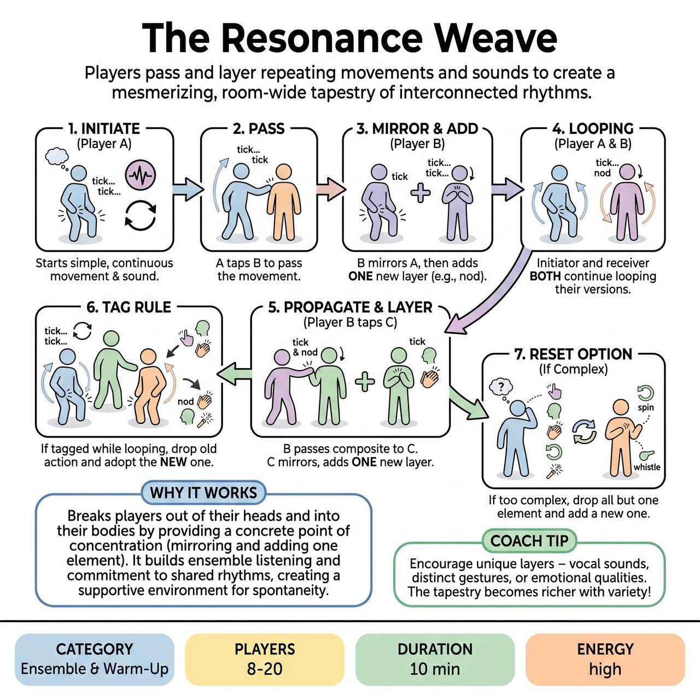

# The Resonance Weave

{ .game-hero }

> Players pass and layer repeating movements and sounds to create a mesmerizing, room-wide tapestry of interconnected rhythms.

## Overview
A physical and vocal contagion game where players pass a repeating movement and sound to one another, adding a single new layer each time. Unlike simple mimicry games, players who pass the movement continue looping their version until they are tagged again, filling the room with a rich, evolving tapestry of interconnected rhythms and gestures.

## Setup
8 to 20 players scattered comfortably around a spacious room. No props or chairs are needed. A facilitator leads the exercise.

## How to Play
1. The facilitator selects one player (the Initiator) to start a simple, continuous physical movement and sound (e.g., tapping their thigh and saying 'tick... tick...').
2. The Initiator walks to another player, gently taps them on the shoulder, and passes the movement.
3. The receiving player immediately mirrors the Initiator's exact movement and sound. After a few seconds of mirroring, they add exactly ONE new physical or vocal element (e.g., they keep the thigh tap and 'tick', but add a rhythmic head nod).
4. The Initiator does not stop after passing. They stay in place, continuously looping their original 'tick' and thigh tap.
5. The receiving player (now doing the tap, 'tick', and nod) walks to a third player, taps their shoulder, and passes their composite movement. The third player mirrors it, adds one new element (e.g., a whistle), and moves on, while the second player stays in place looping their version.
6. If a player who is already looping a movement gets tagged by someone new, they must immediately drop their old loop, adopt the new movement they were just handed, add a new layer to it, and pass it on.
7. If a movement becomes too complex to mirror (e.g., 5+ layers), the next receiving player can choose to drop all elements except one, and add a new one, effectively 'pruning' the weave so it doesn't become physically impossible.

## Coaching Notes
- The 'win' is the ensemble staying fully committed to the physical/vocal loops, listening to the rhythm of the room, and supporting each other's additions.
- Remind players of the concrete Point of Concentration: Mirror the exact movement/sound received, then add exactly one new element.
- Encourage players to lean into the highly physical and vocal nature of the game to break out of their heads and into their bodies.
- Guide the group to appreciate the mesmerizing, room-wide 'looper pedal' effect of overlapping rhythms and actions.

## Variations
- Multiple Seeds: The facilitator taps 2 or 3 different players to start completely different seeds simultaneously. When these different weaves collide (a player from weave A tags a player looping weave B), the tagged player must switch to the new weave and add to it.
- Silent Weave: The same game, but strictly physical with zero vocalizations, forcing intense visual focus and spatial awareness.
- Subtraction Weave: Instead of adding an element, a tagged player can choose to remove one element from the composite they receive, simplifying the loop until it returns to a single movement.

## Why It Works
It breaks players out of their heads and into their bodies by providing a concrete point of concentration (mirroring and adding one element). It builds ensemble listening and commitment to shared rhythms, creating a supportive environment for physical and vocal expression.

## Safety & Inclusion
Establish consent for shoulder taps before starting. If players prefer no touch, they can 'tag' by making eye contact and pointing directly at the recipient. Players should only add movements that are safe and accessible. If a player receives a movement they cannot physically perform, they should adapt it to their own mobility level (e.g., changing a jump to a shoulder shrug) while maintaining the rhythm. Remind players to keep vocalizations at a sustainable volume so the room doesn't become overwhelmingly loud.

