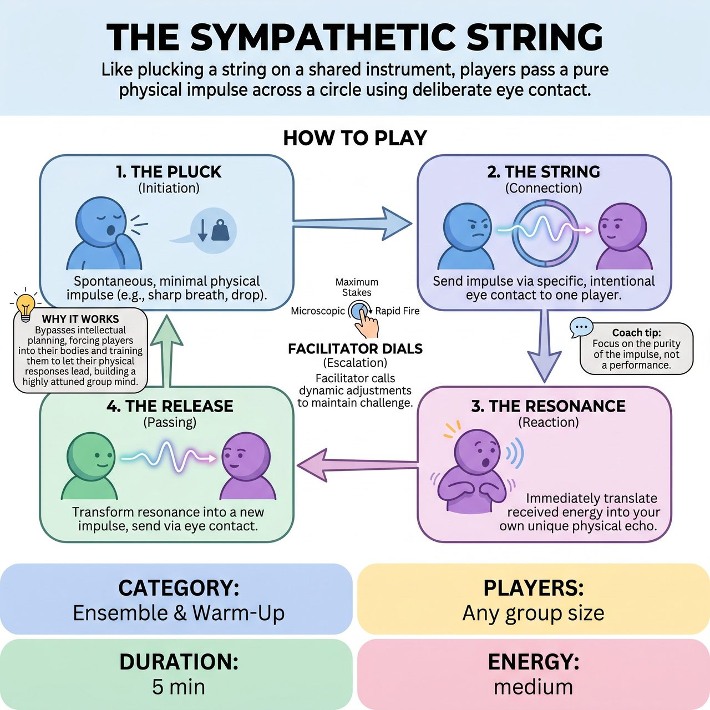

# The Sympathetic String

{ .game-hero }

> Like plucking a string on a shared instrument, players pass a pure physical impulse across a circle using deliberate eye contact.

## Overview
A facilitator-led ensemble warm-up designed to cultivate acute non-verbal listening and intuitive responsiveness. The receiver must instantly translate felt energy into their own spontaneous physical echo without intellectualizing it. It trains improvisers to get out of their heads, stop planning, and let their bodies lead, while building a highly attuned group mind.

## Setup
Players stand in a loose circle with enough room to move freely. No props or physical contact are required. The facilitator stands outside the circle to observe, side-coach, and adjust the pacing.

## How to Play
1. THE PLUCK (Initiation): One player (Player A) spontaneously initiates a single, minimal, pure physical impulse, such as a sharp breath, a sudden drop in weight, or a tense shoulder.
2. THE STRING (Connection): Player A immediately makes specific, intentional eye contact with one other player (Player B) across the circle, 'sending' this impulse to them non-verbally.
3. THE RESONANCE (Reaction): Upon receiving eye contact, Player B must immediately and intuitively allow that received energy to translate into their own unique physical echo. They do not mimic Player A; rather, they react to how Player A's energy 'hits' them.
4. THE RELEASE (Passing): As soon as Player B's echo manifests, they immediately transform their resonance into a new impulse and send it, via deliberate eye contact, to a different player (Player C).
5. FACILITATOR DIALS (Escalation): The facilitator calls out dynamic adjustments like 'Microscopic', 'Maximum Stakes', or 'Rapid Fire' to keep the exercise highly engaging.
6. DEBRIEF: After 3-5 minutes, stop the game and ask the ensemble questions like 'Did you catch yourself planning your reaction?' and 'Did you notice the energy of the room shift?'

## Coaching Notes
- Point of Concentration (POC): Translating received energy into spontaneous physical expression.
- Offer gentle prompts like 'Don't plan it,' 'Breathe,' and 'Let the body surprise the brain.'
- Call out 'Dials' to change the intensity and keep the ensemble highly entertained and engaged in the present moment.
- Avoid the gag: Gently correct 'gagging' (making a funny face for a laugh) or 'pantomime' (pretending to hold an object). The reaction must remain a pure, abstract physical sensation.

## Variations
- IMPULSE TO SCENE: The string passes 4 or 5 times. On the facilitator's call of 'Scene!', the player who just received the impulse uses their physical echo as the foundational posture and emotional state to initiate a grounded 2-person scene with the player who sent it to them.
- THE CONTAGIOUS WEB: Instead of passing to one person, the sender locks eyes with two people simultaneously, splitting the impulse. Those two pass it to two more. The web grows exponentially until the entire room is resonating together in a shared physical state.
- ROOM ROAM: Break the static circle. Players walk randomly around the room. Impulses are passed in passing, requiring acute peripheral vision, spatial awareness, and the ability to catch and release energy while in continuous motion.

## Why It Works
It bypasses intellectual planning and forces players into their bodies, training them to stop planning and let their bodies lead while building a highly attuned group mind.

## Safety & Inclusion
This game requires zero physical contact, making it highly safe. Players should be explicitly encouraged to interpret 'physical impulse' within their own physical mobility limits; a shift in gaze, a change in breathing, or a facial micro-expression is just as valid and powerful as a full-body movement. Emphasize that there is no 'wrong' natural reaction, fostering a judgment-free zone that prevents self-consciousness.

