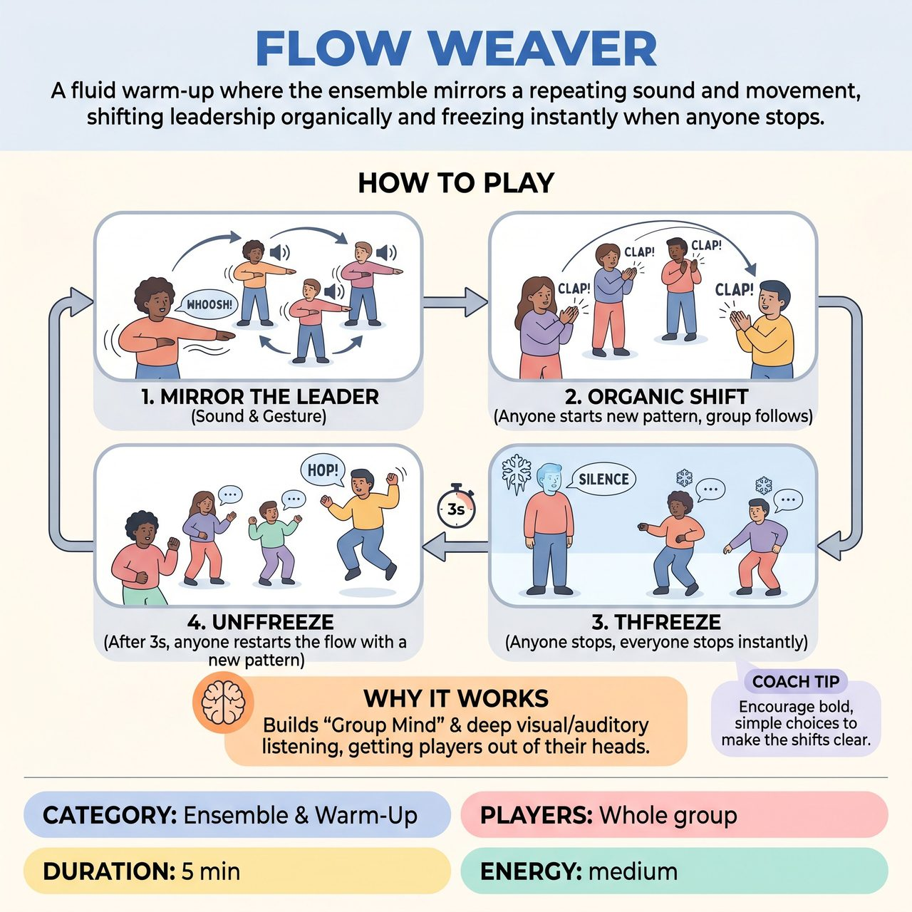

# Flow Weaver

{ .game-hero }

> A fluid warm-up where the ensemble mirrors a repeating sound and movement, shifting leadership organically and freezing instantly when anyone stops.

## Overview
A fluid, non-competitive warm-up where the ensemble mirrors a single leader's repeating sound and movement. Leadership changes organically when anyone introduces a new motion, and the entire group can be paused instantly if any single player freezes. It forces players out of their heads, builds group mind, and relies entirely on visual and auditory listening.

## Setup
Players spread out randomly in an open room, clear of tripping hazards. No props or stage configuration are needed. The facilitator asks the group to maintain a 'soft focus,' keeping as many players in their peripheral vision as possible.

## How to Play
1. The First Weave: Any player can begin the exercise by spontaneously making a simple, repeating physical gesture paired with a sound (e.g., swinging an arm and saying 'Whoosh!').
2. Mirroring: The moment this happens, everyone else immediately copies the gesture and sound, matching the initiator's rhythm and energy.
3. Shifting Leadership: At any moment, any other player can start a completely new gesture and sound. The entire group (including the previous leader) must instantly drop the old pattern and switch to mirroring this new one.
4. Resolving Ties: If two people initiate a new pattern simultaneously, players simply follow whichever they notice first. The group mind will naturally consolidate behind one leader within a few seconds without any verbal planning.
5. The Freeze: At any time, any player can suddenly freeze in place and go silent. The instant one person freezes, every single player must instantly freeze.
6. Unfreezing: After a brief 3-second moment of total stillness and silence, any player can break the freeze by starting a new movement and sound, resuming the flow.

## Coaching Notes
- There is no designated 'it'; anyone can take over at any time, flattening the hierarchy.
- A single player can stop the entire room, demanding high visual awareness and constant attention.
- Keep mechanics simple and jargon-free to get players out of their heads and into their bodies immediately.
- Remind players there are no points or judges; the 'win' is achieving a seamless, hive-mind state where changes and freezes happen instantly and organically.

## Variations
- Silent Weaver: Remove the vocal sounds entirely. The group must rely purely on visual cues and peripheral vision to change movements and freeze, heightening physical awareness.
- Emotion Weaver: Instead of abstract sounds and gestures, players initiate an action tied to a specific emotion (e.g., stomping angrily, skipping joyfully). The group mirrors the emotional intention as well as the physical movement.

## Why It Works
It forces players out of their heads, builds group mind, and relies entirely on visual and auditory listening. The group mind naturally consolidates behind one leader without verbal planning, flattening hierarchy and demanding high visual awareness.

## Safety & Inclusion
Players should move at their own physical capacity. Mirroring does not require matching the exact range of motion if a player has physical limitations or mobility aids; capturing the intention and rhythm is what matters. Ensure the space is completely clear of bags, chairs, or tripping hazards before starting.

