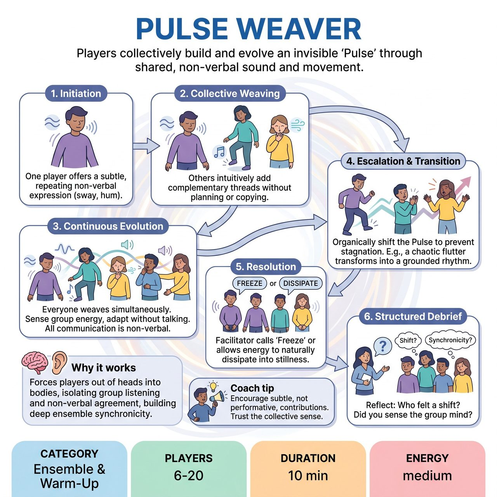

# Pulse Weaver

{ .game-hero }

> Players collectively build and evolve an invisible 'Pulse' through shared, non-verbal sound and movement.

## Overview
An ensemble warm-up where players collectively build and evolve an invisible 'Pulse' through shared, non-verbal sound and movement. By intuitively adding complementary gestures, rhythms, or sounds, the group creates a shifting energetic tapestry. It forces players out of their heads and into their bodies, isolating the specific skill of group listening and non-verbal agreement.

## Setup
Players stand in a loose circle or scattered freely in an open space, ensuring everyone can see and hear each other. No props or prior acting experience are required. The facilitator explains that the group will create a shared, invisible 'Pulse' that exists between them, and that there is no 'wrong' way to contribute as long as they are listening to the group.

## How to Play
1. Initiation: One player (or the facilitator) begins by offering a subtle, repeating non-verbal expression, such as a slow sway, a rhythmic foot tap, a quiet hum, or a flickering hand gesture.
2. Collective Weaving: Without planning or directly copying, other players intuitively add their own complementary threads. If the initiation is a low hum, someone might add a high-pitched whistle, while another adds a sharp, angular arm movement.
3. Continuous Evolution: The Pulse is woven simultaneously by everyone. Players must continuously sense the group's energy and adapt. There is no talking; all communication is physical and vocal.
4. Escalation and Transition: To prevent stagnation, players are encouraged to organically shift the Pulse. For example, if the energy is a chaotic flutter, a player might introduce a loud stomp to shift the group into a slow rhythm, or increase volume to build a crescendo.
5. Resolution: The facilitator calls 'Freeze' or allows the energy to naturally dissipate into stillness.
6. Structured Debrief: After the exercise, the facilitator asks questions like 'Who felt a distinct shift in the energy, and what caused it?', 'Did you find yourself leading or following?', and 'How did it feel to communicate without words?'

## Coaching Notes
- The facilitator can call out prompts like 'Let it grow,' 'Find a new rhythm,' 'Who is changing the pulse right now? Support them,' or 'Bring it down to a whisper.'
- Act as a side-coach, guiding the pacing and encouraging players to trust their impulses and listen to the group.
- Remind players that there are no points, judges, or audience suggestions to worry about; the focus is entirely on ensemble connection.

## Variations
- Pulse to Scene: Once the group reaches a strong, unified physical and vocal pulse, the facilitator calls 'Freeze.' Players hold their physical shapes. The facilitator selects two or three players to step out and immediately begin a concrete scene inspired by the physical posture and emotional tone they were just holding.
- Blind Pulse: Players close their eyes (if comfortable) and build the Pulse using only sound and spatial awareness. This heightens auditory listening and removes the pressure of being watched.

## Why It Works
It forces players out of their heads and into their bodies, isolating the specific skill of group listening and non-verbal agreement while building deep ensemble synchronicity before a show or workshop.

## Safety & Inclusion
Players should only make movements that are comfortable for their bodies. Physical contact between players is not required and should be avoided unless explicitly agreed upon. For accessibility, players with limited mobility can participate entirely vocally or with smaller gestures; deaf or hard-of-hearing players can focus entirely on visual cues, vibrations, and physical movement.

