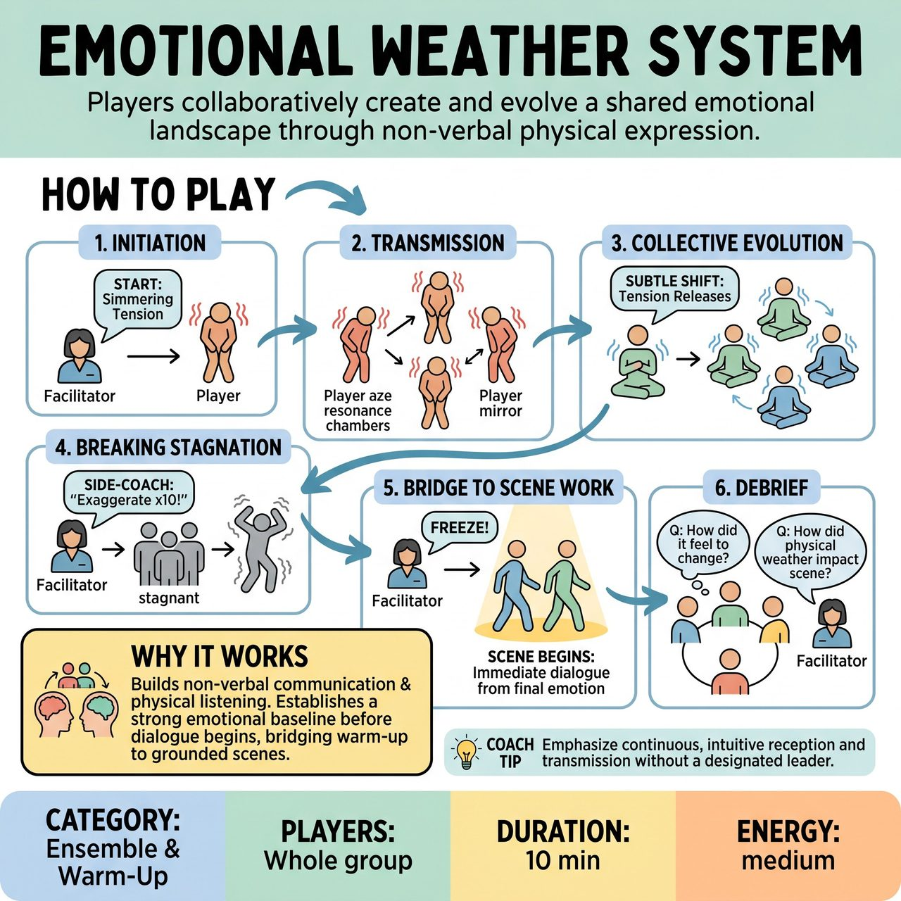

# Emotional Weather System

{ .game-hero }

> Players collaboratively create and evolve a shared emotional landscape through non-verbal physical expression.

## Overview
A non-verbal ensemble warm-up where players collaboratively create and evolve a shared emotional landscape. Starting with one player expressing an initial emotional weather through their body and breath, the group receives and re-expresses its essence. The game emphasizes continuous, intuitive reception and transmission, fostering deep collective empathy and hyper-responsiveness without a designated leader.

## Setup
Players stand scattered throughout an open space, with enough room to move freely but still be aware of others. There is no designated leader. The facilitator stands on the perimeter to side-coach.

## How to Play
1. Initiation: The facilitator calls out a starting emotional weather (e.g., simmering tension, light breezy joy) or points to one player to initiate a physical, non-verbal expression of a feeling.
2. Transmission: Every other player immediately tunes in to this initial weather. They receive it and re-express it through their own bodies, acting as resonance chambers. They do not just mimic; they embody the essence of the emotion.
3. Collective Evolution: The weather is not static. Any player can initiate a subtle shift simply by allowing the received emotion to naturally evolve (e.g., tension growing into sudden fear, or softening into quiet anticipation). The rest of the group organically follows these shifts.
4. Breaking Stagnation: If the group gets stuck in a muddy or stagnant state, the facilitator side-coaches with prompts like: 'Exaggerate what you are doing by ten percent!', 'Find the physical opposite!', or 'Let the weather break and change completely!'
5. The Bridge to Scene Work: Once the group has navigated several emotional shifts, the facilitator calls 'Freeze!' They select two players to step forward and immediately begin a two-person scene, using the exact emotional state they were just in as the baseline for their relationship and dialogue.
6. Debrief: After the exercise, the facilitator leads a brief discussion asking: 'How did it feel to be changed by the group?' and 'How did the physical weather inform the scene work that followed?'

## Coaching Notes
- Encourage players to embody the collective pulse without intellectualizing it.
- Remind players to act as resonance chambers rather than just mimicking each other.
- If the group gets stuck in a muddy or stagnant state, use side-coaching prompts like 'Exaggerate what you are doing by ten percent!', 'Find the physical opposite!', or 'Let the weather break and change completely!'
- Use this exercise to build non-verbal communication and physical listening skills.

## Variations
- Literal Weather: Instead of human emotions, players embody literal weather systems (a crisp autumn morning, a chaotic tornado, a humid swamp) to keep the exercise lighter and focus purely on physical environment.
- Soundscape Only: Players close their eyes and pass the emotional weather using only breath, vocal tones, and abstract sounds, heightening auditory listening.

## Why It Works
It provides a clear point of concentration that builds non-verbal communication and physical listening. By establishing a strong emotional baseline before dialogue begins, it effectively bridges abstract warm-ups directly into grounded scene work.

## Safety & Inclusion
Emotional boundaries are paramount, as embodying intense sorrow or anxiety can be triggering. Facilitators must explicitly state that players can opt out or dial down the intensity at any time. Establish a 'Neutral Reset' gesture (like crossing arms over the chest) that any player can use to safely step out of the emotional state without stopping the game for others. Avoid prompting traumatic emotions, focusing instead on playable, theatrical states.

