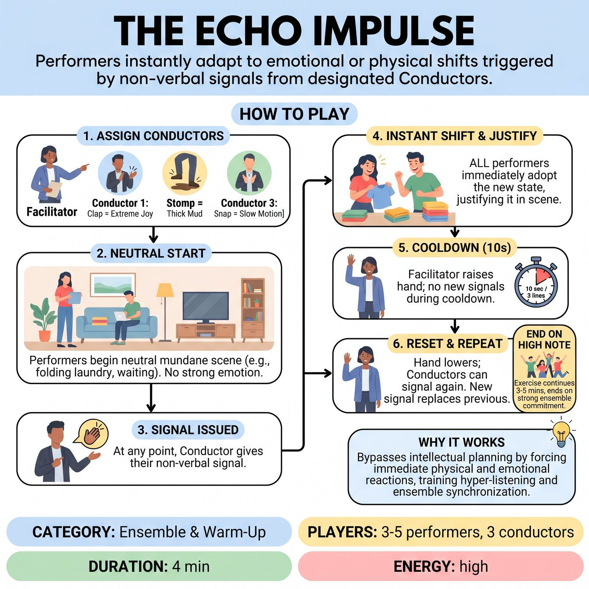

# The Echo Impulse

{ .game-hero }

> Performers instantly adapt to emotional or physical shifts triggered by non-verbal signals from designated Conductors.

## Overview
A facilitator-led ensemble exercise where performers start a neutral scene, and designated 'Conductors' trigger instant emotional or physical shifts using non-verbal signals. It trains hyper-listening, immediate commitment, and letting go of intellectual planning by forcing performers to adapt to external impulses.

## Setup
3-5 performers take the stage. The facilitator selects 3 participants from the observing group to act as 'Conductors'. Each Conductor is assigned one specific non-verbal signal (e.g., a clap, a stomp, a snap) that corresponds to a distinct emotional or physical shift for the performers.

## How to Play
1. The facilitator assigns the 3 Conductors their signals. For example: Conductor 1 claps = Extreme Joy; Conductor 2 stomps = Moving through thick mud; Conductor 3 snaps = Intense Paranoia.
2. Performers begin a simple, neutral scene based on a mundane activity (e.g., folding laundry, waiting at the DMV).
3. At any point, a Conductor may issue their signal. All performers must immediately and simultaneously adopt the new state, justifying it within the existing scene without dropping the core context.
4. Cooldown Rule: Once a signal is issued, the facilitator raises their hand for about 10 seconds (or 3 lines of dialogue). During this cooldown, no new signals can be triggered. This ensures performers have time to fully establish and explore the new reality.
5. When the facilitator lowers their hand, Conductors may signal again. A new signal replaces the previous state. If the same signal is repeated, performers must intensify that specific state.
6. The exercise continues for 3-5 minutes, ending on a high note of ensemble commitment.

## Coaching Notes
- Encourage hyper-listening: Performers must remain acutely aware of external sounds while maintaining the scene.
- Push for instantaneous adaptability: The goal is to bypass intellectual planning by forcing immediate physical and emotional reactions.
- Focus on ensemble synchronization: Ensure the entire group shifts realities together to build group mind and shared focus.
- Guide the Conductors to pay attention to scene pacing, timing, and the impact of sudden constraints on the scene work.

## Variations
- Emotion Only: All three signals correspond to different emotional states (e.g., Anger, Sadness, Euphoria) to drill emotional agility without physical complications.
- Rotating Conductors: For larger workshops, rotate the Conductors every 2 minutes so everyone gets a chance to control the pacing and observe the effects of their timing.

## Why It Works
It bypasses intellectual planning by forcing immediate physical and emotional reactions, training hyper-listening and ensemble synchronization as the entire group shifts realities together.

## Safety & Inclusion
Physical constraints must be safe and grounded (e.g., 'moving through mud' or 'moving in slow motion' instead of 'moving backward') to prevent collisions or stage falls. The cooldown period prevents sensory overload and panic, making the game more accessible. The facilitator retains the power to pause the exercise if the scene becomes physically unsafe or chaotic.

