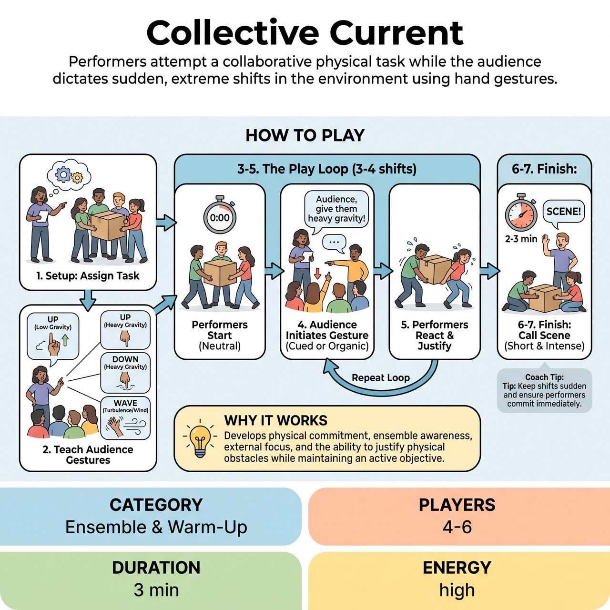

# Collective Current

{ .game-hero }

> Performers attempt a collaborative physical task while the audience dictates sudden, extreme shifts in the environment using hand gestures.

## Overview
A facilitator-led ensemble exercise where a group of performers attempts to complete a simple, collaborative task. Meanwhile, the audience or observing workshop members dictate sudden, extreme shifts in the physical environment using collective hand gestures.

## Setup
Clear an open performance space. Divide the room into 'Performers' (4-6 people) and the 'Audience' (the rest of the group). The Facilitator stands where they can see both groups. The Performers are given a highly physical, collaborative objective (e.g., setting up a campsite, moving a grand piano, or cooking a massive banquet). The Audience is taught four specific environmental gestures that will alter the performers' reality.

## How to Play
1. The Facilitator assigns the Performers their collaborative physical task. The Performers must focus on accomplishing this objective together.
2. The Facilitator teaches the Audience the environmental gestures: Pointing UP (Low Gravity/Floating), Pointing DOWN (Heavy Gravity/Sinking), WAVING arms side-to-side (Strong Wind), and CLAPPING (Strobe Light/Lagging Reality).
3. The Performers begin their task in a normal, neutral environment.
4. The Facilitator cues the Audience to initiate a gesture (e.g., 'Audience, let's give them some heavy gravity'). The Audience must work together to make the gesture clear and unified.
5. The Performers must immediately let the new physical reality affect their bodies while continuing to pursue their assigned task. They must justify the struggle (e.g., trying to hammer a tent peg while floating away).
6. The Facilitator guides the Audience through 3 to 4 environmental shifts, encouraging the Audience to initiate changes organically once they understand the mechanic.
7. Call 'Scene' after 2 to 3 minutes. Do not let the exercise drag on; keep it short, intense, and highly physical.

## Coaching Notes
- Ensure performers maintain focus on their assigned objective rather than just playing the environment.
- Encourage high physical commitment and embodiment of the obstacles.
- Remind performers to justify the physical struggle within the context of their task.
- Guide the audience to work together to make their gestures clear and unified.

## Variations
- Narrative Current: Instead of a group task, two players perform a standard spoken scene (e.g., a breakup at a coffee shop) and must maintain the emotional stakes and dialogue while adapting to the physical shifts.
- Conductor Current: Instead of the whole audience, a single player acts as the 'Conductor', changing the environment to challenge the performers, practicing their own sense of timing and side-coaching.

## Why It Works
It develops physical commitment, ensemble awareness, external focus, and the ability to justify physical obstacles while maintaining an active objective.

## Safety & Inclusion
Crucial physical safety: For 'Heavy Gravity', players must use muscle tension to simulate weight, avoiding actually collapsing, locking knees, or straining their lower backs. For 'Strobe/Clapping', players should move by striking a series of still poses rather than violently jerking their necks or limbs (which can cause whiplash). The game is fully accessible; seated players can easily perform the audience gestures, and performers can adapt the environmental effects to their own mobility levels.

