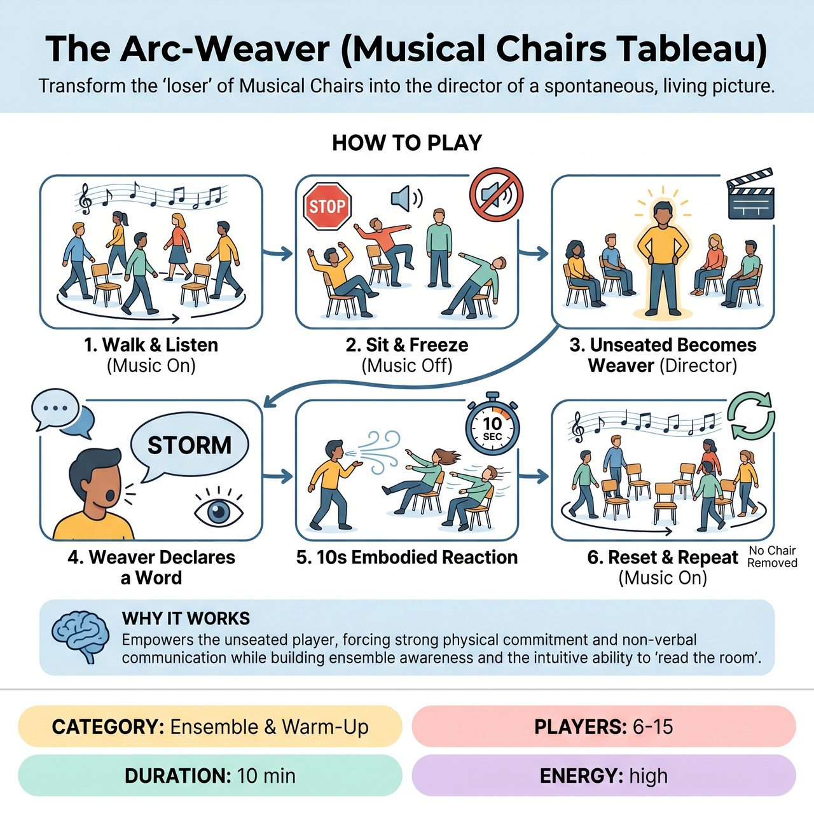

# The Arc-Weaver (Musical Chairs Tableau)

{ .game-hero }

> Transform the 'loser' of Musical Chairs into the director of a spontaneous, living picture.

## Overview
A non-competitive ensemble warm-up that trains physical commitment, ensemble awareness, and non-verbal storytelling. The unseated player guides the seated players through a rapid, embodied reaction based on a single word.

## Setup
Place chairs in a circle facing outward, with one fewer chair than the number of players. You need a music source (or the facilitator can clap/sing) and a clear, safe playing space.

## How to Play
1. The Walk: The facilitator plays music. Players walk (do not run) around the circle of chairs, maintaining a safe pace.
2. The Sit & Freeze: The facilitator stops the music. Players safely find a seat. The moment they sit, they must instantly freeze in a strong physical pose that justifies why they need that chair (e.g., hiding behind it, slumped in exhaustion, guarding it fiercely).
3. The Weaver: The single player left without a chair becomes the 'Arc-Weaver'. Instead of being 'out', they are empowered and step into the center of the circle.
4. The Word: The Weaver observes the frozen poses, senses the collective mood, and loudly declares one single word that summarizes the room (e.g., 'Paranoia', 'Blizzard', 'Joy', 'Anticipation').
5. The Reaction: For exactly 10 seconds, the Weaver moves through the space embodying that word as an environmental force (e.g., blowing like a storm, creeping like a monster). The seated players unfreeze and react physically and with non-verbal sounds to the Weaver's influence.
6. The Reset: After 10 seconds, the facilitator calls 'Scene!' or simply restarts the music. The Weaver joins the group, and a new round begins. No chairs are removed, ensuring everyone keeps playing.

## Coaching Notes
- Side-coach to encourage bold physical choices (e.g., 'Show me the weight of that exhaustion!').
- Keep the reaction phase strictly to 10 seconds to maintain high energy and prevent dragging.

## Variations
- Genre Weaver: Instead of an emotional or environmental word, the Weaver calls out a movie genre (e.g., 'Western', 'Horror', 'Sci-Fi') and acts as a generic trope from that genre, prompting the seated players to react in style.
- Spot-Stepping (Accessible): Use rubber poly-spots or taped X's on the floor instead of chairs. This removes the physical danger of scrambling for furniture and accommodates players using wheelchairs or mobility aids.

## Why It Works
It turns the 'loser' of a traditional game into an empowered, active director. It forces strong physical commitment and non-verbal communication while building ensemble awareness and the intuitive ability to 'read the room'.

## Safety & Inclusion
Explicitly ban running, diving, or pushing during the scramble phase. Instruct players to 'Walk with purpose.' If two players tie for a chair, they must share it or play rock-paper-scissors. Use the 'Spot-Stepping' variation to make the game fully accessible and eliminate chair-collision risks entirely.

