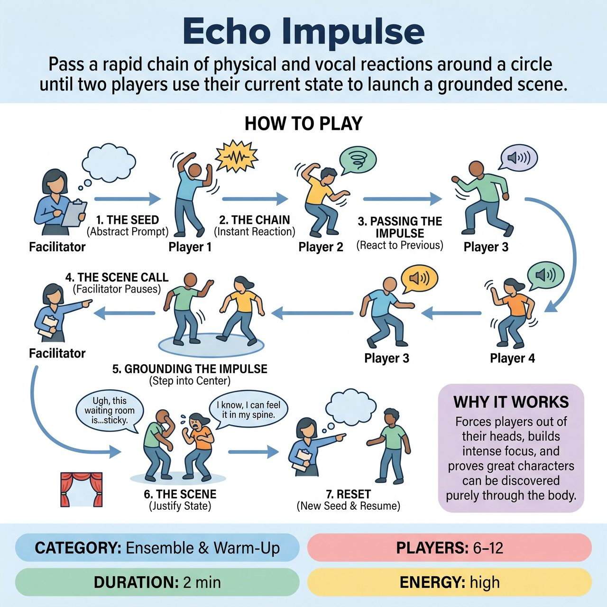

# Echo Impulse

{ .game-hero }

> Pass a rapid chain of physical and vocal reactions around a circle until two players use their current state to launch a grounded scene.

## Overview
Rooted in classic 'Sound and Motion' exercises, Echo Impulse is a high-energy warm-up that bridges the gap between abstract physical play and concrete scene work. Players pass a chain of intuitive physical and vocal reactions around a circle. Once the energy peaks, the facilitator pauses the chain, and the last two players must immediately use their current physical and emotional state to launch into a grounded, two-person scene.

## Setup
6 to 12 players standing or sitting in a circle. One facilitator stands on the outside to guide the pacing and call the scenes. No props or stage setup required.

## How to Play
1. The Seed: The facilitator gives a simple, abstract prompt to the first player to start the chain. This could be a sound, a texture, or a single word (e.g., 'Heavy', 'A sharp exhale', 'Velvet').
2. The Chain (Sound and Motion): Player 1 reacts instantly to the prompt with a physical motion and a sound. Player 2 immediately reacts to Player 1's motion and sound with their own distinct motion and sound. Players must not think or plan; they must simply let their body react to what they just saw and heard.
3. Passing the Impulse: The impulse continues sequentially around the circle. Each player reacts ONLY to the person immediately before them, not to the original seed.
4. The Scene Call: When the facilitator sees a strong, distinct physical or emotional dynamic between two players (or after the impulse has traveled around the circle once or twice), they call out 'Scene!'
5. Grounding the Impulse: The chain stops immediately. The player who just gave the impulse and the player who just received it step into the center of the circle. They must freeze in their current physical posture and retain their current emotional energy.
6. The Scene: Without dropping that physical/emotional state, the two players immediately start a scene. They must justify their weird postures and noises by establishing a relationship and a setting (e.g., if one is cowering and the other is looming, they might instantly become a nervous employee and an overbearing boss).
7. Reset: After 1 to 2 minutes of scene work, the facilitator calls 'Scene over!', gives a new Seed prompt to the next person in the circle, and the chain resumes.

## Coaching Notes
- The facilitator should side-coach to keep the pace rapid with prompts like 'Don't think!', 'React instantly!', and 'Bigger choices!'.
- Encourage players to trust their bodies, avoid intellectualizing the chain, and fully commit to the physical justification during the scene phase.
- Ensure players maintain intense focus and listen only to the immediate preceding player.
- Use this game to force players out of their heads and react physically, bridging the gap between abstract warm-ups and concrete character creation.

## Variations
- Silent Echo: Remove the vocal element. Players pass only physical movements and facial expressions, leading to a silent or highly physical scene when called.
- Group Echo: Instead of a two-person scene, the facilitator calls 'Group Scene!' and the entire circle steps in, using their exact physical posture from that moment to populate a single, shared environment (e.g., a busy office, a sinking ship).

## Why It Works
It forces players out of their heads, builds intense focus, and proves that great characters can be discovered purely through the body.

## Safety & Inclusion
Physical Safety: Remind players to be aware of their spatial surroundings and avoid forceful physical contact during the rapid chain phase. Consent: Emphasize that players should not touch each other during the impulse chain without prior consent; reactions should be energetic and spatial. Accessibility: The game can easily be played seated. 'Motion' can be adapted to facial expressions, hand gestures, or vocal shifts depending on the mobility of the players.

